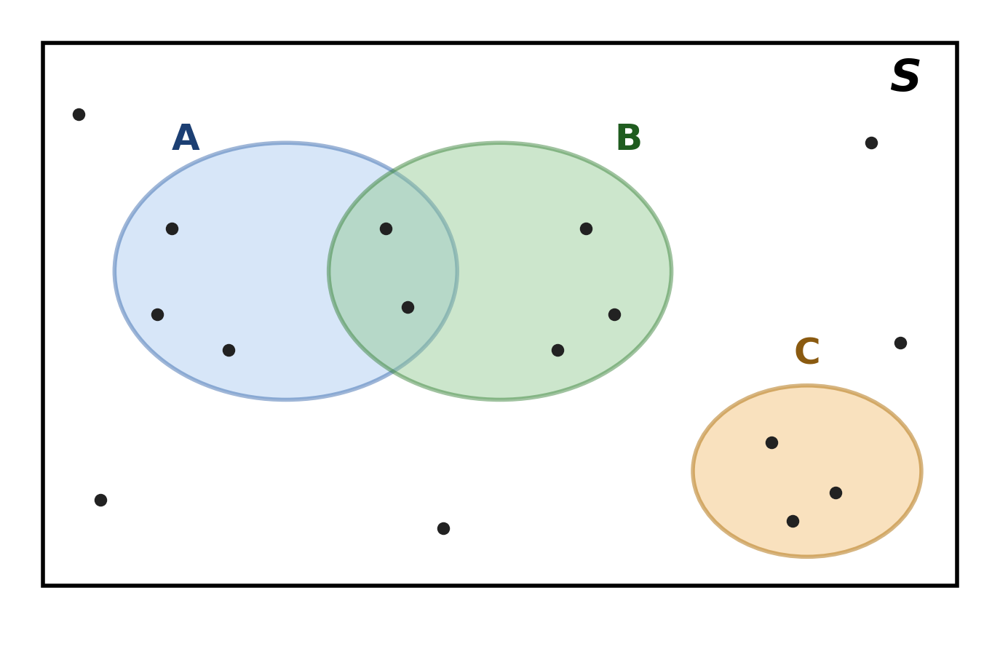

### Course Information

| | |
|---|---|
| **Instructor** | Prof. Vladyslav Nora |
| **Teaching Assistant** | TBA |
| **Class Hours** | T/Th, 16:30–17:45 |
| **Location** | Blue Hall |
| **Office Hours** | T/Th, 15:00–16:00 — register via [Google Calendar](https://calendar.app.google/sNK5oxu7GNkL82316) |
| **Announcements & materials** | Schedule, missing-class forms, exam samples — all on Moodle |

---

### Textbooks

Procure the following (not available in the library):

| Code | Textbook |
|---|---|
| **BH** | *Introduction to Probability*, Blitzstein & Hwang, 2nd edition — free online version available; based on the authors' Harvard lectures |
| **K** | *Statistics for Management and Economics*, Gerald Keller, 11th edition |

---

### Assessment and Attendance {.smaller}

| Component | Weight / Rule |
|---|---|
| Problem sets (6) | Pass/Fail — must pass at least 4 of 6 to qualify for the final exam. Hand-written, scanned, submitted via Moodle by the due date. |
| Quizzes (2) | 35% total (Quiz 1: 15%, Quiz 2: 20%) |
| Midterm exam | 25% |
| Final exam | 40% |
| Attendance | Mandatory — at most 2 missed classes without penalty. Missing more than 20% of classes requires retaking the course. |

---

::: {.callout-note title="Grading Curve"}
Grades are curved to roughly: 15% A/A-, 50% B+/B/B-, 20% C+/C/C-, 10% D+/D/F, with a median around B-.
:::

---

### How to Study

- Practice is the single most important part of this course — **solve as many problems as you can** on your own.
- Sources of practice: problem sets (6, mandatory), exercises in BH and K after each chapter.
- **Believing you understand something is not the same as actually understanding it — only struggling with problems reliably measures comprehension.**

---

### AI Policy

- Outside of exams, you may use generative AI tools **without restriction and at no penalty**.
- If you can't solve a problem, ask AI first only for **hints**, not the full solution.
- Any AI contribution must be **acknowledged** (extent of use + source). Unacknowledged AI use is treated as plagiarism.
- Exams are closed-book: no notes, calculators, or electronic devices.

---

### Course Structure

- **First three-quarters** of the course: probability theory — the mathematical tool for thinking about uncertainty.
- **Last quarter**: basic statistics — applying probability theory to analyze real-world data.

---

### Prerequisites

Review before the next lecture:

- **Basic set theory**: sets, unions, intersections, complements, Cartesian products.
- **Calculus**: derivatives, integrals, geometric series.

---

:::: {.callout-caution title="Review Question 1 — What is a Set?" appearance="minimal"}
Consider the set of primary-ish colors used in traffic lights:

$$C = \{\text{red}, \text{yellow}, \text{green}\}$$

a) Is $\text{blue} \in C$?
b) Is $\{\text{red}, \text{green}, \text{yellow}\}$ the same set as $C$? Does order matter?
c) Suppose someone writes $C = \{\text{red}, \text{red}, \text{yellow}, \text{green}\}$. Is this still a valid representation of $C$? Why?
::::

--- 

::: {.callout-tip collapse="true" title="Solution"}
a) No, $\text{blue} \notin C$ since blue is not listed as an element.
b) Yes — sets are unordered, so $\{\text{red}, \text{green}, \text{yellow}\} = C$.
c) Yes, it represents the same set. Sets do not count multiplicity — repeated elements are collapsed, so $\{\text{red}, \text{red}, \text{yellow}, \text{green}\} = \{\text{red}, \text{yellow}, \text{green}\} = C$.
:::


---

:::: {.callout-caution title="Review Question 2 — Operations on Sets of Numbers" appearance="minimal"}
Let

$$A = \{1, 2, 3, 4, 5\}, \qquad B = \{2, 4, 6, 8\}$$

Find:

a) $A \cup B$
b) $A \cap B$
c) $A \setminus B$ (elements in $A$ but not in $B$)
d) $|A \cup B|$ (the cardinality, i.e. number of elements)
::::

---

::: {.callout-tip collapse="true" title="Solution"}
a) $A \cup B = \{1, 2, 3, 4, 5, 6, 8\}$
b) $A \cap B = \{2, 4\}$
c) $A \setminus B = \{1, 3, 5\}$
d) $|A \cup B| = 7$
:::


---

:::: {.callout-caution title="Review Question 3 — Reading Set Operations off a Venn Diagram" appearance="minimal"}
Each diagram below shows two sets $A$ and $B$ inside a universal set $S$, with one region shaded. For each diagram, write the set expression (using $\cup$, $\cap$, $\setminus$, $\triangle$, or complement) that describes the shaded region.
::::

---

**a)**

```{=html}
<div style="text-align:center;">
<svg width="260" height="180" viewBox="0 0 300 200" xmlns="http://www.w3.org/2000/svg">
  <mask id="maskQ3a"><rect x="0" y="0" width="300" height="200" fill="white"/><circle cx="190" cy="100" r="80" fill="black"/></mask>
  <circle cx="110" cy="100" r="80" fill="#a8c8f0" mask="url(#maskQ3a)"/>
  <circle cx="110" cy="100" r="80" fill="none" stroke="black" stroke-width="1.5"/>
  <circle cx="190" cy="100" r="80" fill="none" stroke="black" stroke-width="1.5"/>
  <text x="55" y="25" font-size="16" font-weight="bold">A</text>
  <text x="245" y="25" font-size="16" font-weight="bold">B</text>
</svg>
</div>
```

---

**b)**

```{=html}
<div style="text-align:center;">
<svg width="260" height="180" viewBox="0 0 300 200" xmlns="http://www.w3.org/2000/svg">
  <clipPath id="clipQ3b"><circle cx="110" cy="100" r="80"/></clipPath>
  <g clip-path="url(#clipQ3b)"><circle cx="190" cy="100" r="80" fill="#8ec98e"/></g>
  <circle cx="110" cy="100" r="80" fill="none" stroke="black" stroke-width="1.5"/>
  <circle cx="190" cy="100" r="80" fill="none" stroke="black" stroke-width="1.5"/>
  <text x="55" y="25" font-size="16" font-weight="bold">A</text>
  <text x="245" y="25" font-size="16" font-weight="bold">B</text>
</svg>
</div>
```

---

**c)**

```{=html}
<div style="text-align:center;">
<svg width="260" height="180" viewBox="0 0 300 200" xmlns="http://www.w3.org/2000/svg">
  <circle cx="110" cy="100" r="80" fill="#f5c98a"/>
  <circle cx="190" cy="100" r="80" fill="#f5c98a"/>
  <circle cx="110" cy="100" r="80" fill="none" stroke="black" stroke-width="1.5"/>
  <circle cx="190" cy="100" r="80" fill="none" stroke="black" stroke-width="1.5"/>
  <text x="55" y="25" font-size="16" font-weight="bold">A</text>
  <text x="245" y="25" font-size="16" font-weight="bold">B</text>
</svg>
</div>
```

---

**d)**

```{=html}
<div style="text-align:center;">
<svg width="260" height="180" viewBox="0 0 300 200" xmlns="http://www.w3.org/2000/svg">
  <mask id="maskQ3d"><rect x="0" y="0" width="300" height="200" fill="white"/><circle cx="110" cy="100" r="80" fill="black"/><circle cx="190" cy="100" r="80" fill="black"/></mask>
  <rect x="10" y="10" width="280" height="180" fill="#d0d0d0" mask="url(#maskQ3d)"/>
  <rect x="10" y="10" width="280" height="180" fill="none" stroke="black" stroke-width="1.5"/>
  <circle cx="110" cy="100" r="80" fill="none" stroke="black" stroke-width="1.5"/>
  <circle cx="190" cy="100" r="80" fill="none" stroke="black" stroke-width="1.5"/>
  <text x="55" y="30" font-size="16" font-weight="bold">A</text>
  <text x="245" y="30" font-size="16" font-weight="bold">B</text>
  <text x="270" y="25" font-size="16" font-style="italic">S</text>
</svg>
</div>
```

---

**e)**

```{=html}
<div style="text-align:center;">
<svg width="260" height="180" viewBox="0 0 300 200" xmlns="http://www.w3.org/2000/svg">
  <mask id="maskQ3e1"><rect x="0" y="0" width="300" height="200" fill="white"/><circle cx="190" cy="100" r="80" fill="black"/></mask>
  <mask id="maskQ3e2"><rect x="0" y="0" width="300" height="200" fill="white"/><circle cx="110" cy="100" r="80" fill="black"/></mask>
  <circle cx="110" cy="100" r="80" fill="#c9a8e0" mask="url(#maskQ3e1)"/>
  <circle cx="190" cy="100" r="80" fill="#c9a8e0" mask="url(#maskQ3e2)"/>
  <circle cx="110" cy="100" r="80" fill="none" stroke="black" stroke-width="1.5"/>
  <circle cx="190" cy="100" r="80" fill="none" stroke="black" stroke-width="1.5"/>
  <text x="55" y="25" font-size="16" font-weight="bold">A</text>
  <text x="245" y="25" font-size="16" font-weight="bold">B</text>
</svg>
</div>
```

---

::: {.callout-tip collapse="true" title="Solution"}
a) $A \setminus B$ (equivalently $A \cap B^c$) — everything in $A$ that is not in $B$.
b) $A \cap B$ — only the overlap.
c) $A \cup B$ — everything in at least one of $A$ or $B$.
d) $(A \cup B)^c$ — everything in $S$ but outside both circles.
e) $A \triangle B = (A \setminus B) \cup (B \setminus A)$ — everything in exactly one of $A$ or $B$, not both.
:::


---

:::: {.callout-caution title="Review Question 4 — Slopes, Areas, and the Fundamental Theorem" appearance="minimal"}
a) **Derivative as slope.** Let $f(x) = x^2 - 4x + 3$. Find $f'(x)$, evaluate $f'(1)$, and interpret this value as the slope of the tangent line to $y = f(x)$ at $x = 1$.

b) **Integral as area.** Compute $\displaystyle\int_0^3 x^2\,dx$ and interpret the result as the area of the region under the curve $y = x^2$.

c) **Fundamental Theorem of Calculus.** Let $F(x) = \displaystyle\int_1^x (2t+1)\,dt$.
   i. Use FTC Part 1 to find $F'(x)$ without computing the integral explicitly.
   ii. Now compute $F(x)$ explicitly and differentiate it to confirm your answer to (i).

d) **Basic rules with polynomials.**
   i. Differentiate $g(x) = 5x^4 - 3x^2 + 7x - 2$.
   ii. Find the general antiderivative of $h(x) = 6x^2 - 4x + 1$.
::::

---

::: {.callout-tip collapse="true" title="Solution"}
**a)** $f'(x) = 2x - 4$, so $f'(1) = 2(1) - 4 = -2$. Since $f(1) = 1 - 4 + 3 = 0$, the tangent line passes through $(1,0)$ with slope $-2$:
$$y - 0 = -2(x-1) \;\Rightarrow\; y = -2x + 2.$$
The slope $-2$ means $f$ is decreasing at a rate of 2 units of $f$ per unit of $x$ at $x=1$.

**b)** $\displaystyle\int_0^3 x^2\,dx = \left[\frac{x^3}{3}\right]_0^3 = \frac{27}{3} - 0 = 9.$
The region under $y=x^2$ from $x=0$ to $x=3$ has area $9$ square units.

**c)**
i. By FTC Part 1, $F'(x) = 2x+1$ directly — no need to integrate first.
ii. $\displaystyle\int (2t+1)\,dt = t^2 + t + C$, so
$$F(x) = \left[t^2+t\right]_1^x = (x^2+x) - (1+1) = x^2 + x - 2.$$
Then $F'(x) = 2x+1$, confirming (i). (Check: $F(1) = 1+1-2=0$, consistent with $\int_1^1(\cdot)\,dt=0$.)

**d)**
i. $g'(x) = 20x^3 - 6x + 7$ (power rule term by term; the constant $-2$ drops out).
ii. $H(x) = 2x^3 - 2x^2 + x + C$. Check: $H'(x) = 6x^2 - 4x + 1 = h(x)$. ✓
:::

## What Is Probability?

**Deterministic view of the world**: if we know the initial conditions and the rules of a system, we can predict the outcome of any experiment with certainty.

| Action | Deterministic question | Sharper question |
|---|---|---|
| I let go of a coin | It will fall to the ground. | Will it land heads or tails? |
| I walk out the door upstairs | I will be in the hallway. | How many people will be there? |
| I submit problem sets in this class | Submitting none, I will fail the course. | Submitting all, will I pass? |

---

Some outcomes cannot be known in advance, no matter how much we know about initial conditions and rules. Determinism alone doesn't capture everything we want to explain — a different perspective is useful.

**Probabilistic view of the world**: some experiments have outcomes that are not knowable in advance, but we can still make useful statements about the *likelihood*, or *probability*, of different outcomes.

::: {.callout-note title="Definition"}
The probability of an event is the proportion of times it would occur if the underlying experiment were repeated, under identical conditions, an indefinitely large number of times.
:::

---

## Tossing a Coin

```{=html}
<div style="text-align:center;">
<svg width="380" height="250" viewBox="0 0 380 250" xmlns="http://www.w3.org/2000/svg">
  <defs>
    <marker id="arrowCoinToss" markerWidth="10" markerHeight="10" refX="8" refY="3" orient="auto" markerUnits="strokeWidth">
      <path d="M0,0 L0,6 L9,3 z" fill="black"/>
    </marker>
  </defs>
  <circle cx="190" cy="45" r="34" fill="#f0c75e" stroke="black" stroke-width="2"/>
  <text x="190" y="51" font-size="14" text-anchor="middle" font-weight="bold">Toss</text>

  <path d="M170,72 Q110,130 82,165" stroke="black" fill="none" stroke-width="2" marker-end="url(#arrowCoinToss)"/>
  <path d="M210,72 Q270,130 298,165" stroke="black" fill="none" stroke-width="2" marker-end="url(#arrowCoinToss)"/>

  <rect x="20" y="170" width="125" height="60" fill="#a8c8f0" stroke="black" rx="6"/>
  <text x="82" y="197" text-anchor="middle" font-size="16" font-weight="bold">Heads</text>
  <text x="82" y="218" text-anchor="middle" font-size="13">P = 1/2</text>

  <rect x="235" y="170" width="125" height="60" fill="#f5a8a8" stroke="black" rx="6"/>
  <text x="298" y="197" text-anchor="middle" font-size="16" font-weight="bold">Tails</text>
  <text x="298" y="218" text-anchor="middle" font-size="13">P = 1/2</text>
</svg>
</div>
```

For a single toss, heads and tails are equally likely — but that's a claim about the *rule*, not something we can see in one flip. Let's watch what happens as we repeat the experiment many times.

---

### Simulation

```{=html}
<div id="coinSimWrap" style="max-width:720px;margin:0 auto;font-family:sans-serif;">
  <div style="display:flex;align-items:center;justify-content:center;gap:24px;margin-bottom:16px;">
    <div id="coinSimCoin" style="width:70px;height:70px;border-radius:50%;background:#f0c75e;border:2px solid #333;display:flex;align-items:center;justify-content:center;font-weight:bold;font-size:22px;">?</div>
    <div style="display:flex;flex-direction:column;gap:8px;">
      <button id="coinSimThrow1" style="padding:8px 14px;font-size:14px;cursor:pointer;">Throw 1 coin</button>
      <button id="coinSimThrow100" style="padding:8px 14px;font-size:14px;cursor:pointer;">Throw 100 coins</button>
      <button id="coinSimReset" style="padding:6px 14px;font-size:12px;cursor:pointer;background:#eee;">Reset</button>
    </div>
  </div>

  <div style="display:flex;justify-content:center;gap:40px;margin-bottom:16px;">
    <div style="text-align:center;">
      <div style="font-weight:bold;">Heads</div>
      <div style="width:60px;height:120px;border:1px solid #333;display:flex;align-items:flex-end;margin:6px auto;background:#f5f5f5;">
        <div id="coinSimHeadsBar" style="width:100%;height:0%;background:#a8c8f0;transition:height 0.3s;"></div>
      </div>
      <div id="coinSimHeadsCount" style="font-size:15px;">0</div>
    </div>
    <div style="text-align:center;">
      <div style="font-weight:bold;">Tails</div>
      <div style="width:60px;height:120px;border:1px solid #333;display:flex;align-items:flex-end;margin:6px auto;background:#f5f5f5;">
        <div id="coinSimTailsBar" style="width:100%;height:0%;background:#f5a8a8;transition:height 0.3s;"></div>
      </div>
      <div id="coinSimTailsCount" style="font-size:15px;">0</div>
    </div>
  </div>

  <div style="text-align:center;margin-bottom:10px;font-size:15px;">
    Tosses: <span id="coinSimN">0</span> &nbsp;|&nbsp;
    Empirical P(Heads) = <span id="coinSimPHat" style="font-weight:bold;">—</span>
  </div>

  <canvas id="coinSimCanvas" width="680" height="200" style="display:block;margin:0 auto;border:1px solid #ccc;background:#fff;"></canvas>
  <div style="text-align:center;font-size:12px;color:#666;margin-top:4px;">Running relative frequency of heads vs. number of tosses</div>
</div>

<script>
(function() {
  const coin = document.getElementById('coinSimCoin');
  const btn1 = document.getElementById('coinSimThrow1');
  const btn100 = document.getElementById('coinSimThrow100');
  const btnReset = document.getElementById('coinSimReset');
  const headsBar = document.getElementById('coinSimHeadsBar');
  const tailsBar = document.getElementById('coinSimTailsBar');
  const headsCount = document.getElementById('coinSimHeadsCount');
  const tailsCount = document.getElementById('coinSimTailsCount');
  const nSpan = document.getElementById('coinSimN');
  const pHatSpan = document.getElementById('coinSimPHat');
  const canvas = document.getElementById('coinSimCanvas');
  const ctx = canvas.getContext('2d');

  let nH = 0, nT = 0;
  let history = [];

  function toss() {
    const isHeads = Math.random() < 0.5;
    if (isHeads) { nH++; } else { nT++; }
    return isHeads;
  }

  function updateDisplay(lastResult) {
    const n = nH + nT;
    nSpan.textContent = n;
    const total = Math.max(nH + nT, 1);
    headsBar.style.height = (nH / total * 100) + '%';
    tailsBar.style.height = (nT / total * 100) + '%';
    headsCount.textContent = nH;
    tailsCount.textContent = nT;
    pHatSpan.textContent = n > 0 ? (nH / n).toFixed(4) : '—';
    if (lastResult !== undefined) {
      coin.textContent = lastResult ? 'H' : 'T';
      coin.style.background = lastResult ? '#a8c8f0' : '#f5a8a8';
    }
    drawChart();
  }

  function drawChart() {
    const w = canvas.width, h = canvas.height;
    ctx.clearRect(0, 0, w, h);
    const padL = 45, padR = 15, padT = 15, padB = 25;
    const plotW = w - padL - padR, plotH = h - padT - padB;

    ctx.strokeStyle = '#333';
    ctx.lineWidth = 1;
    ctx.beginPath();
    ctx.moveTo(padL, padT);
    ctx.lineTo(padL, padT + plotH);
    ctx.lineTo(padL + plotW, padT + plotH);
    ctx.stroke();

    ctx.fillStyle = '#333';
    ctx.font = '11px sans-serif';
    ctx.textAlign = 'right';
    [0, 0.5, 1].forEach(v => {
      const y = padT + plotH - v * plotH;
      ctx.fillText(v.toFixed(1), padL - 6, y + 3);
      ctx.strokeStyle = '#ddd';
      ctx.beginPath();
      ctx.moveTo(padL, y);
      ctx.lineTo(padL + plotW, y);
      ctx.stroke();
    });

    const y05 = padT + plotH - 0.5 * plotH;
    ctx.strokeStyle = '#999';
    ctx.setLineDash([5, 4]);
    ctx.beginPath();
    ctx.moveTo(padL, y05);
    ctx.lineTo(padL + plotW, y05);
    ctx.stroke();
    ctx.setLineDash([]);

    if (history.length === 0) return;

    const maxN = history[history.length - 1].n;
    ctx.strokeStyle = '#2a6fbb';
    ctx.lineWidth = 1.5;
    ctx.beginPath();
    history.forEach((pt, i) => {
      const x = padL + (pt.n / maxN) * plotW;
      const y = padT + plotH - pt.phat * plotH;
      if (i === 0) ctx.moveTo(x, y); else ctx.lineTo(x, y);
    });
    ctx.stroke();

    ctx.fillStyle = '#333';
    ctx.textAlign = 'center';
    ctx.fillText('n = ' + maxN, padL + plotW, padT + plotH + 16);
    ctx.textAlign = 'left';
    ctx.fillText('0', padL, padT + plotH + 16);
  }

  function recordPoint() {
    const n = nH + nT;
    history.push({ n: n, phat: nH / n });
    if (history.length > 3000) {
      history = history.filter((_, i) => i % 2 === 0);
    }
  }

  btn1.addEventListener('click', function() {
    const result = toss();
    recordPoint();
    updateDisplay(result);
  });

  btn100.addEventListener('click', function() {
    let lastResult;
    for (let i = 0; i < 100; i++) {
      lastResult = toss();
      recordPoint();
    }
    updateDisplay(lastResult);
  });

  btnReset.addEventListener('click', function() {
    nH = 0; nT = 0; history = [];
    coin.textContent = '?';
    coin.style.background = '#f0c75e';
    updateDisplay();
  });

  drawChart();
})();
</script>
```

---

::: {.callout-important title="The Big Idea"}
We can't predict the outcome of a single trial of a random experiment with certainty. But across many repeated trials, the **relative frequencies** of outcomes settle into a stable, predictable pattern.

**Probability theory is the study of these long-run relative frequencies, their properties, and relationships.**
:::

---

## Basics: Experiments, Sample Spaces, Events

::: {.callout-note title="Definition — Random Experiment"}
A **random experiment** is a procedure that

1. can (at least conceptually) be repeated under the same conditions,
2. has a well-defined set of possible outcomes (the sample space), and
3. the outcome of any particular trial cannot be predicted with certainty in advance, even though the set of possible outcomes is known.

:::

::: {.callout-note title="Definition — Sample Space"}
The **sample space** $S$ is the set of *all* possible outcomes of a random experiment.
:::

---

| Experiment example | Its sample space $S$ |
|---|---|
| Roll a six-sided die | $\{1,2,3,4,5,6\}$ |
| Draw a card from a standard deck | $\{A\heartsuit, 2\heartsuit, \dots, K\spadesuit\}$ (52 outcomes) |
| Toss a coin | $\{H, T\}$ |
| Roll two six-sided dice | $\{(i,j) : i,j \in \{1,\dots,6\}\}$ (36 outcomes) |
| Toss a coin three times | $\{H,T\}^3 = \{HHH, HHT, HTH, HTT, THH, THT, TTH, TTT\}$ (8 outcomes) |
| Roll a die *and* toss a coin | $\{1,\dots,6\} \times \{H,T\} = \{(1,H), (1,T), \dots, (6,T)\}$ (12 outcomes) |

---

::: {.callout-note title="Definition — Event"}
An **event** is any subset $E \subseteq S$ of the sample space. The event $E$ **occurs** if the outcome of the experiment is an element of $E$.

- A single outcome $\{s\}$, $s \in S$, is called a **simple event**.
- Any other event is built by collecting several outcomes together.
:::

---



---

## Example: Two Coin Tosses

- Experiment: toss a coin twice, record the ordered sequence of results.
- Sample space: $S = \{HH, HT, TH, TT\}$ (4 outcomes).

| Verbal description of an event | Event in set notation |
|---|---|
| Exactly one head | $E_1 = \{HT, TH\}$ |
| At least one head | $E_2 = \{HH, HT, TH\}$ |
| Both tosses land the same | $E_3 = \{HH, TT\}$ |
| First toss is heads | $E_4 = \{HH, HT\}$ |
| No heads at all | $E_5 = \{TT\}$ |
| Three heads (impossible here) | $E_6 = \varnothing$ |
| Some outcome occurs (certain event) | $S = \{HH, HT, TH, TT\}$ |

---

::: {.callout-important title="Where We're Headed"}
We already know how to combine events using $\cup$, $\cap$, $\setminus$, and complements — that's just set theory. The real question is: if we know the probability of each **individual outcome** in $S$, how do we get the probability of a **more complicated event**, like $E_1$ or $E_2$ above, built out of those outcomes? Understanding that relationship is our goal in this course.
:::

---

::: {.callout-warning title="Skill to Master Here"}
The skill to build right now: **translating fluently between plain-language descriptions of events and set notation, in both directions.**

- Given a sentence ("at least one head," "the two tosses differ"), write down the corresponding subset of $S$.
- Given a set expression ($E_1 \cup E_3$, $E_2^c$, $E_1 \cap E_4$), describe in words what event it represents.

This translation is the skill you'll lean on for the rest of the unit — every probability rule we derive will be stated in set notation, but every real question will arrive in words.
:::

---

## Where do probabilities come from?

::: {.callout-note title="Definition — Naive Probability"}
Suppose $S$ is a finite sample space for some experiment. Then the probability of an event $E \subseteq S$ is
$$P(E) = \frac{|E|}{|S|} = \frac{\text{number of outcomes in } E}{\text{total number of outcomes in } S}$$
:::

---

### Applying the Naive Definition: Two Coin Tosses {.smaller}
Sample space: $S = \{HH, HT, TH, TT\}$, and its size is $|S|=4$.

| Event | Set | $|E|$ | $P(E) = |E|/|S|$ |
|---|---|---|---|
| Exactly one head | $E_1 = \{HT, TH\}$ | 2 | $1/2$ |
| At least one head | $E_2 = \{HH, HT, TH\}$ | 3 | $3/4$ |
| Both tosses land the same | $E_3 = \{HH, TT\}$ | 2 | $1/2$ |
| First toss is heads | $E_4 = \{HH, HT\}$ | 2 | $1/2$ |
| No heads at all | $E_5 = \{TT\}$ | 1 | $1/4$ |
| Three heads (impossible) | $E_6 = \varnothing$ | 0 | $0$ |
| Some outcome occurs | $S$ | 4 | $1$ |

---

::: {.callout-warning title="Where This Definition Breaks Down"}
This approach only works when every outcome in $S$ is **equally likely** — a symmetry **assumption**, not something we can always take for granted.
:::

---

### When Is "Equally Likely" a Reasonable Assumption? {.smaller}

| Experiment | Why we believe outcomes are symmetric | How exact is it? |
|---|---|---|
| Coin toss | physical/geometric symmetry of the coin | Very close to exact, for a fair coin fairly tossed |
| Die roll | geometric symmetry of a cube | Very close to exact, for a fair die |
| Card draw from a shuffled deck | every ordering of the deck is equally likely $\Rightarrow$ every card is equally likely to be on top | Exact, assuming a truly random shuffle |

---

### When Is "Equally Likely" a Reasonable Assumption? (cont.) {.smaller}

| Experiment | Why we believe outcomes are symmetric | How exact is it? |
|---|---|---|
| Roulette spin | mechanical symmetry of the wheel | Close, but real wheels can carry small manufacturing biases |
| Sex of a newborn child | outcome of a roughly symmetric biological process | Only approximate — empirically closer to about 105 boys per 100 girls, not exactly 1:1 |


---

::: {.callout-warning title="The Point of the Last Row"}
Coins, dice, and cards are the "clean" cases: the symmetry is essentially built into the object by construction, so $P(E) = |E|/|S|$ is close to exact. Something like child sex is symmetric *enough* that people often model it as $\approx 1/2$, but the physical process isn't perfectly symmetric — the true long-run frequency deviates slightly from $1/2$. This is exactly why we ultimately need probability defined more generally, via long-run frequency, rather than relying on equal-likelihood every time.
:::

---

### Sum of Two Dice

- Experiment: roll two (distinguishable) six-sided dice.
- Sample space: rolling two dice has the following sample space

| Die 1 \ Die 2 | 1 | 2 | 3 | 4 | 5 | 6 |
|---|---|---|---|---|---|---|
| **1** | (1,1) | (1,2) | (1,3) | (1,4) | (1,5) | (1,6) |
| **2** | (2,1) | (2,2) | (2,3) | (2,4) | (2,5) | (2,6) |
| **3** | (3,1) | (3,2) | (3,3) | (3,4) | (3,5) | (3,6) |
| **4** | (4,1) | (4,2) | (4,3) | (4,4) | (4,5) | (4,6) |
| **5** | (5,1) | (5,2) | (5,3) | (5,4) | (5,5) | (5,6) |
| **6** | (6,1) | (6,2) | (6,3) | (6,4) | (6,5) | (6,6) |

---


Mathematically, we can write the sample space as:
$$S = \{(i,j) : i,j \in \{1,\dots,6\}\}, \qquad |S| = 36$$

- Dice are physically symmetric, so we can assume each of the 36 outcomes is equally likely. Then the naive definition applies.
  
- For each possible sum $x \in \{2,3,\dots,12\}$, define the event
$$A_x = \{(i,j) \in S : i+j = x\}$$

---

::: {.callout-tip title="Example 1"}
**Find $P(A_3)$.**

List all pairs summing to 3: $(1,2)$ and $(2,1)$. So
$$A_3 = \{(1,2),(2,1)\}, \qquad |A_3| = 2, \qquad P(A_3) = \frac{|A_3|}{|S|} = \frac{2}{36} = \frac{1}{18}$$
:::

---

::: {.callout-caution collapse="true" title="Practice Question 1" appearance="minimal"}
Find $A_6$ and $A_7$, then compute $P(A_6)$ and $P(A_7)$ using the naive definition.
:::

---

**Solution**

$A_6 = \{(1,5),(2,4),(3,3),(4,2),(5,1)\}$, $\quad |A_6| = 5, \quad P(A_6) = \dfrac{5}{36}$

$A_7 = \{(1,6),(2,5),(3,4),(4,3),(5,2),(6,1)\}$, $\quad |A_7| = 6, \quad P(A_7) = \dfrac{6}{36} = \dfrac{1}{6}$
:::

---

```{=html}
<div class="dice-sim-widget">
  <style>
    .dice-sim-widget {
      --ink: #1c2333;
      --muted: #5b6478;
      --line: #dde1ea;
      --paper: #ffffff;
      --floor: #f6f7fb;
      --blue: #2856d9;
      --blue-soft: #dbe4fb;
      --red: #c23b3b;
      --gray: #9aa2b1;
      font-family: -apple-system, "Segoe UI", Helvetica, Arial, sans-serif;
      color: var(--ink);
      max-width: 720px;
      margin: 0 auto;
      background: var(--paper);
      border: 1px solid var(--line);
      border-radius: 14px;
      padding: 28px 30px 22px;
      box-sizing: border-box;
    }
    .dice-sim-widget * { box-sizing: border-box; }
    .ds-top {
      display: flex;
      align-items: center;
      gap: 22px;
      margin: 22px 0 18px;
      padding: 16px 18px;
      background: var(--floor);
      border-radius: 10px;
      border: 1px solid var(--line);
    }
    .ds-dice { display: flex; gap: 8px; flex-shrink: 0; }
    .die {
      width: 46px; height: 46px;
      background: var(--paper);
      border: 1.5px solid var(--ink);
      border-radius: 8px;
      display: grid; grid-template-columns: repeat(3, 1fr); grid-template-rows: repeat(3, 1fr);
      padding: 6px;
    }
    .pip { width: 100%; height: 100%; display: flex; align-items: center; justify-content: center; }
    .pip::after { content: ""; width: 6px; height: 6px; border-radius: 50%; background: var(--ink); opacity: 0; }
    .pip.on::after { opacity: 1; }

    .ds-sum-box { display: flex; align-items: baseline; gap: 8px; flex-shrink: 0; }
    .ds-sum-label { font-size: 12px; color: var(--muted); text-transform: uppercase; letter-spacing: 0.05em; }
    .ds-sum-val { font-size: 30px; font-weight: 700; min-width: 34px; }

    .ds-stats { margin-left: auto; text-align: right; font-size: 13px; color: var(--muted); }
    .ds-stats b { color: var(--ink); font-variant-numeric: tabular-nums; }

    .ds-controls { display: flex; gap: 10px; margin-bottom: 22px; }
    .ds-btn {
      font-family: inherit;
      font-size: 14px;
      font-weight: 600;
      padding: 9px 16px;
      border-radius: 8px;
      border: 1.5px solid transparent;
      cursor: pointer;
      transition: opacity 0.15s ease, transform 0.05s ease;
    }
    .ds-btn:active { transform: translateY(1px); }
    .ds-btn:disabled { opacity: 0.45; cursor: default; transform: none; }
    .ds-btn-primary { background: var(--blue); color: #fff; }
    .ds-btn-primary:hover:not(:disabled) { opacity: 0.88; }
    .ds-btn-secondary { background: #eef1fb; color: var(--blue); }
    .ds-btn-secondary:hover:not(:disabled) { opacity: 0.8; }
    .ds-btn-ghost { background: transparent; color: var(--muted); border-color: var(--line); margin-left: auto; }
    .ds-btn-ghost:hover:not(:disabled) { background: var(--floor); }

    .ds-chart-wrap { position: relative; }
    svg.ds-chart { width: 100%; height: auto; display: block; overflow: visible; }
    .ds-bar { fill: var(--blue); }
    .ds-axis-line { stroke: var(--line); stroke-width: 1; }
    .ds-gridline { stroke: var(--line); stroke-width: 1; stroke-dasharray: 3 3; }
    .ds-tick-label { font-size: 11px; fill: var(--muted); font-family: inherit; }
    .ds-x-label { font-size: 12.5px; fill: var(--ink); font-weight: 600; font-family: inherit; }
    .ds-theo-line { stroke: var(--red); stroke-width: 1.75; fill: none; }
    .ds-theo-dot { fill: var(--red); }

    .ds-legend { display: flex; flex-wrap: wrap; gap: 18px; margin-top: 14px; font-size: 12.5px; color: var(--muted); }
    .ds-leg-item { display: flex; align-items: center; gap: 6px; }
    .ds-leg-swatch { width: 16px; height: 3px; border-radius: 2px; flex-shrink: 0; }
    .ds-leg-dot { width: 8px; height: 8px; border-radius: 50%; flex-shrink: 0; }

    @media (max-width: 480px) {
      .dice-sim-widget { padding: 20px 16px 16px; }
      .ds-top { flex-wrap: wrap; }
      .ds-stats { margin-left: 0; text-align: left; width: 100%; }
    }
  </style>

  <div class="ds-top">
    <div class="ds-dice" id="dsDice">
      <div class="die" id="dsDie1"></div>
      <div class="die" id="dsDie2"></div>
    </div>
    <div class="ds-sum-box">
      <span class="ds-sum-label">Sum</span>
      <span class="ds-sum-val" id="dsSumVal">—</span>
    </div>
    <div class="ds-stats">
      Rolls: <b id="dsN">0</b>
    </div>
  </div>

  <div class="ds-controls">
    <button class="ds-btn ds-btn-primary" id="dsRollOne">Roll once</button>
    <button class="ds-btn ds-btn-secondary" id="dsRoll100">Roll 100×</button>
    <button class="ds-btn ds-btn-ghost" id="dsReset">Reset</button>
  </div>

  <div class="ds-chart-wrap">
    <svg class="ds-chart" id="dsChart" viewBox="0 0 660 300" preserveAspectRatio="xMidYMid meet"></svg>
  </div>

  <div class="ds-legend">
    <div class="ds-leg-item"><span class="ds-leg-swatch" style="background:var(--blue); height:10px; border-radius:2px;"></span> Observed relative frequency</div>
    <div class="ds-leg-item"><span class="ds-leg-dot" style="background:var(--red);"></span> Theoretical probability</div>
  </div>
</div>


<script>
(function () {
  const root = document.currentScript.previousElementSibling.tagName ? document.currentScript.parentElement : document;
  const $ = (id) => document.getElementById(id);

  const sums = [2,3,4,5,6,7,8,9,10,11,12];
  const counts = Object.fromEntries(sums.map(s => [s, 0]));
  let n = 0;
  let animating = false;

  // Correct theoretical probabilities: ways(s) = 6 - |s-7|, out of 36
  const theo = Object.fromEntries(sums.map(s => [s, (6 - Math.abs(s - 7)) / 36]));

  const dieEls = [$('dsDie1'), $('dsDie2')];
  const pipLayouts = {
    1: [4],
    2: [0, 8],
    3: [0, 4, 8],
    4: [0, 2, 6, 8],
    5: [0, 2, 4, 6, 8],
    6: [0, 2, 3, 5, 6, 8]
  };

  function renderDie(el, value) {
    el.innerHTML = '';
    const on = new Set(pipLayouts[value]);
    for (let i = 0; i < 9; i++) {
      const p = document.createElement('div');
      p.className = 'pip' + (on.has(i) ? ' on' : '');
      el.appendChild(p);
    }
  }
  renderDie(dieEls[0], 1);
  renderDie(dieEls[1], 1);

  function rollDie() { return 1 + Math.floor(Math.random() * 6); }

  // ---- Chart geometry ----
  const W = 660, H = 300;
  const padL = 40, padR = 12, padT = 14, padB = 34;
  const chartW = W - padL - padR;
  const chartH = H - padT - padB;
  const groupW = chartW / sums.length;
  const barW = groupW * 0.52;

  const svg = $('dsChart');
  const SVG_NS = 'http://www.w3.org/2000/svg';
  function el(tag, attrs) {
    const e = document.createElementNS(SVG_NS, tag);
    for (const k in attrs) e.setAttribute(k, attrs[k]);
    return e;
  }

  function yMaxCurrent() {
    const maxObs = n === 0 ? 0 : Math.max(...sums.map(s => counts[s] / n));
    const maxTheo = Math.max(...sums.map(s => theo[s]));
    return Math.max(maxObs, maxTheo) * 1.2;
  }

  function drawChart() {
    svg.innerHTML = '';
    const yMax = Math.max(yMaxCurrent(), 0.05);

    const yScale = (v) => padT + chartH - (v / yMax) * chartH;
    const xCenter = (i) => padL + i * groupW + groupW / 2;

    // gridlines + y ticks
    const ticks = 4;
    for (let t = 0; t <= ticks; t++) {
      const v = (yMax / ticks) * t;
      const y = yScale(v);
      svg.appendChild(el('line', { x1: padL, x2: W - padR, y1: y, y2: y, class: t === 0 ? 'ds-axis-line' : 'ds-gridline' }));
      const label = el('text', { x: padL - 8, y: y + 3, 'text-anchor': 'end', class: 'ds-tick-label' });
      label.textContent = v.toFixed(2);
      svg.appendChild(label);
    }

    // bars
    sums.forEach((s, i) => {
      const freq = n === 0 ? 0 : counts[s] / n;
      const x = xCenter(i) - barW / 2;
      const yTop = yScale(freq);
      const rect = el('rect', {
        x: x, y: yTop, width: barW, height: (padT + chartH) - yTop,
        rx: 3, class: 'ds-bar'
      });
      svg.appendChild(rect);

      const xlab = el('text', { x: xCenter(i), y: H - padB + 18, 'text-anchor': 'middle', class: 'ds-x-label' });
      xlab.textContent = s;
      svg.appendChild(xlab);
    });

    // theoretical triangular curve
    const pts = sums.map((s, i) => `${xCenter(i)},${yScale(theo[s])}`).join(' ');
    svg.appendChild(el('polyline', { points: pts, class: 'ds-theo-line' }));
    sums.forEach((s, i) => {
      svg.appendChild(el('circle', { cx: xCenter(i), cy: yScale(theo[s]), r: 3.5, class: 'ds-theo-dot' }));
    });
  }

  function updateStats() {
    $('dsN').textContent = n;
  }

  function doRoll() {
    const d1 = rollDie(), d2 = rollDie();
    const sum = d1 + d2;
    counts[sum]++;
    n++;
    renderDie(dieEls[0], d1);
    renderDie(dieEls[1], d2);
    $('dsSumVal').textContent = sum;
    updateStats();
    drawChart();
  }

  function setControlsDisabled(disabled) {
    $('dsRollOne').disabled = disabled;
    $('dsRoll100').disabled = disabled;
    $('dsReset').disabled = disabled;
  }

  $('dsRollOne').addEventListener('click', () => {
    if (animating) return;
    doRoll();
  });

  $('dsRoll100').addEventListener('click', () => {
    if (animating) return;
    animating = true;
    setControlsDisabled(true);
    let done = 0;
    const totalRolls = 100;
    const perTick = 2;
    const tick = () => {
      const batch = Math.min(perTick, totalRolls - done);
      for (let i = 0; i < batch; i++) doRoll();
      done += batch;
      if (done < totalRolls) {
        setTimeout(tick, 16);
      } else {
        animating = false;
        setControlsDisabled(false);
      }
    };
    tick();
  });

  $('dsReset').addEventListener('click', () => {
    if (animating) return;
    sums.forEach(s => counts[s] = 0);
    n = 0;
    $('dsSumVal').textContent = '—';
    renderDie(dieEls[0], 1);
    renderDie(dieEls[1], 1);
    updateStats();
    drawChart();
  });

  drawChart();
})();
</script>
```
---

::: {.callout-important title="The Big Idea"}
The naive definition reduces every probability calculation to **counting**: $P(E) = |E|/|S|$. In more complex experiments — like two dice — the events we care about (such as $A_x$, "the sum equals $x$") are just sets of outcomes, and finding their probability means counting how many outcomes belong to that set. As experiments grow more complex, this counting itself becomes the hard part — which is exactly why our next topic is systematic counting techniques.
:::

---

