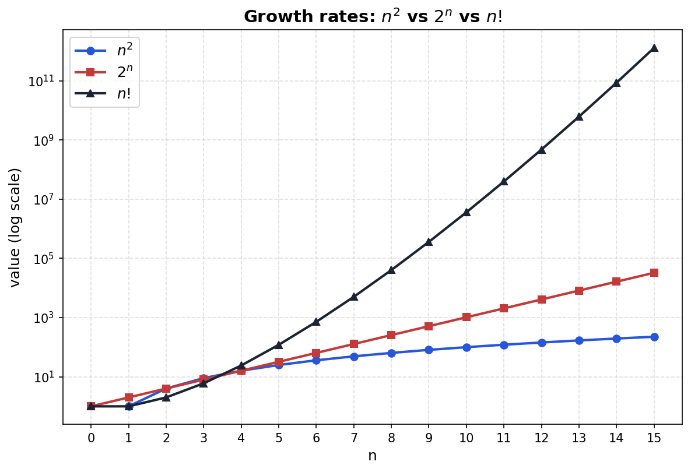
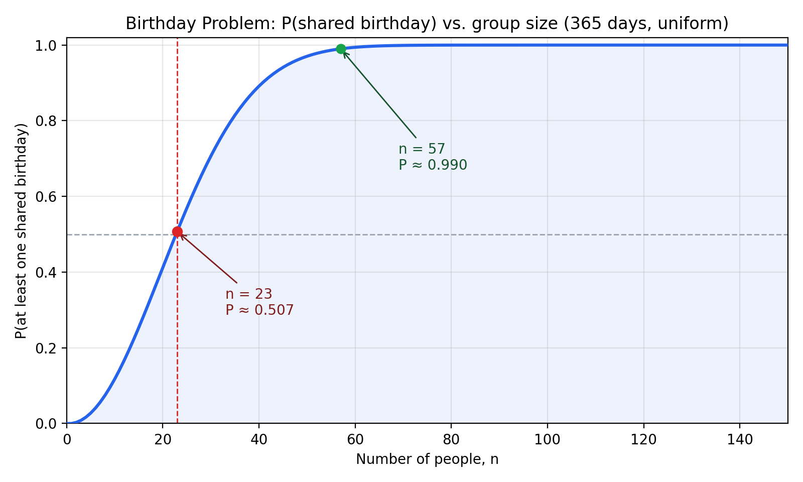

## Contents

::: {.incremental}
- **Combinatorics: Core Tools**
  - Multiplication rule, permutations, factorial
  - Repeated elements (CAT, BOB, MISSISSIPPI)
  - Binomial coefficient $\binom{n}{k}$
- **Sampling Table**
  - Order vs. replacement — four counting scenarios
  - Stars-and-bars
- **Story Proofs**
  - $\binom{n}{k}=\binom{n}{n-k}$, $\sum_k\binom{n}{k}=2^n$, Pascal's rule
- **Combinatorics in Probability**
  - Selecting groups, poker hands, random walks, birthday problem
:::

## Combinatorics

::: {.callout-note title="Definition — Combinatorics"}
**Combinatorics** is the branch of mathematics concerned with counting: determining the number of ways objects can be selected, arranged, or grouped according to a given set of rules — without necessarily listing every possibility one by one.
:::

- For us, combinatorics is the toolbox for computing $|E|$ and $|S|$ in the naive definition of probability, once listing outcomes by hand (as we did for $A_3$) stops being practical.

---

### The Multiplication Rule

::: {.callout-note title="Definition — Multiplication Rule (Rule of Product)"}
If an experiment consists of $k$ stages, where stage 1 has $n_1$ possible outcomes, stage 2 has $n_2$ possible outcomes (regardless of what happened at stage 1), ..., and stage $k$ has $n_k$ possible outcomes, then the total number of outcomes of the combined experiment is
$$n_1 \times n_2 \times \cdots \times n_k$$
:::

---

**Applying it to two dice:** stage 1 = first die (6 outcomes), stage 2 = second die (6 outcomes, regardless of what the first die showed). So
$$|S| = 6 \times 6 = 36,$$
matching what we counted directly earlier.

---

**Illustrating $2\times2$ as a tree — two coin tosses.** Every path from root to leaf is one outcome:

```{=html}
<div style="text-align:center;">
<svg width="420" height="260" viewBox="0 0 420 260" xmlns="http://www.w3.org/2000/svg" font-family="sans-serif">
<circle cx="210.0" cy="25" r="4" fill="#333"/>
<text x="210.0" y="13" font-size="13" text-anchor="middle" font-weight="bold">Toss 1</text>
<line x1="210.0" y1="30" x2="130" y2="87" stroke="#555" stroke-width="1.3"/>
<circle cx="130" cy="95" r="13" fill="#f5e6b0" stroke="#555"/>
<text x="130" y="99.5" font-size="13" text-anchor="middle" font-weight="bold">H</text>
<text x="130" y="117" font-size="10" text-anchor="middle" fill="#555">Toss 2</text>
<line x1="130" y1="123" x2="102.5" y2="166" stroke="#555" stroke-width="1"/>
<circle cx="102.5" cy="175" r="11" fill="#cfe3f7" stroke="#555"/>
<text x="102.5" y="179" font-size="11" text-anchor="middle" font-weight="bold">H</text>
<text x="102.5" y="199" font-size="11" text-anchor="middle">HH</text>
<line x1="130" y1="123" x2="157.5" y2="166" stroke="#555" stroke-width="1"/>
<circle cx="157.5" cy="175" r="11" fill="#cfe3f7" stroke="#555"/>
<text x="157.5" y="179" font-size="11" text-anchor="middle" font-weight="bold">T</text>
<text x="157.5" y="199" font-size="11" text-anchor="middle">HT</text>
<line x1="210.0" y1="30" x2="290" y2="87" stroke="#555" stroke-width="1.3"/>
<circle cx="290" cy="95" r="13" fill="#f5e6b0" stroke="#555"/>
<text x="290" y="99.5" font-size="13" text-anchor="middle" font-weight="bold">T</text>
<text x="290" y="117" font-size="10" text-anchor="middle" fill="#555">Toss 2</text>
<line x1="290" y1="123" x2="262.5" y2="166" stroke="#555" stroke-width="1"/>
<circle cx="262.5" cy="175" r="11" fill="#cfe3f7" stroke="#555"/>
<text x="262.5" y="179" font-size="11" text-anchor="middle" font-weight="bold">H</text>
<text x="262.5" y="199" font-size="11" text-anchor="middle">TH</text>
<line x1="290" y1="123" x2="317.5" y2="166" stroke="#555" stroke-width="1"/>
<circle cx="317.5" cy="175" r="11" fill="#cfe3f7" stroke="#555"/>
<text x="317.5" y="179" font-size="11" text-anchor="middle" font-weight="bold">T</text>
<text x="317.5" y="199" font-size="11" text-anchor="middle">TT</text>
<text x="210.0" y="245" font-size="14" text-anchor="middle" font-weight="bold">Total outcomes = 2 &#215; 2 = 4</text>
</svg>
</div>
```

$2 \times 2 = 4$: matches the sample space $S = \{HH, HT, TH, TT\}$ from our very first coin-toss example.

---

::: {.callout-tip title="Example 2"}
**Choosing Courses.** There are 5 math courses and 6 economics courses on offer.

a) You must choose **one** math course and **one** economics course. In how many ways can you do this?

b) Now suppose instead you must choose **two** math courses (out of the 5) and **two** economics courses (out of the 6). In how many ways can you do this?

---

**Solving (a):** two independent stages — pick the math course, then the econ course — so by the multiplication rule:
$$5 \times 6 = 30 \text{ ways}$$

**Part (b) is harder:** the multiplication rule doesn't directly tell us how many ways to choose 2 courses *out of* 5, since order doesn't matter and we haven't yet built a tool for "choosing a subset" as opposed to "filling ordered stages." We'll come back to this once we have that tool.
:::

---

### Permutations

- Suppose we want to line up $n$ people in $n$ positions (position 1, position 2, ..., position $n$).
- This is a $n$-stage experiment, so the multiplication rule applies — but with a twist compared to the dice and coins examples: **the number of choices shrinks at each stage**, because whoever fills an earlier position is no longer available for a later one.

---

| Position | Who's available | Number of choices |
|---|---|---|
| 1st | all $n$ people | $n$ |
| 2nd | anyone except the person already placed | $n-1$ |
| 3rd | anyone except the two already placed | $n-2$ |
| $\vdots$ | $\vdots$ | $\vdots$ |
| $n$-th (last) | only one person left | $1$ |

- By the multiplication rule, the total number of ways to arrange all $n$ people is
$$n \times (n-1) \times (n-2) \times \cdots \times 2 \times 1$$

---

**Concrete example: 4 people (A, B, C, D) in a line.**

- Position 1: 4 choices. Position 2: 3 choices (one person used). Position 3: 2 choices. Position 4: 1 choice (whoever's left).
- Total arrangements: $4 \times 3 \times 2 \times 1 = 24$.

::: {.callout-warning title="Contrast with the Dice/Coin Examples"}
With two dice (or two coin tosses), every stage had the *same* full set of choices available, because the outcome of the first roll doesn't remove any option from the second. Here, each position **uses up** one of the available people, so the pool shrinks — the multiplication rule still applies, but the factors decrease: $n, n-1, n-2, \dots, 1$ instead of $n, n, n, \dots, n$.
:::

---

::: {.callout-note title="Definition — Factorial"}
For a positive integer $n$, define
$$n! = n \times (n-1) \times (n-2) \times \cdots \times 2 \times 1$$
By convention, $0! = 1$.
:::

---



---

::: {.callout-important title="Combinatorial Interpretation"}
$n!$ is the number of **permutations** of $n$ distinct objects — that is, the number of different ways to arrange all $n$ of them in a sequence (a line, an order, a ranking, ...).
:::

---

How many words can you make by rearranging the letters of "CAT"?

---

- 6 words: CAT, CTA, TCA, ATC, TAC, ACT

::: {.incremental}
- How to count them systematically?
- All three letters are distinct, imagine each as a person. 
- So this is exactly the "$n$ people in a line" problem: $3! = 6$ arrangements.
- Simple: we reduced the new problem to a previously solved one!
:::
  
---

How about BOB?

:::{.incremental}
- Naive instinct: 3 letters, so $3! = 6$ arrangements? 
- But we have only: BOB, BBO, OBB. 
- Our approach fails because the two B's are **indistinguishable** — we can't treat them as distinct people. When they switch places, the word looks the same, so we are overcounting.
- Need to fix the overcount!
:::

---

Fixing the overcounting:

::: {.incremental}
- Temporarily label the two B's as $B_1$ and $B_2$, as if they were distinguishable. Now all 3 "letters" ($B_1, O, B_2$) are distinct, so there are $3! = 6$ arrangements:
- $$B_1OB_2,\; B_1B_2O,\; OB_1B_2,\; OB_2B_1,\; B_2OB_1,\; B_2B_1O$$
- Now drop the labels (i.e., stop distinguishing the B's) and see what collapses together:
  - $B_1OB_2$ and $B_2OB_1$ both become **BOB**
  - $B_1B_2O$ and $B_2B_1O$ both become **BBO**
  - $OB_1B_2$ and $OB_2B_1$ both become **OBB**
- Every real word shows up **exactly 2 times**. Why?
- Once for each way of permuting the two identical B's.
:::

---

Because each word is counted 2! times, we can fix the overcount by dividing by 2!:
$$\text{# of distinct arrangements of BOB} = \frac{3!}{2!} = \frac{6}{2} = 3$$

---

**Strategy**: 

:::{.incremental}
- Reduce to a previously solved problem, then introduce a correction factor to account for overcounting.
- General approach for any word: 
$$\text{# of distinct arrangements of a word} = \frac{n!}{k_1! k_2! \cdots k_m!}$$
where $n$ is the total number of letters, and $k_1, k_2, \dots, k_m$ are the counts of each repeated letter. 
:::

---

**Explore it yourself.** 

Type any word (up to 6 letters) below. It labels every repeated letter, lists all $n!$ labeled arrangements, and lets you click a word — or hit "highlight all clusters" — to see exactly which labeled arrangements collapse onto the same real word.

---

```{=html}
<div class="interactive-box">
<div class="perm-widget-wrap">
<style>
.perm-widget-wrap { font-family: -apple-system, Helvetica, Arial, sans-serif; color: #222; }
.perm-widget-wrap #permWordInput { font-size:16px; font-weight:600; letter-spacing:2px; text-transform:uppercase; padding:6px 10px; border-radius:6px; border:1px solid #ccc; width:140px; }
.perm-widget-wrap button { cursor: pointer; }
.perm-widget-wrap .perm-ctrl-btn { height:34px; padding:0 14px; border-radius:6px; border:1px solid #ccc; background:#fff; font-size:13px; }
.perm-widget-wrap .perm-ctrl-btn.active { background:#222; color:#fff; border-color:#222; }
.perm-widget-wrap .perm-stat-box { background:#f4f3f0; border-radius:8px; padding:0.75rem; text-align:center; }
.perm-widget-wrap .perm-stat-label { font-size:12px; color:#666; margin:0 0 2px; }
.perm-widget-wrap .perm-stat-value { font-size:20px; font-weight:600; margin:0; }
.perm-widget-wrap #permRawList { display:flex; flex-wrap:wrap; gap:6px; padding:10px; border:1px solid #ddd; border-radius:8px; max-height:280px; overflow-y:auto; }
.perm-widget-wrap .perm-raw-chip { font-size:14px; font-family: 'SF Mono', Menlo, monospace; padding:5px 10px; border-radius:6px; border:1px solid #ccc; background:#fff; transition: background 0.15s, color 0.15s, border-color 0.15s; }
.perm-widget-wrap .perm-equation { font-size:17px; font-weight:600; text-align:center; margin: 1.1rem 0 0.4rem; }
</style>
<div style="display:flex; gap:12px; align-items:flex-end; margin-bottom:1rem; flex-wrap:wrap;">
  <div>
    <label style="font-size:13px; color:#666; display:block; margin-bottom:4px;">word (letters only, max 6)</label>
    <input type="text" id="permWordInput" value="BOB" maxlength="6">
  </div>
  <div style="font-size:13px; color:#666;" id="permLetterCounts">B×2, O×1</div>
  <button class="perm-ctrl-btn" id="permAllBtn">highlight all clusters</button>
  <button class="perm-ctrl-btn" id="permResetBtn">clear</button>
</div>
<div style="display:grid; grid-template-columns:repeat(3,1fr); gap:12px; margin-bottom:1rem;">
  <div class="perm-stat-box">
    <p class="perm-stat-label">n! (labeled arrangements)</p>
    <p class="perm-stat-value" id="permStatNfact">6</p>
  </div>
  <div class="perm-stat-box">
    <p class="perm-stat-label">distinct words</p>
    <p class="perm-stat-value" id="permStatDistinct">3</p>
  </div>
  <div class="perm-stat-box">
    <p class="perm-stat-label">cluster size (k₁!k₂!...)</p>
    <p class="perm-stat-value" id="permStatCluster">2</p>
  </div>
</div>
<div id="permRawList"></div>
<p class="perm-equation" id="permEquation">3! = 3 × 2!</p>
<p style="font-size:12px; color:#666; text-align:center; margin-top:0.25rem;">
  click any labeled word to reveal its cluster · "highlight all clusters" reveals the full partition at once
</p>
</div>
</div>

<script>
(function() {
const wordInput = document.getElementById('permWordInput');
const lettersEl = document.getElementById('permLetterCounts');
const rawListEl = document.getElementById('permRawList');
const statNfact = document.getElementById('permStatNfact');
const statDistinct = document.getElementById('permStatDistinct');
const statCluster = document.getElementById('permStatCluster');
const equationEl = document.getElementById('permEquation');
const allBtn = document.getElementById('permAllBtn');
const resetBtn = document.getElementById('permResetBtn');
const SUB = {0:'₀',1:'₁',2:'₂',3:'₃',4:'₄',5:'₅',6:'₆',7:'₇',8:'₈',9:'₉'};
function toSubscript(num) { return String(num).split('').map(d => SUB[d]).join(''); }
function factorial(k) { let r = 1; for (let i = 2; i <= k; i++) r *= i; return r; }
const PALETTE = ['#0F6E56','#D85A30','#7F77DD','#BA7517','#378ADD','#B3467C','#6B8E23','#5B7C99','#8B5E3C','#946E3D'];
let mode = 'none';
let selectedPlain = null;
let tokenPermutations = [];
function permute(arr) {
  if (arr.length <= 1) return [arr];
  const result = [];
  for (let i = 0; i < arr.length; i++) {
    const rest = arr.slice(0, i).concat(arr.slice(i + 1));
    for (const p of permute(rest)) result.push([arr[i], ...p]);
  }
  return result;
}
function render() {
  let word = wordInput.value.toUpperCase().replace(/[^A-Z]/g, '');
  if (word.length === 0) word = 'A';
  wordInput.value = word;
  const counts = {};
  for (const ch of word) counts[ch] = (counts[ch] || 0) + 1;
  lettersEl.textContent = Object.keys(counts).sort().map(ch => `${ch}×${counts[ch]}`).join(', ');
  const seen = {};
  const tokens = [];
  for (const ch of word) {
    seen[ch] = (seen[ch] || 0) + 1;
    tokens.push({ letter: ch, sub: counts[ch] > 1 ? seen[ch] : null });
  }
  const n = word.length;
  const nFact = factorial(n);
  const denomVal = Object.values(counts).reduce((acc, c) => acc * factorial(c), 1);
  const denomParts = Object.keys(counts).sort().map(ch => `${counts[ch]}!`).join('');
  const perms = permute(tokens);
  const plainOrder = [];
  const plainIndex = {};
  tokenPermutations = perms.map(p => {
    const plain = p.map(t => t.letter).join('');
    const labeled = p.map(t => t.letter + (t.sub ? toSubscript(t.sub) : '')).join('');
    if (!(plain in plainIndex)) {
      plainIndex[plain] = plainOrder.length;
      plainOrder.push(plain);
    }
    return { labeled, plain, clusterIdx: plainIndex[plain] };
  });
  statNfact.textContent = nFact.toString();
  statDistinct.textContent = plainOrder.length.toString();
  statCluster.textContent = denomVal.toString();
  equationEl.textContent = `${n}! = ${plainOrder.length} × ${denomParts}`;
  rawListEl.innerHTML = '';
  tokenPermutations.forEach((tp, idx) => {
    const chip = document.createElement('div');
    chip.className = 'perm-raw-chip';
    chip.textContent = tp.labeled;
    chip.dataset.plain = tp.plain;
    chip.dataset.clusterIdx = tp.clusterIdx;
    chip.addEventListener('click', () => selectPlain(tp.plain));
    rawListEl.appendChild(chip);
  });
  mode = 'none';
  selectedPlain = null;
  applyStyles();
}
function applyStyles() {
  const chips = rawListEl.querySelectorAll('.perm-raw-chip');
  chips.forEach(chip => {
    if (mode === 'single') {
      if (chip.dataset.plain === selectedPlain) {
        chip.style.background = '#0F6E56';
        chip.style.color = '#fff';
        chip.style.borderColor = '#0F6E56';
      } else {
        chip.style.background = '#fff';
        chip.style.color = '#999';
        chip.style.borderColor = '#e0e0e0';
      }
    } else if (mode === 'all') {
      const c = PALETTE[(+chip.dataset.clusterIdx) % PALETTE.length];
      chip.style.background = c;
      chip.style.color = '#fff';
      chip.style.borderColor = c;
    } else {
      chip.style.background = '#fff';
      chip.style.color = '#222';
      chip.style.borderColor = '#ccc';
    }
  });
  allBtn.classList.toggle('active', mode === 'all');
}
function selectPlain(plain) {
  if (mode === 'single' && selectedPlain === plain) {
    mode = 'none';
    selectedPlain = null;
  } else {
    mode = 'single';
    selectedPlain = plain;
  }
  applyStyles();
}
allBtn.addEventListener('click', () => {
  mode = (mode === 'all') ? 'none' : 'all';
  selectedPlain = null;
  applyStyles();
});
resetBtn.addEventListener('click', () => {
  mode = 'none';
  selectedPlain = null;
  applyStyles();
});
wordInput.addEventListener('input', render);
render();
})();
</script>
```

---

:::: {.callout-caution title="Practice Question 2" appearance="minimal"}
Consider the word **MISSISSIPPI**.

a) How many distinct arrangements of its letters are there?

b) *(Bonus)* How many of these arrangements have all four I's appearing together, as a single block?
::::

---

::: {.callout-tip title="Solution" collapse="true"}
**a)** MISSISSIPPI has 11 letters, with multiplicities $M{=}1$, $I{=}4$, $S{=}4$, $P{=}2$ (check: $1+4+4+2=11$ ✓). By the formula for permutations with repeated elements:
$$\frac{11!}{1!\,4!\,4!\,2!} = \frac{39{,}916{,}800}{1 \times 24 \times 24 \times 2} = \frac{39{,}916{,}800}{1{,}152} = 34{,}650$$

**b)** Glue the four I's into a single block, "$\text{IIII}$". Now we're arranging 8 units: $M, \text{[IIII]}, S, S, S, S, P, P$ — that's $1$ M, $1$ block, $4$ S's, $2$ P's, totaling 8 units. Same formula:
$$\frac{8!}{1!\,1!\,4!\,2!} = \frac{40{,}320}{1 \times 1 \times 24 \times 2} = \frac{40{,}320}{48} = 840$$

(Note the block itself contributes no further arrangements internally, since all four I's are identical — there's only $4!/4! = 1$ way to arrange them within the block.)
:::

---

**Counting ones and zeros**

::: {.incremental}
- A binary sequence of length $n$ is just a string of $n$ digits, each either $0$ or $1$.
- **How many binary sequences of length $n$ are there?**
  - Each digit has 2 choices, it can be 0 or 1.
  - There are $n$ digits, so by the multiplication rule, there are $2\times 2 \times \cdots \times 2 = 2^n$ binary sequences of length $n$.
- **How many binary sequences of length $n$ have exactly $k$ ones?**
  - For example, for $n=3$ and $k=2$, the sequences are: (110, 101, 011) — so there are 3 sequences.
  - How to count systematically? We can reduce this to a previously solved problem.
:::

---

**Strategy: reduce to a previously solved problem.**

::: {.incremental}
- A binary sequence of length $n$ with exactly $k$ ones is just a string of $n$ digits, $k$ of which are 1's and the remaining $n-k$ are 0's.
- This is exactly the same as arranging $n$ symbols, where 
  - $k$ are one type (1's) and 
  - $n-k$ are another type (0's). 
- We already solved this problem in the "distinct arrangements of a word" section — the answer is
$$\frac{n!}{k!\,(n-k)!}$$
:::

---

**Choosing a team**

From a group of $130$ people, how many different teams of size $5$ can be formed? (Order within the team doesn't matter — a team is just a subset of people.)

---

**Again simplify the numbers to count manually**

:::{.incremental}
- Take: $n=3$, $k=2$. Let people be $A, B, C$. 
- Count by hand: $\{\{A,B\}, \{A,C\}, \{B,C\}\}$, so there are 3 teams.
- To count systematically, notice that we must decide for each person whether they're on the team or not. 
:::

---

**Strategy: encoding to reduce to previously solved problem.** 

::: {.incremental}
- Line up all $n$ people in a fixed order. 
- For any team, write $1$ under each person who's on the team and $0$ under each person who isn't. 
- This turns every team into a binary sequence of length $n$ — and every binary sequence of length $n$ decodes back into exactly one team.
- So teams and binary sequences are in one-to-one and onto correspondence (bijection).
- If we know how to count the binary sequences, we know how to count the teams!
:::

---


| Team | $A$ | $B$ | $C$ |
|:---:|:---:|:---:|:---:|
| $\{A,B\}$ | $1$ | $1$ | $0$ |
| $\{A,C\}$ | $1$ | $0$ | $1$ |
| $\{B,C\}$ | $0$ | $1$ | $1$ |

---

From a group of $130$ people, how many different teams of size $5$ can be formed? (Order within the team doesn't matter — a team is just a subset of people.)

::: {.incremental}
- By the encoding argument, this is the same as counting binary sequences of length $130$ with exactly $5$ ones. 
- By the formula we derived earlier, the answer is
$$\frac{130!}{5! 125!} = \frac{130 \times 129 \times 128 \times 127 \times 126}{5 \times 4 \times 3 \times 2 \times 1} = 2{,}421{,}303{,}200$$
- So there are over 2 billion different teams of size 5 that can be formed from 130 people!
- General formula: the number of teams of size $k$ from a group of $n$ people is
$$\frac{n!}{k!\,(n-k)!}$$
:::

---

::: {.callout-note title="Definition — Bijection"}
A function $f: A \to B$ is a **bijection** if it pairs up every element of $A$ with exactly one element of $B$, and every element of $B$ is paired with exactly one element of $A$ — nothing on either side is left out or used twice.
:::


---

Our encoding creates a bijection between the set of teams of size $k$ from $n$ people and the set of binary sequences of length $n$ with exactly $k$ ones.

---

::: {.callout-important title="Key Counting Principle"}
If a bijection exists between two finite sets $A$ and $B$, then $|A| = |B|$.

So to count a set that's awkward to count directly, it's enough to find *any* bijection between it and a set we already know how to count.
:::

---

:::: {.callout-caution title="Practice Question 3" appearance="minimal"}
Consider two sets, A and B, each with 4 elements. 

a) How many bijections exist from A to B?

b) How many bijections exist from A to itself, such that no element maps to itself? (This is called a **derangement**.)
::::

---

::: {.callout-note title="Definition — Binomial Coefficient"}
For integers $n \geq 0$ and $0 \leq k \leq n$, the **binomial coefficient** is
$$\binom{n}{k} = \frac{n!}{k!\,(n-k)!}$$
Read aloud as "$n$ choose $k$."
:::

---

::: {.callout-important title="Combinatorial Interpretation of Binomial Coefficient"}
$\binom{n}{k}$ is the number of ways to choose a subset of size $k$ from a set of $n$ distinct objects. Everything we've built up to now is really the same quantity in disguise:

- the number of teams of size $k$ from $n$ people,
- the number of binary sequences of length $n$ with exactly $k$ ones (or, equivalently, $k$ zeros),
- the number of distinct arrangements of $n$ symbols where $k$ are one type and $n-k$ are another.
:::

---

**Revisiting: Choosing Courses**

Recall the earlier problem: 5 math courses, 6 econ courses. Now let's redo it with the binomial coefficient formally in hand — including part (b), which we set aside in Example 2.

a) Choose 1 math course and 1 econ course. In how many ways?

b) **Choose 2 math courses and 2 econ courses. In how many ways?**


---

To solve the problem, break it into parts:

::: {.incremental}

- Choosing 2 out of 5 (math courses):
$$\binom{5}{2} = \frac{5!}{2!\,3!} = \frac{120}{2 \times 6} = 10$$

- Choosing 2 out of 6 (econ courses):
$$\binom{6}{2} = \frac{6!}{2!\,4!} = \frac{720}{2 \times 24} = 15$$

- Combine the two independent stages using the multiplication rule:
$$\binom{5}{2} \times \binom{6}{2} = 10 \times 15 = 150$$
:::

---

::: {.callout-important title="Three Problem-Solving Techniques (So Far)"}
1. **Count by hand with small numbers first to understand the problem.** Before reaching for a general formula, work out a tiny concrete case explicitly (two dice summing to 3, BOB's three arrangements, 3 people choosing a team of 2). This builds the intuition the formula is supposed to capture, and gives you a number to check the formula against once you have it.

2. **Reduce to a problem you already know how to solve.** Look for a way to reframe an unfamiliar problem as one you've already solved — either by *temporarily simplifying an assumption* (pretend BOB's two B's are distinguishable, solve the easy "all distinct" version, then correct for the overcounting) or by *encoding* it as a different but equivalent object (a team of people ↔ a binary sequence).

3. **Break a complex problem into independent stages, and multiply.** Whenever a choice splits into a sequence of smaller decisions — each with its own count of options, regardless of the others — the multiplication rule turns the whole problem into a product of easy pieces (two dice, two coin tosses, or "choose the math courses, then choose the econ courses").
:::

---

:::: {.callout-caution title="Practice Question 4 — Count By Hand (Intro · Manual Enumeration)" appearance="minimal"}
Ann, Ben, and Cleo sit in a row of 3 seats. By listing out all the seating arrangements, count how many of them have **Ann not in the middle seat**.
::::
---

:::: {.callout-caution title="Practice Question 5 — Reduce to a Known Problem (Standard · Encoding)" appearance="minimal"}
On a city grid, you can only move **right** (R) or **up** (U), one block at a time. To get from point $A$ to point $B$, you need exactly 4 moves right and 3 moves up (7 moves total). How many different shortest paths are there from $A$ to $B$?
::::

---

:::: {.callout-caution title="Practice Question 6 — Break Into Independent Stages (Standard · Multiplication Rule)" appearance="minimal"}
A university committee needs 2 faculty members chosen from 5 eligible faculty, and 3 student representatives chosen from 8 eligible students. Afterward, one of the two chosen faculty members must be designated committee chair. How many different committees (including the chair designation) can be formed?
::::

---

**General approach**

To recognize when differently sounding problems have the same combinatorial structure, it is useful to keep in mind the following general framework for counting:

::: {.incremental}
- Imagine we are choosing (sampling) $k$ objects from a set of $n$ distinct objects, one by one. There are two key questions to ask:
  - **Order:** does the *order* of selection matter?
  - **Replacement:** do we choose *with* or *without* replacement? (can we choose the same object more than once?)

- We want to count how many choices we have in each of the four resulting scenarios. 
:::

---

## Sampling Table

::: {.fragment}
<table style="width:100%; border-collapse: collapse; text-align:center;">
<tr>
  <th style="border: 1px solid #333; padding: 8px;"></th>
  <th style="border: 1px solid #333; padding: 8px;">Order matters</th>
  <th style="border: 1px solid #333; padding: 8px;">Order doesn't matter</th>
</tr>
<tr>
  <td style="border: 1px solid #333; padding: 8px; text-align:left;"><strong>With replacement</strong></td>
  <td style="border: 1px solid #333; padding: 8px;"></td>
  <td style="border: 1px solid #333; padding: 8px;"></td>
</tr>
<tr>
  <td style="border: 1px solid #333; padding: 8px; text-align:left;"><strong>Without replacement</strong></td>
  <td style="border: 1px solid #333; padding: 8px;"></td>
  <td style="border: 1px solid #333; padding: 8px;"></td>
</tr>
</table>
:::

---

How many ways are there to distribute certain medals to a class of $n$ students? 

:::{.incremental}
- Math and Econ medal
- Gold and Silver Math medals (must give one per person)
- Two Math medals (must give at most one per person)
- Two Math medals (can give more than one per person)
:::

---

Which corner of the sampling table does each scenario belong to?

:::: {.columns}

::: {.column width="55%"}
**Problems**

1. Math and Econ medal
2. Gold and Silver medals
3. Two Math medals
4. Two Math medals — can give more than one to the same person
:::

::: {.column width="45%"}
**Categories**

- (a) Without replacement, unordered
- (b) With replacement, ordered
- (c) With replacement, unordered
- (d) Without replacement, ordered
:::

::::


---

**Math and Econ medals**

:::{.incremental}
- Imaging distributing the medals one by one, first chosen student gets Math, second gets Econ
  - $n$ choices for Math
  - $n$ choices for Econ
  - combine the two: 
  $$n^2$$
- Here **order matters** (first got gold, second got silver)
- and we choose **with replacement** since the same student can be chosen twice.
- Generally, $n$ students and $k$ distinct medals: $$n^k.$$ 
:::

---

<table style="width:100%; border-collapse: collapse; text-align:center;">
<tr>
  <th style="border: 1px solid #333; padding: 8px;"></th>
  <th style="border: 1px solid #333; padding: 8px;">Order matters</th>
  <th style="border: 1px solid #333; padding: 8px;">Order doesn't matter</th>
</tr>
<tr>
  <td style="border: 1px solid #333; padding: 8px; text-align:left;"><strong>With replacement</strong></td>
  <td style="border: 1px solid #333; padding: 8px; background-color: #fff3cd;">Math and Econ medals, $n^k$</td>
  <td style="border: 1px solid #333; padding: 8px;"></td>
</tr>
<tr>
  <td style="border: 1px solid #333; padding: 8px; text-align:left;"><strong>Without replacement</strong></td>
  <td style="border: 1px solid #333; padding: 8px;"></td>
  <td style="border: 1px solid #333; padding: 8px;"></td>
</tr>
</table>

---

**Gold and Silver Math medals (must give one per person)
**

:::{.incremental}
- Imaging distributing the medals one by one, first chosen student gets Gold, second gets Silver
  - $n$ choices for Gold
  - but $n-1$ choices for Silver
  - combine the two: 
  $$n(n-1)=\frac{n!}{(n-2)!}$$
- Here **order matters** (first got gold, second got silver)
- and we choose **without replacement** since the same student **cannot** be chosen twice.
- Generally, $n$ students and $k$ distinct medals: $$\frac{n!}{(n-k)!}.$$ 
:::

---

<table style="width:100%; border-collapse: collapse; text-align:center;">
<tr>
  <th style="border: 1px solid #333; padding: 8px;"></th>
  <th style="border: 1px solid #333; padding: 8px;">Order matters</th>
  <th style="border: 1px solid #333; padding: 8px;">Order doesn't matter</th>
</tr>
<tr>
  <td style="border: 1px solid #333; padding: 8px; text-align:left;"><strong>With replacement</strong></td>
  <td style="border: 1px solid #333; padding: 8px; background-color: #fff3cd;">$n^k$</td>
  <td style="border: 1px solid #333; padding: 8px;"></td>
</tr>
<tr>
  <td style="border: 1px solid #333; padding: 8px; text-align:left;"><strong>Without replacement</strong></td>
  <td style="border: 1px solid #333; padding: 8px; background-color: #d1e7fd;">$\dfrac{n!}{(n-k)!}$</td>
  <td style="border: 1px solid #333; padding: 8px;"></td>
</tr>
</table>


---

**Two Math Medals (at most one per person)**

::: {.incremental}
- Same setup, but the two medals are identical.
- This is the same as choosing a team of 2 out of $n$ people, hence $$\binom{n}{2}$$
- Here **order doesn't matter** (the two medals are indistinguishable)
- and we choose **without replacement** (same student can't get both).
- Generally, $n$ students and $k$ identical medals: $$\binom{n}{k} = \frac{n!}{k!(n-k)!}.$$
:::

---

<table style="width:100%; border-collapse: collapse; text-align:center;">
<tr>
  <th style="border: 1px solid #333; padding: 8px;"></th>
  <th style="border: 1px solid #333; padding: 8px;">Order matters</th>
  <th style="border: 1px solid #333; padding: 8px;">Order doesn't matter</th>
</tr>
<tr>
  <td style="border: 1px solid #333; padding: 8px; text-align:left;"><strong>With replacement</strong></td>
  <td style="border: 1px solid #333; padding: 8px; background-color: #fff3cd;">$n^k$</td>
  <td style="border: 1px solid #333; padding: 8px;"></td>
</tr>
<tr>
  <td style="border: 1px solid #333; padding: 8px; text-align:left;"><strong>Without replacement</strong></td>
  <td style="border: 1px solid #333; padding: 8px; background-color: #d1e7fd;">$\dfrac{n!}{(n-k)!}$</td>
  <td style="border: 1px solid #333; padding: 8px; background-color: #d4edda;">$\dbinom{n}{k}$</td>
</tr>
</table>

---

**Two Math Medals, Repetition Allowed
**

- Simplify - three students — Alice, Bob, Carol
- A student may receive 0, 1, or both.

::: {.fragment}
<table style="width:100%; border-collapse: collapse; text-align:center;">
<tr>
  <th style="border: 1px solid #333; padding: 8px;">#</th>
  <th style="border: 1px solid #333; padding: 8px;">Alice</th>
  <th style="border: 1px solid #333; padding: 8px;">Bob</th>
  <th style="border: 1px solid #333; padding: 8px;">Carol</th>
</tr>
<tr>
  <td style="border: 1px solid #333; padding: 8px;">1</td>
  <td style="border: 1px solid #333; padding: 8px;">••</td>
  <td style="border: 1px solid #333; padding: 8px;"></td>
  <td style="border: 1px solid #333; padding: 8px;"></td>
</tr>
<tr>
  <td style="border: 1px solid #333; padding: 8px;">2</td>
  <td style="border: 1px solid #333; padding: 8px;"></td>
  <td style="border: 1px solid #333; padding: 8px;">••</td>
  <td style="border: 1px solid #333; padding: 8px;"></td>
</tr>
<tr>
  <td style="border: 1px solid #333; padding: 8px;">3</td>
  <td style="border: 1px solid #333; padding: 8px;"></td>
  <td style="border: 1px solid #333; padding: 8px;"></td>
  <td style="border: 1px solid #333; padding: 8px;">••</td>
</tr>
<tr>
  <td style="border: 1px solid #333; padding: 8px;">4</td>
  <td style="border: 1px solid #333; padding: 8px;">•</td>
  <td style="border: 1px solid #333; padding: 8px;">•</td>
  <td style="border: 1px solid #333; padding: 8px;"></td>
</tr>
<tr>
  <td style="border: 1px solid #333; padding: 8px;">5</td>
  <td style="border: 1px solid #333; padding: 8px;">•</td>
  <td style="border: 1px solid #333; padding: 8px;"></td>
  <td style="border: 1px solid #333; padding: 8px;">•</td>
</tr>
<tr>
  <td style="border: 1px solid #333; padding: 8px;">6</td>
  <td style="border: 1px solid #333; padding: 8px;"></td>
  <td style="border: 1px solid #333; padding: 8px;">•</td>
  <td style="border: 1px solid #333; padding: 8px;">•</td>
</tr>
</table>
:::

::: {.fragment}
**6 ways** to distribute 2 identical medals among 3 students.
:::

---

**Strategy: encoding**

Two dividers split the row into 3 groups (Alice | Bob | Carol); two dots mark the medals. Reading left to right: let **0** = a medal, **1** = a divider.

::: {.fragment}
<table style="width:100%; border-collapse: collapse; text-align:center;">
<tr>
  <th style="border: 1px solid #333; padding: 6px 10px;">#</th>
  <th style="border: 1px solid #333; padding: 6px 10px;">Alice</th>
  <th style="border: 1px solid #333; padding: 6px 10px;">Bob</th>
  <th style="border: 1px solid #333; padding: 6px 10px;">Carol</th>
  <th style="border: 1px solid #333; padding: 6px 10px;">Encoding</th>
</tr>
<tr>
  <td style="border: 1px solid #333; padding: 6px 10px;">1</td>
  <td style="border: 1px solid #333; padding: 6px 10px;">••</td>
  <td style="border: 1px solid #333; padding: 6px 10px;"></td>
  <td style="border: 1px solid #333; padding: 6px 10px;"></td>
  <td style="border: 1px solid #333; padding: 6px 10px;">$0\,0\,1\,1$</td>
</tr>
<tr>
  <td style="border: 1px solid #333; padding: 6px 10px;">2</td>
  <td style="border: 1px solid #333; padding: 6px 10px;"></td>
  <td style="border: 1px solid #333; padding: 6px 10px;">••</td>
  <td style="border: 1px solid #333; padding: 6px 10px;"></td>
  <td style="border: 1px solid #333; padding: 6px 10px;">$1\,0\,0\,1$</td>
</tr>
<tr>
  <td style="border: 1px solid #333; padding: 6px 10px;">3</td>
  <td style="border: 1px solid #333; padding: 6px 10px;"></td>
  <td style="border: 1px solid #333; padding: 6px 10px;"></td>
  <td style="border: 1px solid #333; padding: 6px 10px;">••</td>
  <td style="border: 1px solid #333; padding: 6px 10px;">$1\,1\,0\,0$</td>
</tr>
<tr>
  <td style="border: 1px solid #333; padding: 6px 10px;">4</td>
  <td style="border: 1px solid #333; padding: 6px 10px;">•</td>
  <td style="border: 1px solid #333; padding: 6px 10px;">•</td>
  <td style="border: 1px solid #333; padding: 6px 10px;"></td>
  <td style="border: 1px solid #333; padding: 6px 10px;">$0\,1\,0\,1$</td>
</tr>
<tr>
  <td style="border: 1px solid #333; padding: 6px 10px;">5</td>
  <td style="border: 1px solid #333; padding: 6px 10px;">•</td>
  <td style="border: 1px solid #333; padding: 6px 10px;"></td>
  <td style="border: 1px solid #333; padding: 6px 10px;">•</td>
  <td style="border: 1px solid #333; padding: 6px 10px;">$0\,1\,1\,0$</td>
</tr>
<tr>
  <td style="border: 1px solid #333; padding: 6px 10px;">6</td>
  <td style="border: 1px solid #333; padding: 6px 10px;"></td>
  <td style="border: 1px solid #333; padding: 6px 10px;">•</td>
  <td style="border: 1px solid #333; padding: 6px 10px;">•</td>
  <td style="border: 1px solid #333; padding: 6px 10px;">$1\,0\,1\,0$</td>
</tr>
</table>
:::

---

<table style="width:100%; border-collapse: collapse; text-align:center;">
<tr>
  <th style="border: 1px solid #333; padding: 6px 10px;">#</th>
  <th style="border: 1px solid #333; padding: 6px 10px;">Alice</th>
  <th style="border: 1px solid #333; padding: 6px 10px;">Bob</th>
  <th style="border: 1px solid #333; padding: 6px 10px;">Carol</th>
  <th style="border: 1px solid #333; padding: 6px 10px;">Encoding</th>
</tr>
<tr>
  <td style="border: 1px solid #333; padding: 6px 10px;">1</td>
  <td style="border: 1px solid #333; padding: 6px 10px;">••</td>
  <td style="border: 1px solid #333; padding: 6px 10px;"></td>
  <td style="border: 1px solid #333; padding: 6px 10px;"></td>
  <td style="border: 1px solid #333; padding: 6px 10px;">$0\,0\,1\,1$</td>
</tr>
<tr>
  <td style="border: 1px solid #333; padding: 6px 10px;">2</td>
  <td style="border: 1px solid #333; padding: 6px 10px;"></td>
  <td style="border: 1px solid #333; padding: 6px 10px;">••</td>
  <td style="border: 1px solid #333; padding: 6px 10px;"></td>
  <td style="border: 1px solid #333; padding: 6px 10px;">$1\,0\,0\,1$</td>
</tr>
<tr>
  <td style="border: 1px solid #333; padding: 6px 10px;">3</td>
  <td style="border: 1px solid #333; padding: 6px 10px;"></td>
  <td style="border: 1px solid #333; padding: 6px 10px;"></td>
  <td style="border: 1px solid #333; padding: 6px 10px;">••</td>
  <td style="border: 1px solid #333; padding: 6px 10px;">$1\,1\,0\,0$</td>
</tr>
<tr>
  <td style="border: 1px solid #333; padding: 6px 10px;">4</td>
  <td style="border: 1px solid #333; padding: 6px 10px;">•</td>
  <td style="border: 1px solid #333; padding: 6px 10px;">•</td>
  <td style="border: 1px solid #333; padding: 6px 10px;"></td>
  <td style="border: 1px solid #333; padding: 6px 10px;">$0\,1\,0\,1$</td>
</tr>
<tr>
  <td style="border: 1px solid #333; padding: 6px 10px;">5</td>
  <td style="border: 1px solid #333; padding: 6px 10px;">•</td>
  <td style="border: 1px solid #333; padding: 6px 10px;"></td>
  <td style="border: 1px solid #333; padding: 6px 10px;">•</td>
  <td style="border: 1px solid #333; padding: 6px 10px;">$0\,1\,1\,0$</td>
</tr>
<tr>
  <td style="border: 1px solid #333; padding: 6px 10px;">6</td>
  <td style="border: 1px solid #333; padding: 6px 10px;"></td>
  <td style="border: 1px solid #333; padding: 6px 10px;">•</td>
  <td style="border: 1px solid #333; padding: 6px 10px;">•</td>
  <td style="border: 1px solid #333; padding: 6px 10px;">$1\,0\,1\,0$</td>
</tr>
</table>

::: {.fragment}
Every sequence has exactly $k=2$ zeros and $n-1=2$ ones, laid out in $n+k-1=4$ total slots. Choosing **which** $k$ of the $4$ positions are zeros fixes the whole sequence:
$$\binom{n+k-1}{k} = \binom{4}{2} = 6$$
:::

---

<table style="width:100%; border-collapse: collapse; text-align:center;">
<tr>
  <th style="border: 1px solid #333; padding: 8px;"></th>
  <th style="border: 1px solid #333; padding: 8px;">Order matters</th>
  <th style="border: 1px solid #333; padding: 8px;">Order doesn't matter</th>
</tr>
<tr>
  <td style="border: 1px solid #333; padding: 8px; text-align:left;"><strong>With replacement</strong></td>
  <td style="border: 1px solid #333; padding: 8px; background-color: #fff3cd;">$n^k$</td>
  <td style="border: 1px solid #333; padding: 8px; background-color: #f8d7da;">$\dbinom{n+k-1}{k}$</td>
</tr>
<tr>
  <td style="border: 1px solid #333; padding: 8px; text-align:left;"><strong>Without replacement</strong></td>
  <td style="border: 1px solid #333; padding: 8px; background-color: #d1e7fd;">$\dfrac{n!}{(n-k)!}$</td>
  <td style="border: 1px solid #333; padding: 8px; background-color: #d4edda;">$\dbinom{n}{k}$</td>
</tr>
</table>

---

**Story proofs: interpret combinatorial expressions
**

Prove that:

$$\binom{n}{k}=\binom{n}{n-k}$$

::: {.incremental}
- **Algebraic proof:** $\dbinom{n}{n-k} = \dfrac{n!}{(n-k)!\,(n-(n-k))!} = \dfrac{n!}{(n-k)!\,k!} = \dbinom{n}{k}.$
- **Story proof:** choosing a team of $k$ people from $n$ is the same as choosing which $n-k$ people to *leave out* — so both sides count the number of teams of size $k$.
:::

---

**The Idea Behind a Story Proof
**

::: {.fragment}
To show $A = B$, find a single set of objects and **count it two different ways**:
:::

::: {.fragment}
- one way of counting gives $A$
- another way of counting gives $B$
- since both count the same objects, $A = B$
:::

::: {.fragment}
No algebra required — and often more insightful, since it explains *why* the identity holds, not just *that* it holds.
:::

---

**Sum of Binomial Coefficients
**

Prove that:
$$\sum_{k=0}^{n} \binom{n}{k} = \binom{n}{0}+\binom{n}{1}+\ldots+\binom{n}{n} \overset{?}{=} 2^n$$

::: {.incremental}
- **Algebraic proof:** ????
- **Story proof:** both sides count the number of binary sequences of length $n$.
:::

---

$$\binom{n}{0}+\binom{n}{1}+\ldots+\binom{n}{n}$$


::: {.incremental}
- Number of sequences with only 0's ($k=0$ ones): $\binom{n}{0}$
- Number of sequences with exactly one 1 ($k=1$): $\binom{n}{1}$
- Number of sequences with exactly two 1's ($k=2$): $\binom{n}{2}$
- $\vdots$
- Number of sequences with only 1's ($k=n$): $\binom{n}{n}$
- Every sequence has *some* number of 1's between $0$ and $n$, and no sequence is counted twice — so summing over $k$ counts every sequence exactly once:
  $$\sum_{k=0}^n \binom{n}{k} = \underbrace{2^n}_{\text{total sequences}}$$
:::

---

::: {.callout-caution title="Practice Question"}
Give a story proof of Pascal's rule: for $1 \le k \le n$,
$$\binom{n}{k} = \binom{n-1}{k-1} + \binom{n-1}{k}.$$

*Hint:* consider choosing a committee of size $k$ from $n$ people, one of whom is Nurlan. Split into cases based on whether Nurlan is on the committee.
:::

::: {.callout-caution title="Practice Question"}
Give a story proof that, for $1 \le k \le n$,
$$k\binom{n}{k} = n\binom{n-1}{k-1}.$$

*Hint:* consider choosing a committee of size $k$ from $n$ people, one of whom will be designated chair. Count the possibilities two ways: chair first vs. committee first.
:::

---

## Combinatorics in probability calculations

::: {.incremental}
- Naive definition = counting
- If the problem fits the naive definition (typically some symmetry), start by recalling the formula first:
$$P(A)=\frac{|A|}{|S|}.$$
- Usually $|S|$ is easy, start counting first.
- $A$ is always a subset of $S$, count it next (typically a hard part)
:::

---

**Problem 1:** 

:::{.incremental}
- Class has 70 girls and 60 boys
- Randomnly choose 5 people (what does it mean randomly?)
- What is the probability that all 5 chosen are girls?
:::

---

**Approach 1 — unordered sample space (combinations)**

::: {.incremental}
- Randomly: experiment where a group of 5 people is chosen such that each possible 5-people group is equally likely to be chosen.
- Sample space: all ways to pick 5 people group out of 130: 
  - Choosing when order does not matter, without replacement — $\binom{130}{5}$ equally likely outcomes.
- Event A: all ways to pick 5 people from the 70 girls — $\binom{70}{5}$.
- $$P(A) = \frac{\binom{70}{5}}{\binom{130}{5}} = \approx 0.042282$$
:::

---


**Approach 2 — ordered sample space (permutations)**

::: {.incremental}
- Randomly: experiment where where a line is form of 5 people such that each possible 5-people line is equally likely to be formed.
- Sample space: all ways to line up 5 people out of 130:
  - Order matters, without replacement — $130\cdot129\cdot128\cdot127\cdot126$ equally likely outcomes.
- Event A: all 5 people in a line come from the 70 girls — $70\cdot69\cdot68\cdot67\cdot66$.
- $$P(A) = \frac{70\cdot69\cdot68\cdot67\cdot66}{130\cdot129\cdot128\cdot127\cdot126} = \approx 0.042282$$
:::

::: {.fragment}
Same answer either way — imposing an order on selection multiplies both numerator and favorable count by the same $5!$, so it cancels out of the ratio.
:::

---

**Problem 2:** A 5-card hand is dealt from a standard 52-card deck (13 ranks, 4 suites). 

:::{.incremental}
- What is the probability the hand contains exactly two pairs — two cards of one rank, two of another rank, and one card of a third, different rank?
:::


---

:::{.inremental}
- Experiment: choosing a 5-card hand, so that all hands are equally likely to be chosen.
- First count the sample space S, all possible hands: $$\binom{52}{5}=2598960$$
- Then count event A: how many hands out of 2598960 are such that they contain exactly two pairs. 
:::

---

The event "two pairs":

::: {.incremental}
- A hand of "two pair" has 3 distinct ranks involved: two ranks contribute **2 cards each** (the pairs), one rank contributes **1 card**. Total: $2+2+1=5$ cards.
- The deck has $13$ ranks, each with $4$ suits.
- We build the hand in 4 independent choices:
  1. **Which 2 ranks** form the pairs: $\binom{13}{2}$
  2. **Which 2 suits** for each of those ranks (2 out of 4 suits per rank, chosen independently for each of the 2 pair-ranks): $\binom{4}{2}$ each, so $\binom{4}{2}^2$
  3. **Which rank** the 5th card comes from — must differ from the 2 pair-ranks, so $11$ remaining choices: $\binom{11}{1}$
  4. **Which suit** for that 5th card: $\binom{4}{1}$
:::

:::

---

The event "two pairs":

::: {.fragment}
$$\binom{13}{2}\binom{4}{2}^2\binom{11}{1}\binom{4}{1} = 78 \cdot 36 \cdot 11 \cdot 4 = 123{,}552$$
:::

and combine: 

::: {.fragment}
$$P(\text{two pair}) = \frac{123{,}552}{\binom{52}{5}} = \frac{123{,}552}{2{,}598{,}960} \approx 0.0475$$
:::


---

**Problem: random binary price movement:** 

Shares of a company start at price $100 and follow a simple law of movement: each day, the price randomly moves up $1 or down $1.

:::{.incremental}
- What is the probability the in 10 days the price will stay the same (Event $A_{100}$)?
- What is the probability the in 10 days the price will be greater or equal to $105 (Event $A_{\geq 105})$? 
:::

---

```{=html}
<style>
  .rw-wrap {
    font-family: -apple-system, "Segoe UI", Helvetica, Arial, sans-serif;
    max-width: 860px;
    margin: 0 auto;
    color: #1f2937;
  }
  .rw-title {
    font-size: 18px;
    font-weight: 600;
    margin: 0 0 4px 0;
  }
  .rw-subtitle {
    font-size: 13px;
    color: #6b7280;
    margin: 0 0 12px 0;
  }
  .rw-controls {
    display: flex;
    align-items: center;
    gap: 10px;
    flex-wrap: wrap;
    margin-bottom: 10px;
  }
  .rw-btn {
    font-size: 14px;
    font-weight: 600;
    padding: 8px 16px;
    border-radius: 6px;
    border: none;
    cursor: pointer;
    transition: opacity 0.15s ease;
  }
  .rw-btn:hover { opacity: 0.85; }
  .rw-btn:active { opacity: 0.7; }
  .rw-btn-primary { background: #2563eb; color: #ffffff; }
  .rw-btn-secondary { background: #e5e7eb; color: #1f2937; }
  .rw-btn-reset { background: #ffffff; color: #dc2626; border: 1.5px solid #dc2626; }
  .rw-stats {
    font-size: 13px;
    color: #374151;
    margin-bottom: 10px;
    display: flex;
    gap: 18px;
    flex-wrap: wrap;
  }
  .rw-stats b { color: #111827; }
  .rw-legend {
    display: flex;
    gap: 16px;
    font-size: 12px;
    color: #4b5563;
    margin-bottom: 6px;
  }
  .rw-legend span { display: inline-flex; align-items: center; gap: 5px; }
  .rw-dot { width: 10px; height: 10px; border-radius: 50%; display: inline-block; }
  .rw-svg-box { background: #ffffff; border: 1px solid #e5e7eb; border-radius: 8px; }
  .rw-caption {
    font-size: 12px;
    color: #6b7280;
    margin-top: 8px;
  }
</style>

<div class="rw-wrap">
  <p class="rw-title">Random Binary Price Walk</p>
  <p class="rw-subtitle">Start price = 100. Each of 10 steps: +1 tick or &minus;1 tick, equally likely, independent of the past.</p>

  <div class="rw-controls">
    <button class="rw-btn rw-btn-primary" id="addBtn">Add trajectory</button>
    <button class="rw-btn rw-btn-secondary" id="addTenBtn">Add 10</button>
    <button class="rw-btn rw-btn-reset" id="resetBtn">Reset</button>
  </div>

  <div class="rw-stats">
    <span>Trajectories: <b id="statCount">0</b></span>
    <span>Mean final price: <b id="statMean">&mdash;</b></span>
    <span>Std. dev.: <b id="statStd">&mdash;</b></span>
  </div>

  <div class="rw-legend">
    <span><span class="rw-dot" style="background:#16a34a;"></span> ended above 100</span>
    <span><span class="rw-dot" style="background:#dc2626;"></span> ended below 100</span>
    <span><span class="rw-dot" style="background:#6b7280;"></span> ended at 100</span>
  </div>

  <div class="rw-svg-box">
    <svg id="walkSvg" viewBox="0 0 820 430" style="width:100%;height:auto;display:block;"></svg>
  </div>

  <p class="rw-caption">The right-hand panel accumulates the final (step-10) price of every trajectory drawn so far. As trajectories pile up, its shape converges to Binomial(10, &frac12;) shifted to a mean of 100 &mdash;.</p>
</div>

<script>
(function () {
  // ---------- config ----------
  var START_PRICE = 100;
  var STEPS = 10;
  var W = 820, H = 430;
  var margin = { top: 40, right: 16, bottom: 46, left: 50 };
  var gap = 22;
  var histW = 160;
  var plotW = W - margin.left - margin.right - gap - histW;
  var plotH = H - margin.top - margin.bottom;
  var yMin = 88, yMax = 112;
  var histX0 = margin.left + plotW + gap;

  var svg = document.getElementById('walkSvg');
  var NS = 'http://www.w3.org/2000/svg';

  function xScale(step) { return margin.left + (step / STEPS) * plotW; }
  function yScale(price) { return margin.top + ((yMax - price) / (yMax - yMin)) * plotH; }

  function el(tag, attrs) {
    var e = document.createElementNS(NS, tag);
    for (var k in attrs) e.setAttribute(k, attrs[k]);
    return e;
  }

  // ---------- static chart chrome ----------
  function drawChrome() {
    // horizontal gridlines + y ticks on main plot
    var prices = [90, 95, 100, 105, 110];
    prices.forEach(function (p) {
      var y = yScale(p);
      svg.appendChild(el('line', {
        x1: margin.left, x2: margin.left + plotW, y1: y, y2: y,
        stroke: p === 100 ? '#9ca3af' : '#f0f1f3',
        'stroke-width': p === 100 ? 1.2 : 1,
        'stroke-dasharray': p === 100 ? '4,3' : 'none'
      }));
      var t = el('text', { x: margin.left - 8, y: y + 4, 'text-anchor': 'end', 'font-size': 11, fill: '#6b7280' });
      t.textContent = p;
      svg.appendChild(t);
    });

    // x ticks
    for (var s = 0; s <= STEPS; s++) {
      var x = xScale(s);
      svg.appendChild(el('line', {
        x1: x, x2: x, y1: margin.top + plotH, y2: margin.top + plotH + 4,
        stroke: '#9ca3af', 'stroke-width': 1
      }));
      var tx = el('text', { x: x, y: margin.top + plotH + 18, 'text-anchor': 'middle', 'font-size': 11, fill: '#6b7280' });
      tx.textContent = s;
      svg.appendChild(tx);
    }

    // axis frame
    svg.appendChild(el('rect', {
      x: margin.left, y: margin.top, width: plotW, height: plotH,
      fill: 'none', stroke: '#d1d5db', 'stroke-width': 1
    }));

    // axis labels
    var xlab = el('text', { x: margin.left + plotW / 2, y: H - 8, 'text-anchor': 'middle', 'font-size': 12, fill: '#374151' });
    xlab.textContent = 'Step';
    svg.appendChild(xlab);

    var ylab = el('text', {
      x: 14, y: margin.top + plotH / 2, 'text-anchor': 'middle', 'font-size': 12, fill: '#374151',
      transform: 'rotate(-90 14 ' + (margin.top + plotH / 2) + ')'
    });
    ylab.textContent = 'Price';
    svg.appendChild(ylab);

    // histogram frame
    svg.appendChild(el('rect', {
      x: histX0, y: margin.top, width: histW, height: plotH,
      fill: '#fafafa', stroke: '#d1d5db', 'stroke-width': 1
    }));
    var hlab = el('text', { x: histX0 + histW / 2, y: margin.top - 12, 'text-anchor': 'middle', 'font-size': 12, fill: '#374151' });
    hlab.textContent = 'Final-price distribution';
    svg.appendChild(hlab);
  }

  // ---------- histogram bars (one per reachable final price) ----------
  var histLevels = [];
  for (var u = 0; u <= STEPS; u++) histLevels.push(START_PRICE - STEPS + 2 * u); // 90..110 step 2
  var counts = {};
  histLevels.forEach(function (lv) { counts[lv] = 0; });
  var barEls = {};

  function drawHistBars() {
    var barThickness = (plotH / (yMax - yMin)) * 2 * 0.72; // thickness in px, proportional to 2-tick spacing
    histLevels.forEach(function (lv) {
      var y = yScale(lv);
      var bar = el('rect', {
        x: histX0 + 4, y: y - barThickness / 2, width: 0, height: barThickness,
        fill: '#93c5fd', stroke: '#2563eb', 'stroke-width': 0.6, rx: 2
      });
      svg.appendChild(bar);
      barEls[lv] = bar;
    });
  }

  function updateHistBars() {
    var maxCount = 0;
    histLevels.forEach(function (lv) { if (counts[lv] > maxCount) maxCount = counts[lv]; });
    var usable = histW - 12;
    histLevels.forEach(function (lv) {
      var frac = maxCount > 0 ? counts[lv] / maxCount : 0;
      barEls[lv].setAttribute('width', Math.max(0, frac * usable));
    });
  }

  // ---------- trajectories ----------
  var finals = [];

  function genTrajectory() {
    var p = START_PRICE;
    var pts = [p];
    for (var i = 0; i < STEPS; i++) {
      p += Math.random() < 0.5 ? 1 : -1;
      pts.push(p);
    }
    return pts;
  }

  function pathData(pts) {
    return pts.map(function (p, i) {
      return (i === 0 ? 'M' : 'L') + xScale(i).toFixed(1) + ',' + yScale(p).toFixed(1);
    }).join(' ');
  }

  function colorFor(finalPrice) {
    if (finalPrice > START_PRICE) return '#16a34a';
    if (finalPrice < START_PRICE) return '#dc2626';
    return '#6b7280';
  }

  function addTrajectory(animate) {
    var pts = genTrajectory();
    var finalPrice = pts[pts.length - 1];
    var d = pathData(pts);
    var color = colorFor(finalPrice);

    var path = el('path', {
      d: d, fill: 'none', stroke: color, 'stroke-width': 1.8,
      'stroke-opacity': 0.28, 'stroke-linejoin': 'round', 'stroke-linecap': 'round'
    });
    svg.appendChild(path);

    counts[finalPrice] = (counts[finalPrice] || 0) + 1;
    finals.push(finalPrice);

    if (animate) {
      var len = path.getTotalLength();
      path.style.strokeDasharray = len + ' ' + len;
      path.style.strokeDashoffset = len;

      // tracer dot that literally travels along the path as it's revealed;
      // segment lengths are equal (each step is +-1 tick vertically over an
      // identical horizontal span) so constant speed == constant per-step pace.
      var startPt = path.getPointAtLength(0);
      var tracer = el('circle', {
        r: 4.5, fill: color, 'fill-opacity': 0.95, stroke: '#ffffff', 'stroke-width': 1
      });
      tracer.setAttribute('cx', startPt.x);
      tracer.setAttribute('cy', startPt.y);
      svg.appendChild(tracer);

      var duration = STEPS * 90; // ms, ~90ms per step
      var startTime = null;

      function frame(ts) {
        if (startTime === null) startTime = ts;
        var t = Math.min(1, (ts - startTime) / duration);
        var travelled = t * len;
        path.style.strokeDashoffset = String(len - travelled);
        var pt = path.getPointAtLength(travelled);
        tracer.setAttribute('cx', pt.x);
        tracer.setAttribute('cy', pt.y);
        if (t < 1) {
          requestAnimationFrame(frame);
        } else {
          svg.removeChild(tracer);
          updateHistBars();
          updateStats();
        }
      }
      requestAnimationFrame(frame);
    } else {
      path.style.strokeDasharray = 'none';
      path.style.strokeDashoffset = '0';
      updateHistBars();
      updateStats();
    }
  }

  function updateStats() {
    var n = finals.length;
    document.getElementById('statCount').textContent = n;
    if (n === 0) {
      document.getElementById('statMean').textContent = '\u2014';
      document.getElementById('statStd').textContent = '\u2014';
      return;
    }
    var mean = finals.reduce(function (a, b) { return a + b; }, 0) / n;
    var variance = finals.reduce(function (a, b) { return a + (b - mean) * (b - mean); }, 0) / n;
    document.getElementById('statMean').textContent = mean.toFixed(2);
    document.getElementById('statStd').textContent = Math.sqrt(variance).toFixed(2);
  }

  function reset() {
    while (svg.firstChild) svg.removeChild(svg.firstChild);
    finals = [];
    histLevels.forEach(function (lv) { counts[lv] = 0; });
    drawChrome();
    drawHistBars();
    updateStats();
  }

  // ---------- wire up controls ----------
  document.getElementById('addBtn').addEventListener('click', function () {
    addTrajectory(true);
  });
  document.getElementById('addTenBtn').addEventListener('click', function () {
    for (var i = 0; i < 10; i++) addTrajectory(false);
  });
  document.getElementById('resetBtn').addEventListener('click', reset);

  // ---------- init ----------
  drawChrome();
  drawHistBars();
  updateStats();
})();
</script>
```

---

:::{.incremental}
- Price trajectory lists price movement per each of the days: a sequence of 10 letters, for example $(U, U, \dots, U)$.
- Experiment: a price trajectory is chosen at random such that each possible price trajectory is equally likely. 
- Sample space: all possible trajectories, $$2^{10}$$
- Event $A_x$: trajectory results in price $x$. 
:::

---

:::{.incremental}
- Event $A_{100}$ occurs if and only if
  - Ups-Downs=0 or Ups-(10-Ups)=0, hence Ups=5.
  - in other words price went up 5 times and went down 5 times.
- It does not matter when the price went up or down, just total number of ups. 
- Hence to count $|A_{100}|$ we need to count all sequences with exactly 5 ups: $\binom{10}{5}$
- Putting together: $$P(A_{100})=\frac{\binom{10}{5}}{2^{10}}\approx 0.25 $$
:::

---

:::{.incremental}
- Event $A_{\geq105}$ occurs if and only if 
  - Ups-Downs $\geq 5$, hence Ups $\geq$ 7.5. 
- It does not matter when the price went up or down, just total number of ups must be 8 or more. 
- Hence to count $|A_{\geq105}|$ we need to count all trajectories with exactly 8, 9, or 10 ups: $$\binom{10}{8}, \binom{10}{9}, \binom{10}{10}$$
- Putting together: $$P(A_{\geq105})=\frac{\binom{10}{8}+ \binom{10}{9}+\binom{10}{10}}{2^{10}}\approx 0.05 $$
:::

---

**Practice Question**

For the same random walk as the widget on the previous slide ($n=10$ steps, starting at 100, each step $+1$ or $-1$ equally likely): compute the probability of **every** possible final price. There are 11 reachable values.

| Final price | 90 | 92 | 94 | 96 | 98 | 100 | 102 | 104 | 106 | 108 | 110 |
|---|---|---|---|---|---|---|---|---|---|---|---|
| $P(\text{price})$ | | | | | | | | | | | |

---

**Birthday problem**

- There are 130 students
- What is the probability that at least two students born on the same day?

---

:::{.incremental}

- Assumption: being born on any date is equally likely, 365 days in a year. 
- Outcome: a birthday sequence records a birth date for each person.
- Experiment: a random birthday sequence is chosen, with all sequences equally likely. How many are there?
- $$|S|=365^{130}$$
- Event A: a birthday sequence contains at least two same dates. 
:::

--- 

We need to count how many birthday sequences are in A.

:::{.incremental}
- All sequences either contain at least two same dates or do not contain same dates (all are born on different days).
- It is easier to count the latter here!
- In set notation $$S=A\cup A^c$$
- So, $|S|=|A|+|A^c|$, that is $$|A|=|S|-|A^c|$$
- Hence, by naive definition $$P(A)=1-\frac{|A^c|}{|S|}$$
:::

---

How many sequences do not contain repeated dates?

:::{.incremental}
Lets choose a birthday sequence person by person:
- 365 choices for first student
- 364 choices for second student
- 363 choices for third student
- ...
- 365-129=236 choices for the 130th student
- Combining: $$|A^c|=365\times364\times\dots\times 236$$
:::

---

Applying naive definition:

$$P(A)=1-\frac{365\times364\times\dots\times 236}{365^{130}}\approx 0.99999999999624$$

---



---

:::{.incremental}
- Naive definition = **way to assign probabilities to outcomes of an experiment**. 
- But many experiments we care about have assymetric outcomes, so naive approach does not apply.
- We want to be able to think about any experiment, so should have a way to assign any nonequal probabilities to outcomes. 
- For example: model a "biased" coin which has nonequal probabilities of Heads and Tails. 
:::

---

**How to model Biased coin?**

:::{.incremental}
- Can simply **assume** that $P(H)=0.8$
- But of course this restricts the probability of T:
  - $P(T)=0.2$ since only two outcomes and we define probabity $P(T)$ to be long run proportion of T, and hence probabilities of all outcomes must sum to 1 by definition of probability. 
- So, it would make no sense to assume $P(H)=0.8$ and $P(T)=0.5$. 
- The assumed probabilities **must satisfy some constraints** for our probability model to make sense.
:::

---

A **probability space** consists of:

:::{.incremental}
- a **sample space** $S$ (the set of all possible outcomes), and
- a **probability function** $P$ that takes an event $A \subseteq S$ and returns a real number $P(A) \in [0,1]$,

satisfying two axioms:

1. $P(\emptyset) = 0, \quad P(S) = 1$.
2. If $A_1, A_2, \dots$ are **disjoint** ($A_i \cap A_j = \emptyset$ for $i \ne j$), then
$$P\left(\bigcup_{j=1}^{\infty} A_j\right) = \sum_{j=1}^{\infty} P(A_j).$$
:::

--- 

:::{.incremental}
- Any $P$ satisfying these axioms is a **valid** probability function — the axioms say nothing about whether $(S,P)$ correctly describes reality:
- Every problem in this course fixes a probability space $(S,P)$ for some experiment:
  - $S$ is suggested by the problem
  - $P$ is not given in full: we're told some probabilities, or properties, and must derive the rest.
- This is the game for most of the semester: **given partial information about $P$, use the axioms to find what's asked.**
- Later: what if we don't know $P$ at all — only data generated by it? $\to$ **statistics**.
:::

---

:::{.incremental}
- **Naive:** assuming that every outcome in $S$ has the same probability $1/|S|$.
- **General:** outcomes can have **different probabilities** — non-negative, summing to 1.
:::

--- 

**Example: Tossing two Fair coins**

How do we build a probability model of this experiment?

:::{.incremental}
- Sample space: $\{HH, HT, TH, TT\}$
  - **ordered**: because coins are "physically" distinguishable (give names to coins, flip sequentially)
  - outcomes are **physically symmetric** because different sides of the coins are not really different, just called differently, and the two tosses don't influence each other
- Assume that naive definition applies.
- Find probability of each outcome in $S$.
:::

--- 

**Example: Tossing two Magic coins**

Now we want our experiment to have some special properties.

:::{.incremental}
- Sample space: $\{HH, HT, TH, TT\}$
  - still ordered
  - no longer symmetric (magic coins behave in a magical way!)
- Naive no longer applies. We specify some probabilities instead:
  - Probability that the first toss is H is 1/2.
  - Probability that the second toss is H is 1/2.
  - Probabilty of TT is 0.
- Find probability of each outcome in $S$.
:::

--- 

**Properties of probability**

From the axioms we can derive the following properties which apply to any events $A, B \subseteq S$:

::: {.incremental}
1. $P(A^c) = 1 - P(A)$ (complement)
2. If $A \subseteq B$, then $P(A) \le P(B)$ (monotonicity)
3. $P(A \cup B) = P(A) + P(B) - P(A \cap B)$ 
:::

::: {.fragment}
Take a look at **formal** derivation of these in the book.
:::

---

**Compute complement**

Throw dice 3 times. What is the probability that at least one 6 appears (A)?

::: {.incremental}
- Event A is compex, consisting of outcomes with exactly one 6, two 6's, and three 6's. So, to count directly, we need to count one by one:
  - one 6: $\binom{3}{1}5^2$
  - two 6's: $\binom{3}{2}5$
  - three 6's: $\binom{3}{3}$
  - Total outcomes: $$|A|=\binom{3}{1}5^2+\binom{3}{2}5+\binom{3}{3}=91$$
:::

---

**Compute complement**

Throw dice 3 times. What is the probability that at least one 6 appears (event A)?

$$P(A)=\frac{91}{6^3}\approx 0.42$$

::: {.incremental}
- But $A^c$ is a simpler event -- no 6's at all. Easy to count:
  - $5^3$ outcomes (drop 6 out of the feasible choices)
- $$P(A)=1-P(A^c)=1-\frac{5^3}{6^3}=\frac{91}{6^3}\approx 0.42$$
:::

---

**Monotonicity to bound the probabilities**

Throw 3 dice. Find a lower bound on the probability that the sum is greater or equal to 8 (event B).

::: {.incremental}
- Probability of Event B is harder to compute since there are many cases:
  - Complement does not help since it also consists of many cases.
- Notice that if A happens, then the lowest possible sum is 8. Hence $A\subseteq B$.
- By monotonicty we get the lower bound $P(A)\approx 0.42 \leq P(B)$.
- The actual probability is $P(B)\approx 0.84$. 
:::

---

**Inclusion-Exclusion Principle**

Throw three dice. What is the probability that either 6 does not appear, or 5 does not appear?

::: {.incremental}
  - $E_x$ is event that number $x$ does not appear.
  - We look for $P(E_5\cup E_6)$:
    - $$P(E_5\cup E_6)=P(E_5)+P(E_6)-P(E_5 \cap E_6)$$
    - $P(E_5)=P(E_6)=\dfrac{5^3}{6^3}$
    - $P(E_5 \cap E_6)=\dfrac{4^3}{6^3}$
:::

---

$$
      \begin{aligned}
      P(E_5\cup E_6) &= \frac{5^3}{6^3}+\frac{5^3}{6^3}-\frac{4^3}{6^3}\\
      &= \frac{125+125-64}{216}=\frac{186}{216}=\frac{31}{36}\approx 0.861
      \end{aligned}
$$


---

**Inclusion-Exclusion Principle**

Throw three dice. What is the probability that either 6 does not appear, or 5 does not appear, or 4 does not appear?

::: {.incremental}
  - We look for $P(E_4\cup E_5\cup E_6)$:
    - $$
      \begin{aligned}
      P(E_4\cup E_5\cup E_6) &= P(E_4)+P(E_5)+P(E_6)\\
      &\quad -P(E_4\cap E_5)-P(E_4\cap E_6)-P(E_5\cap E_6)\\
      &\quad +P(E_4\cap E_5\cap E_6)
      \end{aligned}
      $$
    - $P(E_4)=P(E_5)=P(E_6)=\dfrac{5^3}{6^3}$
    - $P(E_4\cap E_5)=P(E_4\cap E_6)=P(E_5\cap E_6)=\dfrac{4^3}{6^3}$
    - $P(E_4\cap E_5\cap E_6)=\dfrac{3^3}{6^3}$
:::

---

$$
      \begin{aligned}
      P(E_4\cup E_5\cup E_6) &= 3\cdot\frac{125}{216}-3\cdot\frac{64}{216}+\frac{27}{216}\\
      &= \frac{375-192+27}{216}=\frac{210}{216}=\frac{35}{36}\approx 0.972
      \end{aligned}
      $$

---

**Problem: Four Couples in a Row**

Four couples — are seated randomly in a row of 8 chairs at a wedding banquet. All $8!$ seatings are equally likely.

:::{.incremental}
- What is the probability that **noone ends up sitting next to their partner**?
:::

---

:::{.incremental}
- Experiment: seat all 8 people in a row, so that all $8!$ orderings are equally likely.
- First count the sample space $S$, all possible seatings: $$|S| = 8! = 40{,}320$$
- Then count event $A$: seatings where noone is sitting next to his/her partner.
:::

---

**Strategy**

:::{.incremental}
- Formulate in terms of probability of union of some sets.
- $A^c$ is an event when:
  - at least one person sits next to partner, that is at least one couple together
- Let $A_i$ be event that couple $i$ together
- Then: $A^c=A_1\cup A_2 \cup A_3 \cup A_4$
- Now we can apply inclusion-exclusion: first find probabilities of all possible intersections, then combine
:::

---

**$P(A_i)$: One Couple Together**

::: {.incremental}
- Fix couple $i$. Glue them into one block: now arranging **7 units** (the block + the other 6 people).
- Arrangements of the 7 units: $7!$. Orderings inside the block: $2$.
- $$P(A_i) = \frac{2 \cdot 7!}{8!} = \frac{2 \cdot 5040}{40320} = \frac{1}{4}$$
:::

---

Fix two specific couples, say $i$ and $j$. Glue **both** into blocks.

::: {.incremental}
- Now arranging **6 units**: 2 blocks + the 4 people from the other two couples.
- Arrangements of the 6 units: $6!$. Orderings inside each block: $2$, and there are 2 blocks, so $2^2$.
- $$P(A_i \cap A_j) = \frac{2^2 \cdot 6!}{8!} = \frac{4 \cdot 720}{40320} = \frac{1}{14}$$
:::

---

Fix three specific couples. Glue all three into blocks.

::: {.incremental}
- Now arranging **5 units**: 3 blocks + the 2 people from the remaining couple.
- Arrangements of the 5 units: $5!$. Orderings inside the 3 blocks: $2^3$.
- $$P(A_i \cap A_j \cap A_k) = \frac{2^3 \cdot 5!}{8!} = \frac{8 \cdot 120}{40320} = \frac{1}{42}$$
:::

---

::: {.incremental}
- All four couples glued into blocks: **4 units** total, nothing left ungrouped.
- Arrangements of the 4 units: $4!$. Orderings inside each block: $2^4$.
- $$P(A_1\cap A_2\cap A_3\cap A_4) = \frac{2^4 \cdot 4!}{8!} = \frac{16 \cdot 24}{40320} = \frac{1}{105}$$
:::

---

Every specific choice of $j$ couples gives the *same* probability (only $j$ matters, not which couples) — so each level of the sum is just $\binom{4}{j}$ copies of what we already found:

| together | count | probability |
|---|---|---|
| 1 couple | $\binom{4}{1}=4$ | $1/4$ |
| 2 couples | $\binom{4}{2}=6$ | $1/14$ |
| 3 couples | $\binom{4}{3}=4$ | $1/42$ |
| 4 couples | $\binom{4}{4}=1$ | $1/105$ |

::: {.fragment}
$$P(A^c) = 4\cdot\tfrac14 - 6\cdot\tfrac{1}{14} + 4\cdot\tfrac{1}{42} - 1\cdot\tfrac{1}{105} = 1 - \tfrac37 + \tfrac{2}{21} - \tfrac{1}{105} = \frac{23}{35}$$
:::

---
