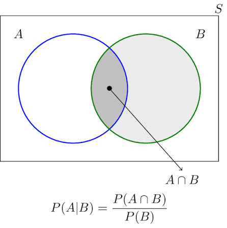
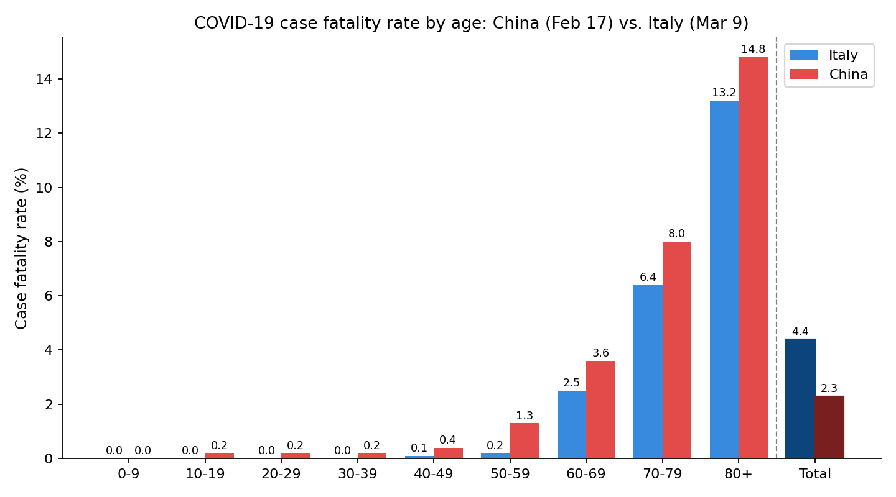

## Conditional probability

How do we account for (new) information?

::: {.incremental}
- What are my chances to pass this course?
  - given that I am a math major?
  - given that I am retaking it?
  - given that I am Aries?
- What is the probability that a worker makes over 1 mln KZT per month?
  - given she works in Astana?
  - given she is in Finace?
  - given she is NU graduate?
:::

---

**Example: Two-children family**

A family has two children.

- What is the probability that it has [at least one boy]{style="color: red;"} (event A)?
  
- What is the probability that it has at least one boy, **given** that it has [at least one girl]{style="color: red;"} (event B)?

---

```{=html}
<div class="fam2c-widget" style="background:#fbfbfb;border:2px solid #333333;border-radius:14px;padding:20px;max-width:720px;margin:0 auto;font-family:'Helvetica Neue',Arial,sans-serif;">
  <canvas id="fam2c-canvas" width="700" height="460" style="display:block;margin:0 auto;background:#ffffff;border-radius:8px;max-width:100%;height:auto;"></canvas>
  <div id="fam2c-info" style="text-align:center;font-size:16px;font-weight:700;margin-top:14px;color:#222222;min-height:44px;line-height:1.4;"></div>
  <div style="display:flex;justify-content:center;gap:12px;margin-top:14px;flex-wrap:wrap;">
    <button id="fam2c-btn-clusters" class="fam2c-btn">Show the 4 outcomes</button>
    <button id="fam2c-btn-boy" class="fam2c-btn">Circle: at least one boy</button>
    <button id="fam2c-btn-girl" class="fam2c-btn">Circle: at least one girl</button>
  </div>
</div>

<style>
  .fam2c-btn { padding:10px 18px; font-size:15px; font-weight:600; border-radius:8px; border:2px solid #333333; background:#ffffff; color:#222222; cursor:pointer; transition: background 0.15s; }
  .fam2c-btn:hover { background:#f0f0f0; }
</style>

<script>
(function(){
  function mulberry32(a){
    return function(){
      a |= 0; a = a + 0x6D2B79F5 | 0;
      let t = Math.imul(a ^ a>>>15, 1 | a);
      t = t + Math.imul(t ^ t>>>7, 61 | t) ^ t;
      return ((t ^ t>>>14)>>>0)/4294967296;
    };
  }
  const rng = mulberry32(42);

  const blockW = 150, gap = 14, x0 = 29;
  const blocks = [
    {cat:'BB', x:x0,                    color:'#2980b9'},
    {cat:'BG', x:x0+blockW+gap,         color:'#16a085'},
    {cat:'GB', x:x0+2*(blockW+gap),     color:'#f39c12'},
    {cat:'GG', x:x0+3*(blockW+gap),     color:'#c0392b'}
  ];

  const yTop = 100, yBot = 370;
  const cols = 10, rows = 25;
  const innerPad = 20, innerW = blockW - 2*innerPad;
  const cellW = innerW/cols, cellH = (yBot-yTop)/rows;

  // center/radii of the single "pile" the dots start in, before separating
  const pileCx = x0 + (3*(blockW+gap)+blockW)/2; // 350
  const pileCy = (yTop+yBot)/2;                   // 235
  const pileRx = 150, pileRy = 110;

  let points = [];
  blocks.forEach(b=>{
    for(let r=0;r<rows;r++){
      for(let c=0;c<cols;c++){
        const jx = (rng()-0.5)*cellW*0.7;
        const jy = (rng()-0.5)*cellH*0.7;
        const homeX = b.x+innerPad + c*cellW + cellW/2 + jx;
        const homeY = yTop + r*cellH + cellH/2 + jy;

        const ang = rng()*Math.PI*2;
        const rad = Math.sqrt(rng()); // uniform-density disk
        const pileX = pileCx + Math.cos(ang)*pileRx*rad;
        const pileY = pileCy + Math.sin(ang)*pileRy*rad;

        points.push({ homeX, homeY, pileX, pileY, cat: b.cat });
      }
    }
  });

  const canvas = document.getElementById('fam2c-canvas');
  const ctx = canvas.getContext('2d');
  const clusterColor = {BB:'#2980b9', BG:'#16a085', GB:'#f39c12', GG:'#c0392b'};

  const capY = 80, capH = 310;
  const boyCap  = {x:9,   y:capY, w:518, h:capH};
  const girlCap = {x:173, y:capY, w:518, h:capH};

  const state = {clusters:false, boy:false, girl:false};

  // 0 = merged into one pile, 1 = fully separated into the 4 outcome piles
  let clusterT = 0;
  let animFrame = null, animStartTime = null, animStartT = 0, animTargetT = 0;
  const ANIM_DURATION = 800;
  function easeInOutCubic(t){ return t<0.5 ? 4*t*t*t : 1-Math.pow(-2*t+2,3)/2; }
  function animateClusterTo(target){
    animTargetT = target;
    animStartT = clusterT;
    animStartTime = null;
    if(animFrame) cancelAnimationFrame(animFrame);
    function step(ts){
      if(!animStartTime) animStartTime = ts;
      const raw = Math.min((ts-animStartTime)/ANIM_DURATION, 1);
      clusterT = animStartT + (animTargetT-animStartT)*easeInOutCubic(raw);
      draw();
      if(raw<1){ animFrame = requestAnimationFrame(step); }
      else { clusterT = animTargetT; animFrame = null; draw(); }
    }
    animFrame = requestAnimationFrame(step);
  }

  function capsulePath(x,y,w,h){
    const r = Math.min(h/2, w/2);
    ctx.beginPath();
    ctx.moveTo(x+r,y);
    ctx.lineTo(x+w-r,y);
    ctx.arcTo(x+w,y,x+w,y+r,r);
    ctx.lineTo(x+w,y+h-r);
    ctx.arcTo(x+w,y+h,x+w-r,y+h,r);
    ctx.lineTo(x+r,y+h);
    ctx.arcTo(x,y+h,x,y+h-r,r);
    ctx.lineTo(x,y+r);
    ctx.arcTo(x,y,x+r,y,r);
    ctx.closePath();
  }

  function draw(){
    ctx.clearRect(0,0,canvas.width,canvas.height);

    if(state.boy){
      capsulePath(boyCap.x,boyCap.y,boyCap.w,boyCap.h);
      ctx.globalAlpha=0.14; ctx.fillStyle='#2980b9'; ctx.fill(); ctx.globalAlpha=1;
    }
    if(state.girl){
      capsulePath(girlCap.x,girlCap.y,girlCap.w,girlCap.h);
      ctx.globalAlpha=0.14; ctx.fillStyle='#c0392b'; ctx.fill(); ctx.globalAlpha=1;
    }

    points.forEach(p=>{
      const px = p.pileX + (p.homeX - p.pileX)*clusterT;
      const py = p.pileY + (p.homeY - p.pileY)*clusterT;
      const fill = state.clusters ? clusterColor[p.cat] : '#999999';
      ctx.globalAlpha = state.clusters ? 0.85 : 0.5;
      ctx.fillStyle = fill;
      ctx.beginPath(); ctx.arc(px,py,4.2,0,Math.PI*2); ctx.fill();
    });
    ctx.globalAlpha = 1;

    if(state.boy){
      capsulePath(boyCap.x,boyCap.y,boyCap.w,boyCap.h);
      ctx.strokeStyle='#2980b9'; ctx.lineWidth=2.5; ctx.setLineDash([7,5]); ctx.stroke(); ctx.setLineDash([]);
    }
    if(state.girl){
      capsulePath(girlCap.x,girlCap.y,girlCap.w,girlCap.h);
      ctx.strokeStyle='#c0392b'; ctx.lineWidth=2.5; ctx.setLineDash([7,5]); ctx.stroke(); ctx.setLineDash([]);
    }

    if(state.clusters && clusterT > 0.9){
      ctx.font='bold 15px Arial'; ctx.textAlign='left';
      ctx.globalAlpha = (clusterT-0.9)/0.1;
      blocks.forEach(b=>{
        ctx.fillStyle=b.color;
        ctx.fillText(b.cat, b.x+innerPad, 68);
      });
      ctx.globalAlpha = 1;
    }

    if(state.boy && state.girl){
      const bx1=193, bx2=507, by=400;
      ctx.strokeStyle='#7d3c98'; ctx.lineWidth=2;
      ctx.beginPath();
      ctx.moveTo(bx1,by-8); ctx.lineTo(bx1,by); ctx.lineTo(bx2,by); ctx.lineTo(bx2,by-8);
      ctx.stroke();
    }
  }

  function updateInfo(){
    const info = document.getElementById('fam2c-info');
    if(state.boy && state.girl){
      info.innerHTML = 'Families circled by <span style="color:#2980b9">both</span> regions satisfy <b>both</b> conditions: {BG, GB} — 500/1000.<br>This is exactly the numerator we\'ll need for P(A | C).';
    } else if(state.boy){
      info.innerHTML = 'A = at least one boy = {BB, BG, GB} &nbsp; 750/1000 &nbsp; P(A) = 3/4';
    } else if(state.girl){
      info.innerHTML = 'C = at least one girl = {BG, GB, GG} &nbsp; 750/1000 &nbsp; P(C) = 3/4';
    } else if(state.clusters){
      info.innerHTML = 'Four equally likely outcomes, 250 families each: '
        + '<span style="color:#2980b9">BB</span>, <span style="color:#16a085">BG</span>, '
        + '<span style="color:#f39c12">GB</span>, <span style="color:#c0392b">GG</span>';
    } else {
      info.innerHTML = '1,000 families, each with two children (in birth order)';
    }
  }

  function updateButtons(){
    document.getElementById('fam2c-btn-clusters').style.boxShadow = state.clusters ? '0 0 0 3px #333333 inset' : 'none';
    document.getElementById('fam2c-btn-boy').style.boxShadow = state.boy ? '0 0 0 3px #2980b9 inset' : 'none';
    document.getElementById('fam2c-btn-girl').style.boxShadow = state.girl ? '0 0 0 3px #c0392b inset' : 'none';
  }

  document.getElementById('fam2c-btn-clusters').addEventListener('click', ()=>{
    state.clusters=!state.clusters;
    animateClusterTo(state.clusters ? 1 : 0);
    updateInfo(); updateButtons();
  });
  document.getElementById('fam2c-btn-boy').addEventListener('click', ()=>{ state.boy=!state.boy; draw(); updateInfo(); updateButtons(); });
  document.getElementById('fam2c-btn-girl').addEventListener('click', ()=>{ state.girl=!state.girl; draw(); updateInfo(); updateButtons(); });

  draw(); updateInfo(); updateButtons();
})();
</script>
```

---

Hence, we get:

::: {.incremental}
- $P(A)=750/1000=0.75$
- $P(\text{A given B})=500/750$
- The second probability is called **conditional probability of A given B**.
- Here even B is the new information we condition upon.
:::

---

::: {.callout-note}
## Definition

For events $A$ and $B$ with $P(B) > 0$, the **conditional probability of $A$ given $B$** is
$$
P(A \mid B) = \frac{P(A \cap B)}{P(B)}.
$$
:::

::: {.fragment}
- $A$: the event whose probability we're updating
- $B$: the evidence — what we observe / treat as given
- Requires $P(B) > 0$: can't condition on an impossible event
- $P(A)$ is called a **prior** probability.
- $P(A|B)$ is called a **posterior** probability.
:::

---

::: {.fragment}
Matches what we just found:
$$
P(A \mid B) = \frac{500/1000}{750/1000} = \frac{500}{750}
$$
:::

---



---

**Example: two dice**

Roll two fair dice. Let

- $A$ = at least one die shows 6
- $B$ = the sum is 8

Find $P(A\mid B)$ and $P(B\mid A)$, interpret.

---

Start from the definition:

$$P(A \mid B) = \frac{P(A \cap B)}{P(B)}.$$
$$P(B \mid A) = \frac{P(A \cap B)}{P(A)}.$$

::: {.fragment}
We use the definition we need:

- $|S|$
- $|A \cap B|$
- $|B|$ and $|A|$
:::

---

::: {.fragment}
Sample space: $S = \{(i,j) : i,j \in \{1,\dots,6\}\}$, 36 equally likely outcomes.
:::

---

**Listing $A$**

$$A = \{(1,6),(2,6),(3,6),(4,6),(5,6),\dots\}$$

::: {.fragment}
$$|A| = 11 \qquad P(A) = \frac{11}{36}$$
:::

::: {.fragment}
How to count quickly? 
:::

---

**Listing $B$**

$$B = \{(2,6),(3,5),(4,4),(5,3),(6,2)\}$$

::: {.fragment}
$$|B| = 5 \qquad P(B) = \frac{5}{36}$$
:::

---

**Finding $A \cap B$**

Scan $B$'s five outcomes for the ones that also have a 6:

$$B = \{\color{#2980b9}{(2,6)},(3,5),(4,4),(5,3),\color{#2980b9}{(6,2)}\}$$

::: {.fragment}
$$A \cap B = \{(2,6),(6,2)\} \qquad |A\cap B| = 2 \qquad P(A\cap B) = \frac{2}{36}$$
:::

---

**$P(A \mid B)$: given the sum is 8**

$$P(A\mid B) = \frac{P(A\cap B)}{P(B)} = \frac{2/36}{5/36} = \frac{2}{5}$$

::: {.fragment}
Same thing directly: restrict to $B$'s 5 equally likely outcomes, 2 of them are also in $A$ $\to \dfrac{2}{5}$.
:::

---

**$P(B \mid A)$: given at least one 6**

$$P(B\mid A) = \frac{P(A\cap B)}{P(A)} = \frac{2/36}{11/36} = \frac{2}{11}$$

::: {.fragment}
Restrict to $A$'s 11 equally likely outcomes, 2 of them also sum to 8 $\to \dfrac{2}{11}$.
:::

::: {.fragment}
::: {.callout-warning}
$P(A\mid B) \neq P(B\mid A)$ generally. Which event you condition on determines which sample space you restrict to.
:::
:::

---

```{=html}
<div class="dice2-widget" style="background:#fbfbfb;border:2px solid #333333;border-radius:14px;padding:20px;max-width:640px;margin:0 auto;font-family:'Helvetica Neue',Arial,sans-serif;">
  <canvas id="dice2-canvas" width="560" height="560" style="display:block;margin:0 auto;background:#ffffff;border-radius:8px;max-width:100%;height:auto;"></canvas>
  <div id="dice2-info" style="text-align:center;font-size:16px;font-weight:700;margin-top:14px;color:#222222;min-height:44px;line-height:1.4;"></div>
  <div style="display:flex;justify-content:center;gap:12px;margin-top:14px;flex-wrap:wrap;">
    <button id="dice2-btn-a" class="dice2-btn">Circle A: at least one 6</button>
    <button id="dice2-btn-b" class="dice2-btn">Circle B: sum is 8</button>
  </div>
</div>

<style>
  .dice2-btn { padding:10px 18px; font-size:15px; font-weight:600; border-radius:8px; border:2px solid #333333; background:#ffffff; color:#222222; cursor:pointer; transition: background 0.15s; }
  .dice2-btn:hover { background:#f0f0f0; }
</style>

<script>
(function(){
  const cellSize = 62, gridOriginX = 122, gridOriginY = 100, gap = 3;
  const canvas = document.getElementById('dice2-canvas');
  const ctx = canvas.getContext('2d');

  let cells = [];
  for(let i=1;i<=6;i++){
    for(let j=1;j<=6;j++){
      cells.push({
        i:i, j:j,
        x: gridOriginX + (i-1)*cellSize + gap,
        y: gridOriginY + (j-1)*cellSize + gap,
        w: cellSize - 2*gap,
        h: cellSize - 2*gap,
        inA: (i===6 || j===6),
        inB: (i+j===8)
      });
    }
  }

  const state = {A:false, B:false};

  function roundRect(x,y,w,h,r){
    ctx.beginPath();
    ctx.moveTo(x+r,y);
    ctx.lineTo(x+w-r,y);
    ctx.arcTo(x+w,y,x+w,y+r,r);
    ctx.lineTo(x+w,y+h-r);
    ctx.arcTo(x+w,y+h,x+w-r,y+h,r);
    ctx.lineTo(x+r,y+h);
    ctx.arcTo(x,y+h,x,y+h-r,r);
    ctx.lineTo(x,y+r);
    ctx.arcTo(x,y,x+r,y,r);
    ctx.closePath();
  }

  function draw(){
    ctx.clearRect(0,0,canvas.width,canvas.height);

    ctx.font = 'bold 15px Arial'; ctx.textAlign='center'; ctx.fillStyle='#333333';
    ctx.fillText('Die 1 (i)', gridOriginX + 3*cellSize, 30);
    ctx.save();
    ctx.translate(30, gridOriginY + 3*cellSize);
    ctx.rotate(-Math.PI/2);
    ctx.fillText('Die 2 (j)', 0, 0);
    ctx.restore();

    ctx.font = '13px Arial'; ctx.fillStyle = '#555555';
    for(let k=1;k<=6;k++){
      ctx.textAlign='center';
      ctx.fillText(k, gridOriginX + (k-0.5)*cellSize, gridOriginY - 14);
      ctx.textAlign='right';
      ctx.fillText(k, gridOriginX - 14, gridOriginY + (k-0.5)*cellSize + 5);
    }

    // 1. base white cells
    cells.forEach(c=>{
      roundRect(c.x, c.y, c.w, c.h, 6);
      ctx.fillStyle = '#ffffff'; ctx.fill();
    });

    // 2. region fills (under borders/text)
    if(state.A){
      ctx.fillStyle = '#2980b9'; ctx.globalAlpha = 0.18;
      roundRect(gridOriginX + 5*cellSize + 4, gridOriginY + 4, cellSize - 8, 6*cellSize - 8, 14); ctx.fill();
      roundRect(gridOriginX + 4, gridOriginY + 5*cellSize + 4, 6*cellSize - 8, cellSize - 8, 14); ctx.fill();
      ctx.globalAlpha = 1;
    }
    if(state.B){
      ctx.fillStyle = '#c0392b'; ctx.globalAlpha = 0.22;
      cells.filter(c=>c.inB).forEach(c=>{
        roundRect(c.x-2, c.y-2, c.w+4, c.h+4, 8); ctx.fill();
      });
      ctx.globalAlpha = 1;
    }

    // 3. borders + labels on top
    ctx.font = 'bold 13px Arial'; ctx.textAlign='center';
    cells.forEach(c=>{
      roundRect(c.x, c.y, c.w, c.h, 6);
      ctx.strokeStyle = '#cccccc'; ctx.lineWidth = 1; ctx.stroke();
      ctx.fillStyle = '#222222';
      ctx.fillText('('+c.i+','+c.j+')', c.x + c.w/2, c.y + c.h/2 + 4);
    });

    // 4. region outlines
    if(state.A){
      ctx.strokeStyle = '#2980b9'; ctx.lineWidth = 2.5; ctx.setLineDash([7,5]);
      roundRect(gridOriginX + 5*cellSize + 4, gridOriginY + 4, cellSize - 8, 6*cellSize - 8, 14); ctx.stroke();
      roundRect(gridOriginX + 4, gridOriginY + 5*cellSize + 4, 6*cellSize - 8, cellSize - 8, 14); ctx.stroke();
      ctx.setLineDash([]);
    }
    if(state.B){
      ctx.strokeStyle = '#c0392b'; ctx.lineWidth = 2.5; ctx.setLineDash([5,4]);
      cells.filter(c=>c.inB).forEach(c=>{
        roundRect(c.x-2, c.y-2, c.w+4, c.h+4, 8); ctx.stroke();
      });
      ctx.setLineDash([]);
    }
  }

  function updateInfo(){
    const info = document.getElementById('dice2-info');
    const A = cells.filter(c=>c.inA);
    const B = cells.filter(c=>c.inB);
    const AB = cells.filter(c=>c.inA && c.inB);
    if(state.A && state.B){
      const list = AB.map(c=>'('+c.i+','+c.j+')').join(', ');
      info.innerHTML = 'A ∩ B = {'+list+'} — '+AB.length+'/36 outcomes, P(A∩B) = '+AB.length+'/36.<br>This is the numerator for both P(A|B) and P(B|A).';
    } else if(state.A){
      info.innerHTML = 'A = at least one die shows 6 — '+A.length+'/36 outcomes, P(A) = '+A.length+'/36';
    } else if(state.B){
      info.innerHTML = 'B = sum is 8 — '+B.length+'/36 outcomes, P(B) = '+B.length+'/36';
    } else {
      info.innerHTML = '36 equally likely outcomes (i, j): i = first die, j = second die';
    }
  }

  function updateButtons(){
    document.getElementById('dice2-btn-a').style.boxShadow = state.A ? '0 0 0 3px #2980b9 inset' : 'none';
    document.getElementById('dice2-btn-b').style.boxShadow = state.B ? '0 0 0 3px #c0392b inset' : 'none';
  }

  document.getElementById('dice2-btn-a').addEventListener('click', ()=>{ state.A=!state.A; draw(); updateInfo(); updateButtons(); });
  document.getElementById('dice2-btn-b').addEventListener('click', ()=>{ state.B=!state.B; draw(); updateInfo(); updateButtons(); });

  draw(); updateInfo(); updateButtons();
})();
</script>
```

---

**Another example $P(A|B)\neq P(B|A)$.
**

::: {.incremental}
- Imagine a fire alarm so sensetive that it goes off often
- If there is a fire, alarm rings
- But also often rings when there is no fire
- Here $P(F|A)$ can be low, but $P(A|F)$ is high
- Cook up the numbers to demonstrate? What must be the condition for this to be true?
:::

---

## Bayes' rule

::: {.callout-note}
## Theorem

For events $A, B$ with $P(A), P(B) > 0$:
$$
P(A \mid B) = \frac{P(B \mid A)\, P(A)}{P(B)}
$$
:::

::: {.fragment}
**Derivation.** Apply the definition of conditional probability twice to the same intersection:
$$
P(A \cap B) = P(A \mid B)\,P(B) = P(B \mid A)\,P(A)
$$
:::

::: {.fragment}
Divide through by $P(B)$ or $P(A$):
:::

::: {.fragment}
Bayes' rule connects two conditional probabilities. Hence, useful when you know one, not the other.
:::

---

## Law of Total Probability

::: {.callout-note}
## Theorem

Let $A_1, \dots, A_n$ be a **partition** of the sample space $S$ (disjoint events with $A_1\cup\cdots\cup A_n = S$), each with $P(A_i) > 0$. Then for any event $B$:
$$
P(B) = \sum_{i=1}^n P(B \mid A_i)\,P(A_i)
$$
:::

::: {.fragment}
**Idea:** $P(B)$ is given by the weighted average of $B$'s conditional probabilities given $A_i$s, where weights are probabilities of corresponding partitioning sets. 
:::

::: {.fragment}
Often paired with Bayes' rule: LOTP builds the denominator $P(B)$ that Bayes' rule needs.
:::

---

**Proof of LOTP ($n=2$)**

Partition: $A_1$ and $A_2 = A_1^c$, so $A_1\cap A_2=\varnothing$ and $A_1\cup A_2 = S$.

::: {.fragment}
**Step 1 — express $B$ as a union of its pieces inside each $A_i$.**

Since $A_1\cup A_2 = S \supseteq B$, every outcome in $B$ lies in exactly one of $A_1$ or $A_2$:
$$
B = (B \cap A_1) \cup (B \cap A_2)
$$
:::

::: {.fragment}
$B\cap A_1$ and $B\cap A_2$ are **disjoint** (since $A_1\cap A_2=\varnothing$), so by the second axiom of probability:
$$
P(B) = P(B\cap A_1) + P(B\cap A_2)
$$
:::

::: {.fragment}
**Step 2 — use**, $P(B\cap A_i) = P(B\mid A_i)\,P(A_i)$:
$$
P(B) = P(B\mid A_1)P(A_1) + P(B\mid A_2)P(A_2)
$$
:::

---

$B$ splits along the $A_1/A_2$ boundary into two disjoint pieces:

::: {.fragment}
```{=html}
<div style="text-align:center;">
<svg viewBox="0 0 600 340" width="600" height="340" xmlns="http://www.w3.org/2000/svg" style="max-width:100%;height:auto;font-family:'Helvetica Neue',Arial,sans-serif;">
  <rect x="20" y="20" width="560" height="280" fill="#ffffff" stroke="#333333" stroke-width="2"/>
  <line x1="300" y1="20" x2="300" y2="300" stroke="#333333" stroke-width="2" stroke-dasharray="6,5"/>
  <defs>
    <clipPath id="leftHalf"><rect x="20" y="20" width="280" height="280"/></clipPath>
    <clipPath id="rightHalf"><rect x="300" y="20" width="280" height="280"/></clipPath>
  </defs>
  <ellipse cx="300" cy="160" rx="170" ry="105" fill="#2980b9" opacity="0.35" clip-path="url(#leftHalf)"/>
  <ellipse cx="300" cy="160" rx="170" ry="105" fill="#f39c12" opacity="0.35" clip-path="url(#rightHalf)"/>
  <ellipse cx="300" cy="160" rx="170" ry="105" fill="none" stroke="#222222" stroke-width="2.5"/>
  <text x="45" y="50" font-size="20" font-weight="700" fill="#2980b9">A&#8321;</text>
  <text x="535" y="50" font-size="20" font-weight="700" fill="#f39c12" text-anchor="end">A&#8322;</text>
  <text x="300" y="45" font-size="18" font-weight="700" fill="#222222" text-anchor="middle">B</text>
  <text x="215" y="170" font-size="16" font-weight="600" fill="#1a5276" text-anchor="middle">B &#8745; A&#8321;</text>
  <text x="385" y="170" font-size="16" font-weight="600" fill="#9c640c" text-anchor="middle">B &#8745; A&#8322;</text>
  <text x="30" y="290" font-size="14" fill="#555555">S</text>
</svg>
</div>
```
:::

::: {.fragment}

- Dashed line = the $A_1/A_2$ partition boundary. 
- The two shaded lobes of $B$ are disjoint by construction, so their probabilities add: $P(B) = P(B\cap A_1)+P(B\cap A_2)$, and each equals $P(B\mid A_i)P(A_i)$ by the definition of conditional probability.
:::

---

**Example: Two Bins**

- **Bin 1:** 2 red balls, 1 blue ball
- **Bin 2:** 2 red balls, 2 blue balls

::: {.fragment}
Pick one of the two bins **uniformly at random**, then draw **one ball uniformly at random** from the chosen bin.
:::

::: {.fragment}

- What is the probability that the ball drawn is **blue**?
- Given that the ball is blue, what is the probability that Bin 1 was chosen?
:::

---

```{=html}
<div class="binx-widget" style="background:#fbfbfb;border:2px solid #333333;border-radius:14px;padding:20px;max-width:460px;margin:0 auto;font-family:'Helvetica Neue',Arial,sans-serif;">

  <div style="display:flex;justify-content:center;gap:30px;">
    <div id="binx-bin1" class="binx-bin"></div>
    <div id="binx-bin2" class="binx-bin"></div>
  </div>

  <div id="binx-mystery-slot" style="display:flex;justify-content:center;margin-top:24px;opacity:0;transform:scale(0.85);transition:opacity .5s ease, transform .5s ease;">
    <div id="binx-mystery" class="binx-bin binx-mystery"></div>
  </div>

  <div id="binx-drawn-slot" style="display:flex;justify-content:center;margin-top:24px;opacity:0;transform:scale(0.85);transition:opacity .5s ease, transform .5s ease;">
    <div class="binx-slot">
      <div id="binx-drawn-ball" class="binx-ball"></div>
    </div>
  </div>

  <div id="binx-info" style="text-align:center;font-size:16px;font-weight:700;margin-top:18px;color:#222222;min-height:26px;line-height:1.4;"></div>

  <div style="display:flex;justify-content:center;gap:12px;margin-top:10px;flex-wrap:wrap;">
    <button id="binx-btn-next" class="binx-btn">Choose a bin →</button>
    <button id="binx-btn-reset" class="binx-btn">↺ Reset</button>
  </div>
</div>

<style>
  .binx-btn { padding:10px 18px; font-size:15px; font-weight:600; border-radius:8px; border:2px solid #333333; background:#ffffff; color:#222222; cursor:pointer; transition: background 0.15s; }
  .binx-btn:hover { background:#f0f0f0; }
  .binx-btn:disabled { opacity:0.45; cursor:default; }

  .binx-bin {
    width:160px; min-height:140px; border:3px solid #333333; border-radius:0 0 22px 22px;
    background:#ffffff; display:flex; flex-wrap:wrap; align-content:flex-start; justify-content:center;
    gap:7px; padding:14px 10px; box-sizing:border-box;
  }
  .binx-bin.binx-mystery { background:#2b2b2b; border-color:#111111; }

  .binx-slot {
    width:160px; min-height:80px; border:3px dashed #999999; border-radius:16px;
    display:flex; align-items:center; justify-content:center; box-sizing:border-box;
  }

  .binx-ball { border-radius:50%; box-shadow: inset -3px -3px 6px rgba(0,0,0,0.25), 0 2px 3px rgba(0,0,0,0.15); width:28px; height:28px; }
  .binx-ball.red { background:#c0392b; }
  .binx-ball.blue { background:#2980b9; }
  #binx-drawn-ball { width:60px; height:60px; opacity:0; transform:scale(0.3); transition:opacity .5s ease, transform .5s ease; }
</style>

<script>
(function(){
  const bins = {
    bin1: {balls:['red','red','blue']},
    bin2: {balls:['red','red','blue','blue']}
  };
  const binEls = { bin1: document.getElementById('binx-bin1'), bin2: document.getElementById('binx-bin2') };
  const mysterySlot = document.getElementById('binx-mystery-slot');
  const drawnSlot = document.getElementById('binx-drawn-slot');
  const info = document.getElementById('binx-info');
  const nextBtn = document.getElementById('binx-btn-next');
  const resetBtn = document.getElementById('binx-btn-reset');
  const drawnBall = document.getElementById('binx-drawn-ball');

  let phase = 0, chosenBinKey = null;

  function renderSourceBins(){
    Object.keys(bins).forEach(key=>{
      const el = binEls[key];
      el.innerHTML = '';
      bins[key].balls.forEach(color=>{
        const b = document.createElement('div');
        b.className = 'binx-ball ' + color;
        el.appendChild(b);
      });
    });
  }

  function setInfo(html){ info.innerHTML = html; }

  function phase0(){
    phase = 0; chosenBinKey = null;
    renderSourceBins();
    mysterySlot.style.opacity = 0; mysterySlot.style.transform = 'scale(0.85)';
    drawnSlot.style.opacity = 0; drawnSlot.style.transform = 'scale(0.85)';
    drawnBall.className = 'binx-ball';
    drawnBall.style.opacity = 0; drawnBall.style.transform = 'scale(0.3)';
    setInfo('');
    nextBtn.textContent = 'Choose a bin →';
    nextBtn.disabled = false;
  }

  function phase1(){
    phase = 1;
    const keys = ['bin1','bin2'];
    let ticks = 0;
    const flicker = setInterval(()=>{
      keys.forEach(k=>binEls[k].style.boxShadow = 'none');
      binEls[keys[ticks % 2]].style.boxShadow = '0 0 0 4px rgba(39,174,96,0.35)';
      ticks++;
    }, 140);

    setTimeout(()=>{
      clearInterval(flicker);
      keys.forEach(k=>binEls[k].style.boxShadow = 'none');
      chosenBinKey = Math.random() < 0.5 ? 'bin1' : 'bin2';

      mysterySlot.style.opacity = 1;
      mysterySlot.style.transform = 'scale(1)';

      setInfo('A bin has been chosen at random.');
      nextBtn.textContent = 'Take a ball →';
    }, 1100);
  }

  function phase2(){
    phase = 2;
    const balls = bins[chosenBinKey].balls;
    const color = balls[Math.floor(Math.random()*balls.length)];

    drawnSlot.style.opacity = 1;
    drawnSlot.style.transform = 'scale(1)';
    drawnBall.className = 'binx-ball ' + color;
    requestAnimationFrame(()=>{
      drawnBall.style.opacity = 1;
      drawnBall.style.transform = 'scale(1)';
    });

    const colorHex = color === 'blue' ? '#2980b9' : '#c0392b';
    setInfo('Drawn ball: <span style="color:' + colorHex + '">' + color.toUpperCase() + '</span>');
    nextBtn.disabled = true;
  }

  nextBtn.addEventListener('click', ()=>{
    if(phase===0) phase1();
    else if(phase===1) phase2();
  });
  resetBtn.addEventListener('click', phase0);

  phase0();
})();
</script>
```

---

**Probability of blue ball**
We know conditional probabilities of drawing a blue ball given which bin was chosen, and the probabilities of choosing each bin. 

- Let $A_1$ = "Bin 1 chosen", 
- Let $A_2$ = "Bin 2 chosen", and 
- $B$ = "ball drawn is blue". We are given:

::: {.fragment}
**Bin choice probabilities:**
$$P(A_1) = P(A_2) = \frac12$$
:::

::: {.fragment}
**Conditional probabilities:**
$$P(B\mid A_1) = \frac13, \qquad P(B\mid A_2) = \frac{2}{4} = \frac12$$
:::

---

**Apply LOTP:**

::: {.fragment}
$$
\begin{aligned}
P(B) &= P(B\mid A_1)P(A_1) + P(B\mid A_2)P(A_2) \\
     &= \frac13\cdot\frac12 + \frac12\cdot\frac12 \\
     &= \frac{5}{12} \approx 0.417
\end{aligned}
$$

:::

---

```{=html}
<!DOCTYPE html>
<html>
<head>
<meta charset="utf-8">
<title>LOTP vertical tree — dot animation</title>
<style>
  html, body { margin:0; padding:0; background:#ffffff; }
  #lotp-wrap {
    width: 900px;
    height: 1040px;
    margin: 0 auto;
    font-family: "Helvetica Neue", Arial, sans-serif;
    user-select: none;
    cursor: pointer;
    position: relative;
  }
  #lotp-wrap svg { display:block; width:100%; height:100%; }
  .lotp-dot { transition: fill 0.7s ease; }
  .lotp-title { font-size: 24px; font-weight: 700; fill: #2B2B2B; }
  .lotp-hint { font-size: 14px; fill: #7A7A7A; font-style: italic; }
  .lotp-label { font-size: 15px; font-weight: 700; }
  .lotp-formula { font-size: 18px; font-weight: 700; fill: #2E5C8A; }
  .fade { transition: opacity 0.5s ease; }
  .bg-edge { stroke: #C9CDD2; stroke-width: 2; fill: none; }
  .bg-edge-dashed { stroke: #C9CDD2; stroke-width: 1.6; fill: none; stroke-dasharray: 5 5; }
  .bg-node { fill: #ffffff; stroke: #AEB4BA; stroke-width: 1.6; }
  .bg-label { font-size: 13px; fill: #9AA0A6; }
</style>
</head>
<body>

<div id="lotp-wrap">
  <svg id="lotp-svg" viewBox="0 0 900 1040">
    <g id="bg-group"></g>
    <g id="dots-group"></g>
    <text id="title" class="lotp-title" x="450" y="34" text-anchor="middle"></text>
    <text id="hint" class="lotp-hint" x="450" y="1015" text-anchor="middle"></text>

    <g id="labels-group"></g>

    <rect id="formula-bg" class="fade" x="0" y="0" width="0" height="0" rx="10"
          fill="#EAF1F8" stroke="#2E5C8A" stroke-width="1.4" opacity="0"></rect>
    <text id="formula" class="lotp-formula fade" x="450" y="978" text-anchor="middle" opacity="0"></text>
  </svg>
</div>

<script>
(function () {
  const RED = "#C0392B", BLUE = "#2E5C8A", GREY = "#B9B9B9", INK = "#2B2B2B";
  const N = 120;

  const N_BIN1 = 60, N_BIN2 = 60;
  const N_BIN1_RED = 40, N_BIN1_BLUE = 20;   // P(Blue|Bin1) = 1/3
  const N_BIN2_RED = 30, N_BIN2_BLUE = 30;   // P(Blue|Bin2) = 1/2
  const N_BLUE = N_BIN1_BLUE + N_BIN2_BLUE;  // 50
  const N_RED = N_BIN1_RED + N_BIN2_RED;     // 70

  function groupOf(i) {
    if (i < N_BIN1_RED) return "bin1-red";
    if (i < N_BIN1) return "bin1-blue";
    if (i < N_BIN1 + N_BIN2_RED) return "bin2-red";
    return "bin2-blue";
  }
  function binOf(i) { return i < N_BIN1 ? "bin1" : "bin2"; }
  function ballOf(i) { return groupOf(i).endsWith("blue") ? "blue" : "red"; }

  // --- sunflower (Fermat spiral) layout, radius scales with sqrt(n) ---
  const GOLDEN = 2.399963229728653;
  const K = 10.0;
  function radiusFor(n) { return K * Math.sqrt(n); }
  function sunflower(indices, cx, cy) {
    const n = indices.length;
    const R = radiusFor(n);
    const out = {};
    indices.forEach((idx, k) => {
      const r = R * Math.sqrt((k + 0.5) / n);
      const theta = k * GOLDEN;
      out[idx] = { x: cx + r * Math.cos(theta), y: cy + r * Math.sin(theta) };
    });
    return out;
  }

  const allIdx = Array.from({ length: N }, (_, i) => i);
  const bin1Idx = allIdx.filter(i => binOf(i) === "bin1");
  const bin2Idx = allIdx.filter(i => binOf(i) === "bin2");
  const b1rIdx = allIdx.filter(i => groupOf(i) === "bin1-red");
  const b1bIdx = allIdx.filter(i => groupOf(i) === "bin1-blue");
  const b2rIdx = allIdx.filter(i => groupOf(i) === "bin2-red");
  const b2bIdx = allIdx.filter(i => groupOf(i) === "bin2-blue");
  const blueIdx = allIdx.filter(i => ballOf(i) === "blue");
  const redIdx = allIdx.filter(i => ballOf(i) === "red");

  // --- structural node coordinates (also used by the grey background tree) ---
  const NODE = {
    root:      { x: 450, y: 190 },
    bin1:      { x: 230, y: 410 },
    bin2:      { x: 670, y: 410 },
    b1red:     { x: 100, y: 630 },
    b1blue:    { x: 360, y: 630 },
    b2red:     { x: 540, y: 630 },
    b2blue:    { x: 800, y: 630 },
    redMerge:  { x: 320, y: 850 },
    blueMerge: { x: 580, y: 850 },
  };

  const rRoot = radiusFor(N);
  const rBin = radiusFor(N_BIN1);
  const rB1R = radiusFor(N_BIN1_RED), rB1B = radiusFor(N_BIN1_BLUE);
  const rB2R = radiusFor(N_BIN2_RED), rB2B = radiusFor(N_BIN2_BLUE);
  const rRedMerge = radiusFor(N_RED), rBlueMerge = radiusFor(N_BLUE);

  const pos0 = sunflower(allIdx, NODE.root.x, NODE.root.y);
  const pos1 = { ...sunflower(bin1Idx, NODE.bin1.x, NODE.bin1.y),
                 ...sunflower(bin2Idx, NODE.bin2.x, NODE.bin2.y) };
  const pos2 = {
    ...sunflower(b1rIdx, NODE.b1red.x, NODE.b1red.y),
    ...sunflower(b1bIdx, NODE.b1blue.x, NODE.b1blue.y),
    ...sunflower(b2rIdx, NODE.b2red.x, NODE.b2red.y),
    ...sunflower(b2bIdx, NODE.b2blue.x, NODE.b2blue.y),
  };
  const pos3 = {
    ...sunflower(redIdx, NODE.redMerge.x, NODE.redMerge.y),
    ...sunflower(blueIdx, NODE.blueMerge.x, NODE.blueMerge.y),
  };

  function colorAt(i, stage) {
    if (stage < 2) return GREY;
    return ballOf(i) === "blue" ? BLUE : RED;
  }

  // ============================ BACKGROUND TREE (static, grey) ============================
  const svgNS = "http://www.w3.org/2000/svg";
  const bgGroup = document.getElementById("bg-group");

  function bgEdge(p0, p1, dashed) {
    const line = document.createElementNS(svgNS, "line");
    line.setAttribute("x1", p0.x); line.setAttribute("y1", p0.y);
    line.setAttribute("x2", p1.x); line.setAttribute("y2", p1.y);
    line.setAttribute("class", dashed ? "bg-edge-dashed" : "bg-edge");
    bgGroup.appendChild(line);
  }
  function bgNode(p, r) {
    const c = document.createElementNS(svgNS, "circle");
    c.setAttribute("cx", p.x); c.setAttribute("cy", p.y); c.setAttribute("r", r);
    c.setAttribute("class", "bg-node");
    bgGroup.appendChild(c);
  }
  // xDir: -1 nudges the label further toward the left sibling, +1 toward the
  // right sibling -- this (not a line-perpendicular rotation) is what keeps
  // left/right branch labels from colliding near a shared parent node.
  function bgLabel(p0, p1, text, frac, xDir, xDist, yDist) {
    const dx = p1.x - p0.x, dy = p1.y - p0.y;
    const mx = p0.x + frac * dx + xDir * xDist;
    const my = p0.y + frac * dy - yDist;
    const t = document.createElementNS(svgNS, "text");
    t.setAttribute("x", mx); t.setAttribute("y", my);
    t.setAttribute("text-anchor", "middle");
    t.setAttribute("class", "bg-label");
    t.textContent = text;
    bgGroup.appendChild(t);
  }

  // edges: probability tree (solid) + merge guides (dashed)
  bgEdge(NODE.root, NODE.bin1); bgEdge(NODE.root, NODE.bin2);
  bgEdge(NODE.bin1, NODE.b1red); bgEdge(NODE.bin1, NODE.b1blue);
  bgEdge(NODE.bin2, NODE.b2red); bgEdge(NODE.bin2, NODE.b2blue);

  bgLabel(NODE.root, NODE.bin1, "P(Bin 1)=1/2", 0.6, -1, 20, 10);
  bgLabel(NODE.root, NODE.bin2, "P(Bin 2)=1/2", 0.6, 1, 20, 10);
  bgLabel(NODE.bin1, NODE.b1red, "P(Red∣Bin1)=2/3", 0.45, -1, 55, 8);
  bgLabel(NODE.bin1, NODE.b1blue, "P(Blue∣Bin1)=1/3", 0.45, 1, 55, 8);
  bgLabel(NODE.bin2, NODE.b2red, "P(Red∣Bin2)=1/2", 0.45, -1, 55, 8);
  bgLabel(NODE.bin2, NODE.b2blue, "P(Blue∣Bin2)=1/2", 0.45, 1, 55, 8);

  bgNode(NODE.root, 6); bgNode(NODE.bin1, 5); bgNode(NODE.bin2, 5);
  bgNode(NODE.b1red, 4.5); bgNode(NODE.b1blue, 4.5); bgNode(NODE.b2red, 4.5); bgNode(NODE.b2blue, 4.5);

  // ============================ STAGE CONTENT ============================
  const stages = [
    {
      pos: pos0,
      title: "120 independent trials",
      hint: "click to split by bin",
      labels: [],
      formula: "",
    },
    {
      pos: pos1,
      title: "Stage 1 — choose a bin",
      hint: "click to draw a ball from each bin",
      labels: [
        { x: NODE.bin1.x, y: NODE.bin1.y + rBin + 22, text: "Bin 1 (n=60)", color: INK },
        { x: NODE.bin2.x, y: NODE.bin2.y + rBin + 22, text: "Bin 2 (n=60)", color: INK },
      ],
      formula: "",
    },
    {
      pos: pos2,
      title: "Stage 2 — draw one ball",
      hint: "click to pool same-colour outcomes",
      labels: [
        { x: NODE.b1red.x, y: NODE.b1red.y + rB1R + 22, text: "Red: 40", color: RED },
        { x: NODE.b1blue.x, y: NODE.b1blue.y + rB1B + 22, text: "Blue: 20", color: BLUE },
        { x: NODE.b2red.x, y: NODE.b2red.y + rB2R + 22, text: "Red: 30", color: RED },
        { x: NODE.b2blue.x, y: NODE.b2blue.y + rB2B + 22, text: "Blue: 30", color: BLUE },
      ],
      formula: "",
    },
    {
      pos: pos3,
      title: "P(Blue) via the Law of Total Probability",
      hint: "click to restart",
      labels: [
        { x: NODE.redMerge.x, y: NODE.redMerge.y - rRedMerge - 16, text: "Red: 40+30 = 70", color: RED },
        { x: NODE.blueMerge.x, y: NODE.blueMerge.y - rBlueMerge - 16, text: "Blue: 20+30 = 50", color: BLUE },
      ],
      formula: "P(Blue) = ½·⅓ + ½·½ = 50/120 = 5/12 ≈ 0.417",
    },
  ];

  // ============================ DOTS ============================
  const dotsGroup = document.getElementById("dots-group");
  const dots = [];
  for (let i = 0; i < N; i++) {
    const c = document.createElementNS(svgNS, "circle");
    c.setAttribute("r", 4.4);
    c.setAttribute("class", "lotp-dot");
    c.setAttribute("fill", GREY);
    c.setAttribute("cx", pos0[i].x);
    c.setAttribute("cy", pos0[i].y);
    dotsGroup.appendChild(c);
    dots.push({ el: c, x: pos0[i].x, y: pos0[i].y });
  }

  const titleEl = document.getElementById("title");
  const hintEl = document.getElementById("hint");
  const formulaEl = document.getElementById("formula");
  const formulaBg = document.getElementById("formula-bg");
  const labelsGroup = document.getElementById("labels-group");

  function easeInOutCubic(t) { return t < 0.5 ? 4 * t * t * t : 1 - Math.pow(-2 * t + 2, 3) / 2; }

  let animId = null;
  function animateTo(targetPos, colorFn, duration) {
    if (animId) cancelAnimationFrame(animId);
    const start = performance.now();
    const from = dots.map(d => ({ x: d.x, y: d.y }));
    dots.forEach((d, i) => { d.el.setAttribute("fill", colorFn(i)); });

    function frame(now) {
      const t = Math.min(1, (now - start) / duration);
      const e = easeInOutCubic(t);
      dots.forEach((d, i) => {
        const tx = targetPos[i].x, ty = targetPos[i].y;
        const nx = from[i].x + (tx - from[i].x) * e;
        const ny = from[i].y + (ty - from[i].y) * e;
        d.el.setAttribute("cx", nx);
        d.el.setAttribute("cy", ny);
        if (t === 1) { d.x = tx; d.y = ty; }
      });
      if (t < 1) { animId = requestAnimationFrame(frame); }
    }
    animId = requestAnimationFrame(frame);
  }

  function renderLabels(labels) {
    labelsGroup.innerHTML = "";
    labels.forEach(l => {
      const t = document.createElementNS(svgNS, "text");
      t.setAttribute("x", l.x);
      t.setAttribute("y", l.y);
      t.setAttribute("text-anchor", "middle");
      t.setAttribute("class", "lotp-label fade");
      t.setAttribute("fill", l.color);
      t.setAttribute("opacity", "0");
      t.textContent = l.text;
      labelsGroup.appendChild(t);
      requestAnimationFrame(() => requestAnimationFrame(() => t.setAttribute("opacity", "1")));
    });
  }

  function sizeFormulaBg(text) {
    if (!text) { formulaBg.setAttribute("opacity", "0"); return; }
    const w = Math.min(820, text.length * 9.2 + 40);
    formulaBg.setAttribute("x", 450 - w / 2);
    formulaBg.setAttribute("y", 954);
    formulaBg.setAttribute("width", w);
    formulaBg.setAttribute("height", 42);
    formulaBg.setAttribute("opacity", "1");
  }

  let stage = 0;
  function render(first) {
    const s = stages[stage];
    animateTo(s.pos, (i) => colorAt(i, stage), first ? 0 : 950);
    titleEl.textContent = s.title;
    hintEl.textContent = s.hint;

    formulaEl.setAttribute("opacity", "0");
    formulaBg.setAttribute("opacity", "0");
    labelsGroup.innerHTML = "";

    setTimeout(() => {
      renderLabels(s.labels);
      formulaEl.textContent = s.formula;
      sizeFormulaBg(s.formula);
      formulaEl.setAttribute("opacity", s.formula ? "1" : "0");
    }, first ? 0 : 550);
  }

  document.getElementById("lotp-wrap").addEventListener("click", () => {
    stage = (stage + 1) % stages.length;
    render(false);
  });

  render(true);
})();
</script>

</body>
</html>
```

---

**Conditional probability of Bin 1 given blue**
We know one conditional probability, $P(B\mid A_1)$, and want to find reverse $P(A_1\mid B)$.

$$
P(A_1 \mid B) = \dfrac{P(B\mid A_1)\,P(A_1)}{P(B)}
$$

::: {.fragment}
- $P(B\mid A_1)=\dfrac13$
- $P(A_1)=\dfrac12$
- $P(B)=\dfrac{5}{12}$
:::

::: {.fragment}
$$
\color{red}{= \dfrac{\frac13\cdot\frac12}{\frac{5}{12}} \approx 0.4}
$$
:::

---

After observing a blue ball, the prior $P(A_1)=0.5$ dropped to posterior $P(A_1\mid B)=0.4$.

:::{.incremental}
 - Hence, seeing a blue ball is evidence *against* Bin 1. Why?
 - Bin 1 has a smaller share of blue balls than Bin 2 does.
 - **Question:** Can you guess how things change upon observing a red ball instead? Explain intuition and do the computations.
 - **Question:** Imagine drawing two balls instead, with replacement (draw once, put back, draw again). 
   - What is the probability that both are blue?
   - Given both are blue, what is the probability that Bin 1 was chosen?
:::

---

## Testing for a Disease

::: {.fragment}
A patient is tested for some disease. Let:

- $D$ = the event the patient **has** the disease
- $D^c$ = the event the patient does not have the disease
- $T$ = the event the test comes back **positive**
- $T^c$ = the event the test comes back **negative**
:::

::: {.incremental}
- The test is a **noisy signal** about $D$ — it doesn't perfectly reveal the truth, and it can be wrong in two different ways. 
- **Which ways?**
:::

---

**Two Ways a Test Can Be Wrong**

::: {.fragment}
**False positive:** test says positive, but the patient doesn't have the disease — event $T \cap D^c$.
:::

::: {.fragment}
**False negative:** test says negative, but the patient does have the disease — event $T^c \cap D$.
:::

::: {.fragment}
|              | $D$ (disease) | $D^c$ (no disease) |
|:------------:|:---:|:---:|
| $T$ (test +)  | correct | **false positive** |
| $T^c$ (test −) | **false negative** | correct |
:::

---

**Test Accuracy: Sensitivity & Specificity**

Avoiding each type of mistake is exactly what the two standard accuracy measures capture:

- **Sensitivity** (true positive rate): $P(T \mid D)$ — chance of testing positive *given* disease
- **Specificity** (true negative rate): $P(T^c \mid D^c)$ — chance of testing negative *given* no disease


::: {.fragment}
**Example:** COVID-19 rapid antigen test, symptomatic patients (Cochrane meta-analysis, ~150,000 samples):
$$
\text{Sensitivity} \approx 0.73 \ (73.0\%), \qquad \text{Specificity} \approx 0.99 \ (99.1\%)
$$
:::

::: {.fragment}
**Accuracy is two numbers, not one!**
:::

---

Sensitivity and specificity answer: *given the true disease status, what does the test say?*

::: {.fragment}
But a patient taking the test doesn't know their true status — they only see the **test result**. What they actually want is the reverse:
:::

::: {.fragment}
**Given a positive test result, what is the probability of actually having the disease?**
$$
P(D \mid T) = \, ?
$$
:::

::: {.fragment}
This is *not* the sensitivity — $P(D\mid T) \neq P(T\mid D)$. We need to flip the conditioning.
:::

---

::: {.fragment}
**Step 1.** Apply Bayes' rule:
$$
P(D\mid T) = \frac{P(T\mid D)\,P(D)}{P(T)}
$$
:::

::: {.fragment}
**Step 2.** To find $P(T)$, expand it with LOTP, partitioning on $D, D^c$:
$$
P(T) = P(T\mid D)P(D) + P(T\mid D^c)P(D^c)
$$
:::

::: {.fragment}
Note $P(T\mid D^c) = 1-\text{specificity}$ (the false-positive rate). 
:::

---

**Step 3.** Combine:
$$
P(D\mid T) = \frac{\text{sensitivity}\cdot P(D)}{\text{sensitivity}\cdot P(D) + (1-\text{specificity})\cdot P(D^c)}
$$

::: {.fragment}
Three ingredients: sensitivity, specificity, and $P(D)$ — the disease's **prevalence**. Same formula for any test, any disease.
:::

---

**Numerical Example**

::: {.fragment}
Take $P(D) = 0.01$, sensitivity $= 0.73$, specificity $= 0.99$:
:::

::: {.fragment}
$$
\begin{align*}
P(D\mid T) &= \frac{0.73 \times 0.01}{0.73\times 0.01 + 0.01\times 0.99} \\[6pt]
&= \frac{0.0073}{0.0073+0.0099} \\[6pt]
&= \frac{0.0073}{0.0172} \\[6pt]
&\approx 0.424
\end{align*}
$$
:::

::: {.fragment}
Even with a positive test, there's only about a **42%** chance of actually having COVID.
:::

---


```{=html}
<div id="bayes-demo" style="font-family: -apple-system, Helvetica, Arial, sans-serif; max-width: 620px; margin: 0 auto;">

  <div style="display:grid; grid-template-columns:1fr 1fr 1fr; gap:16px; margin-bottom:1.25rem;">
    <div>
      <label style="font-size:13px; color:#555; display:block; margin-bottom:4px;">Prior &pi; = P(disease)</label>
      <input type="range" min="1" max="50" value="1" step="1" id="prior" style="width:100%;">
      <div style="font-size:14px; font-weight:600;" id="prior-out">1%</div>
    </div>
    <div>
      <label style="font-size:13px; color:#555; display:block; margin-bottom:4px;">Sensitivity Se</label>
      <input type="range" min="50" max="100" value="73" step="1" id="se" style="width:100%;">
      <div style="font-size:14px; font-weight:600;" id="se-out">73%</div>
    </div>
    <div>
      <label style="font-size:13px; color:#555; display:block; margin-bottom:4px;">Specificity Sp</label>
      <input type="range" min="50" max="100" value="99" step="1" id="sp" style="width:100%;">
      <div style="font-size:14px; font-weight:600;" id="sp-out">99%</div>
    </div>
  </div>

  <div style="display:flex; gap:24px; margin-bottom:1.25rem; flex-wrap:wrap;">
    <div>
      <label style="font-size:14px; font-weight:600; display:flex; align-items:center; gap:6px;">
        <input type="checkbox" id="g-diseased"> diseased (&pi;)
      </label>
      <div style="margin-left:22px; margin-top:4px; display:flex; flex-direction:column; gap:4px;">
        <label style="font-size:13px; color:#555; display:flex; align-items:center; gap:6px;">
          <input type="checkbox" id="s-tp"> true positive
        </label>
        <label style="font-size:13px; color:#555; display:flex; align-items:center; gap:6px;">
          <input type="checkbox" id="s-fn"> false negative
        </label>
      </div>
    </div>
    <div>
      <label style="font-size:14px; font-weight:600; display:flex; align-items:center; gap:6px;">
        <input type="checkbox" id="g-healthy"> healthy (1-&pi;)
      </label>
      <div style="margin-left:22px; margin-top:4px; display:flex; flex-direction:column; gap:4px;">
        <label style="font-size:13px; color:#555; display:flex; align-items:center; gap:6px;">
          <input type="checkbox" id="s-fp"> false positive
        </label>
        <label style="font-size:13px; color:#555; display:flex; align-items:center; gap:6px;">
          <input type="checkbox" id="s-tn"> true negative
        </label>
      </div>
    </div>
    <button id="reset-btn" style="align-self:flex-start; height:32px; padding:0 12px; border-radius:6px; border:1px solid #ccc; background:#fff; cursor:pointer;">reset</button>
  </div>

  <div style="display:grid; grid-template-columns:repeat(3,1fr); gap:12px; margin-bottom:1.5rem;">
    <div style="background:#f4f3f0; border-radius:8px; padding:1rem;">
      <p style="font-size:13px; color:#555; margin:0 0 4px;">P(disease | test +)</p>
      <p style="font-size:24px; font-weight:600; margin:0;" id="posterior">16.1%</p>
    </div>
    <div style="background:#f4f3f0; border-radius:8px; padding:1rem;">
      <p style="font-size:13px; color:#555; margin:0 0 4px;">Test + total</p>
      <p style="font-size:24px; font-weight:600; margin:0;" id="pos-total">59</p>
    </div>
    <div style="background:#f4f3f0; border-radius:8px; padding:1rem;">
      <p style="font-size:13px; color:#555; margin:0 0 4px;">Of those, false alarms</p>
      <p style="font-size:24px; font-weight:600; margin:0;" id="fp-share">50 of 59</p>
    </div>
  </div>

  <div id="grid" style="display:grid; grid-template-columns:repeat(40,1fr); gap:1px; width:480px; margin:0 auto 1rem;"></div>

  <div style="display:flex; flex-wrap:wrap; gap:14px; justify-content:center; font-size:12px; color:#555;">
    <span><i style="display:inline-block;width:10px;height:10px;background:#BA7517;margin-right:4px;border-radius:2px;"></i>diseased (undifferentiated)</span>
    <span><i style="display:inline-block;width:10px;height:10px;background:#378ADD;margin-right:4px;border-radius:2px;"></i>healthy (undifferentiated)</span>
    <span><i style="display:inline-block;width:10px;height:10px;background:#0F6E56;margin-right:4px;border-radius:2px;"></i>true positive</span>
    <span><i style="display:inline-block;width:10px;height:10px;background:#7F77DD;margin-right:4px;border-radius:2px;"></i>false negative</span>
    <span><i style="display:inline-block;width:10px;height:10px;background:#D85A30;margin-right:4px;border-radius:2px;"></i>false positive</span>
    <span><i style="display:inline-block;width:10px;height:10px;background:#B4B2A9;margin-right:4px;border-radius:2px;"></i>true negative</span>
  </div>

</div>

<script>
(function() {
  const N = 1000;
  const grid = document.getElementById('grid');
  const cells = [];
  for (let i = 0; i < N; i++) {
    const d = document.createElement('div');
    d.style.width = '11px';
    d.style.height = '11px';
    d.style.borderRadius = '2px';
    d.style.border = '0.5px solid #ddd';
    grid.appendChild(d);
    cells.push(d);
  }

  const priorEl = document.getElementById('prior');
  const seEl = document.getElementById('se');
  const spEl = document.getElementById('sp');
  const gDis = document.getElementById('g-diseased');
  const gHea = document.getElementById('g-healthy');
  const sTP = document.getElementById('s-tp');
  const sFN = document.getElementById('s-fn');
  const sFP = document.getElementById('s-fp');
  const sTN = document.getElementById('s-tn');

  function largestRemainder(counts, total) {
    const floors = counts.map(c => Math.floor(c));
    let used = floors.reduce((a,b) => a+b, 0);
    let remainder = total - used;
    const rema = counts.map((c,i) => ({i, r: c - floors[i]}));
    rema.sort((a,b) => b.r - a.r);
    for (let k = 0; k < remainder; k++) floors[rema[k].i]++;
    return floors;
  }

  const EMPTY = 'transparent';
  const DIS = '#BA7517';
  const HEA = '#378ADD';
  const TP = '#0F6E56';
  const FN = '#7F77DD';
  const FP = '#D85A30';
  const TN = '#B4B2A9';

  function update() {
    const prior = +priorEl.value / 100;
    const se = +seEl.value / 100;
    const sp = +spEl.value / 100;

    document.getElementById('prior-out').textContent = priorEl.value + '%';
    document.getElementById('se-out').textContent = seEl.value + '%';
    document.getElementById('sp-out').textContent = spEl.value + '%';

    const tpF = N * prior * se;
    const fnF = N * prior * (1 - se);
    const fpF = N * (1 - prior) * (1 - sp);
    const tnF = N * (1 - prior) * sp;

    const [tp, fn, fp, tn] = largestRemainder([tpF, fnF, fpF, tnF], N);

    const posterior = (tp / (tp + fp)) * 100;
    document.getElementById('posterior').textContent = posterior.toFixed(1) + '%';
    document.getElementById('pos-total').textContent = (tp + fp).toString();
    document.getElementById('fp-share').textContent = fp + ' of ' + (tp + fp);

    const tpColor = sTP.checked ? TP : (gDis.checked ? DIS : EMPTY);
    const fnColor = sFN.checked ? FN : (gDis.checked ? DIS : EMPTY);
    const fpColor = sFP.checked ? FP : (gHea.checked ? HEA : EMPTY);
    const tnColor = sTN.checked ? TN : (gHea.checked ? HEA : EMPTY);

    let idx = 0;
    const fillBlock = (count, color) => {
      for (let k = 0; k < count; k++) {
        cells[idx].style.background = color;
        idx++;
      }
    };
    fillBlock(tp, tpColor);
    fillBlock(fn, fnColor);
    fillBlock(fp, fpColor);
    fillBlock(tn, tnColor);
  }

  [priorEl, seEl, spEl, gDis, gHea, sTP, sFN, sFP, sTN].forEach(el => el.addEventListener('input', update));
  document.getElementById('reset-btn').addEventListener('click', () => {
    [gDis, gHea, sTP, sFN, sFP, sTN].forEach(el => el.checked = false);
    update();
  });
  update();
})();
</script>
```

---

## Independence

::: {.fragment}
**Flip a fair coin 100 times, get 100 heads.** What's the probability the next flip is heads?
:::

::: {.fragment}
**Two bins, draw a ball.** Ball turns out blue. Does that change your belief about which bin was chosen?
:::

::: {.fragment}
**COVID test.** Result comes back positive. Does that change your belief about having the disease?
:::

::: {.fragment}
Events are **independent** if knowing one does not change our estimate of the probability of the other.
:::

---


::: {.callout-note}
## Definition

Events $A$ and $B$ are **independent** if
$$
P(A \cap B) = P(A)\,P(B)
$$

If $P(A)>0$ and $P(B)>0$, this is equivalent to each of:
$$
P(A \mid B) = P(A) \qquad \Longleftrightarrow \qquad P(B \mid A) = P(B)
$$
:::

::: {.fragment}
- Multiply Probabilities
- Posterior = Prior (new information does not affect our estimates)
:::

---

**Two Cards**

Draw two cards without replacement from a standard 52-card deck. 

- Let $A$ = "first card is an ace", 
- Let $B$ = "second card is an ace". 
- Independent?

::: {.fragment}
Intuition: 

**No**, because if first is an Ace, then there are one fewer aces left in the pile, so second does not have the same probability.
:::

::: {.fragment}
To formally check this use the definition.
:::


---

We check if $P(A\cap B)=P(A)P(B)$. By naive definition:

::: {.fragment}
$$
P(A) = \frac{4}{52}
$$
:::

::: {.fragment}
By symmetry, every position in the deck is equally likely to hold any given card, so $P(B) = P(A)$.
:::

::: {.fragment}
Now for the right hand side:
$$
P(A \cap B) = \frac{\binom{4}{2}}{\binom{52}{2}} = \frac{4\times 3}{52\times 51}
$$
:::

::: {.fragment}
Not independent since: 
$$
\frac{4 \times 3}{52 \times 51} \neq (\frac{4}{52})^2 
$$
:::

---

**Question:** check that the independence definition using the conditional probability also does not hold:

$$
P(A \mid B) \neq \frac{P(A \cap B)}{P(B)}
$$

---

Independence is useful as **a simplifying assumption**:

:::{.incremental}
- Fair **coin flips** are assumed independent: there is no any physical reason for one flip to affect the next.
- **Sexes of children** are often assumed independent: in reality a child was more likely to be of the same sex as its preceding sibling, but the effect is small enough to be ignored in most models.
:::

:::{.incremental}
But it is not always a good assumption:

- **Possibility of biased coin**: what if there is a chance that a coin I flip is biased? Then the flips are not independent!
- **Hot Hand**: do basketball players really have "hot streaks," or is a made shot independent of the shots before it? Empirical question.
:::

---

**Question:** During a single contact a virus is transmitted from an infected to a healthy person with probability $p>0$. Assume that the transmissions are independent across contacts.

:::{.incremental}
- What is the probability of getting infected after 3 contacts with infected individuals?
- What is the probability of getting infected after 3 contacts, where each contact is with an individual who is infected with probability $q>0$, independently, and transmission occurs with probability $p$ if the contact individual is infected?
- Suppose that after 3 contacts, each of whom is infected with probability $q>0$ independently, Alice is not infected. Given that Alice is not infected, what is the  probability that neither of Alice's contacts was infected?
:::

---

## The Monty Hall Problem

::: {.fragment}
**Setup.** Three doors. One hides a car, two hide goats. You pick a door. The host — who **knows** what's behind every door — opens one of the *other two*, always revealing a goat, and offers you the chance to switch to the remaining closed door.
:::

::: {.fragment}
**Question.** Should you switch?
:::

::: {.callout-note .fragment}
**Precise assumptions** (these matter — see below):

- The car is placed uniformly at random among the 3 doors.
- The host always opens a door you didn't pick, and it always has a goat.
- The host always offers the switch, regardless of what you initially chose.
:::

---

```{=html}
<div id="mh-root" style="max-width:680px;margin:0 auto;font-family:sans-serif;">

  <div id="mh-status" style="text-align:center;font-size:18px;margin-bottom:20px;min-height:28px;color:#222;">
    Pick a door.
  </div>

  <div id="mh-doors" style="display:flex;justify-content:center;gap:24px;margin-bottom:24px;">
    <div class="mh-door-col">
      <div class="mh-door" data-door="0"></div>
      <div class="mh-door-tag" data-tag="0"></div>
    </div>
    <div class="mh-door-col">
      <div class="mh-door" data-door="1"></div>
      <div class="mh-door-tag" data-tag="1"></div>
    </div>
    <div class="mh-door-col">
      <div class="mh-door" data-door="2"></div>
      <div class="mh-door-tag" data-tag="2"></div>
    </div>
  </div>

  <div id="mh-decision" style="display:none;text-align:center;margin-bottom:24px;">
    <p style="font-size:16px;margin-bottom:12px;color:#222;">Do you want to switch to the other closed door?</p>
    <button id="mh-switch" class="mh-btn" style="background:#1d9e75;">Switch</button>
    <button id="mh-keep" class="mh-btn" style="background:#378add;">Keep</button>
  </div>

  <div id="mh-again-wrap" style="display:none;text-align:center;margin-bottom:32px;">
    <button id="mh-again" class="mh-btn" style="background:#444;">Play again</button>
  </div>

  <div style="border-top:1px solid #ddd;padding-top:16px;">
    <div style="display:flex;justify-content:space-between;align-items:center;margin-bottom:10px;">
      <span style="font-size:15px;font-weight:bold;color:#222;">Results</span>
      <button id="mh-reset" style="font-size:12px;color:#888;background:none;border:1px solid #ccc;border-radius:4px;padding:3px 8px;cursor:pointer;">Reset stats</button>
    </div>
    <table style="width:100%;border-collapse:collapse;font-size:14px;color:#222;">
      <thead>
        <tr style="border-bottom:1px solid #ccc;">
          <th style="text-align:left;padding:4px;">Strategy</th>
          <th style="text-align:right;padding:4px;">Games</th>
          <th style="text-align:right;padding:4px;">Wins</th>
          <th style="text-align:right;padding:4px;">Win rate</th>
        </tr>
      </thead>
      <tbody>
        <tr>
          <td style="padding:4px;">Switched</td>
          <td id="mh-switch-n" style="text-align:right;padding:4px;">0</td>
          <td id="mh-switch-w" style="text-align:right;padding:4px;">0</td>
          <td id="mh-switch-r" style="text-align:right;padding:4px;">–</td>
        </tr>
        <tr>
          <td style="padding:4px;">Kept</td>
          <td id="mh-keep-n" style="text-align:right;padding:4px;">0</td>
          <td id="mh-keep-w" style="text-align:right;padding:4px;">0</td>
          <td id="mh-keep-r" style="text-align:right;padding:4px;">–</td>
        </tr>
        <tr style="border-top:1px solid #ccc;font-weight:bold;">
          <td style="padding:4px;">Total</td>
          <td id="mh-total-n" style="text-align:right;padding:4px;">0</td>
          <td id="mh-total-w" style="text-align:right;padding:4px;">0</td>
          <td id="mh-total-r" style="text-align:right;padding:4px;">–</td>
        </tr>
      </tbody>
    </table>
    <div id="mh-log" style="margin-top:12px;font-size:12px;color:#666;max-height:90px;overflow-y:auto;"></div>
  </div>

</div>

<style>
  .mh-door-col {
    display: flex;
    flex-direction: column;
    align-items: center;
  }
  .mh-door {
    width: 140px;
    height: 190px;
    background: #8a5a3b;
    border: 4px solid #5c3a24;
    border-radius: 6px 6px 0 0;
    position: relative;
    cursor: pointer;
    display: flex;
    align-items: center;
    justify-content: center;
    font-size: 60px;
    transition: transform 0.15s;
    box-sizing: border-box;
  }
  .mh-door:hover { transform: translateY(-3px); }
  .mh-door.mh-disabled { cursor: default; }
  .mh-door.mh-disabled:hover { transform: none; }
  .mh-door-num {
    position: absolute;
    top: 8px;
    left: 8px;
    color: #f0e0c8;
    font-size: 16px;
    font-family: sans-serif;
  }
  .mh-door-knob {
    position: absolute;
    right: 14px;
    top: 50%;
    width: 10px;
    height: 10px;
    background: #f0d060;
    border-radius: 50%;
  }
  .mh-door.mh-open { background: #ddd; }
  .mh-door.mh-initial { border-color: #378add; }
  .mh-door.mh-final { box-shadow: 0 0 0 4px #1d9e75; }
  .mh-door-tag {
    margin-top: 8px;
    font-size: 12px;
    font-weight: bold;
    min-height: 16px;
    text-align: center;
  }
  .mh-door-tag .mh-tag-initial { color: #378add; }
  .mh-door-tag .mh-tag-final { color: #1d9e75; }
  .mh-btn {
    color: white;
    border: none;
    border-radius: 5px;
    padding: 10px 22px;
    font-size: 15px;
    margin: 0 6px;
    cursor: pointer;
  }
  .mh-btn:hover { opacity: 0.9; }
</style>

<script>
(function() {
  var state = {
    car: -1,
    chosen: -1,
    opened: -1,
    finalChoice: -1,
    phase: 'pick'
  };
  var stats = { switchN: 0, switchW: 0, keepN: 0, keepW: 0 };

  var doorsEl = document.querySelectorAll('#mh-doors .mh-door');
  var tagsEl = document.querySelectorAll('#mh-doors .mh-door-tag');
  var statusEl = document.getElementById('mh-status');
  var decisionEl = document.getElementById('mh-decision');
  var againWrapEl = document.getElementById('mh-again-wrap');
  var logEl = document.getElementById('mh-log');

  function renderDoors() {
    doorsEl.forEach(function(d, i) {
      d.innerHTML = '<span class="mh-door-num">' + (i + 1) + '</span><span class="mh-door-knob"></span>';
      d.classList.remove('mh-open', 'mh-initial', 'mh-final', 'mh-disabled');
      if (state.phase === 'pick') {
        d.style.cursor = 'pointer';
      }
    });
    tagsEl.forEach(function(t) { t.innerHTML = ''; });
  }

  function renderTags() {
    tagsEl.forEach(function(t, i) {
      var parts = [];
      if (i === state.chosen) parts.push('<span class="mh-tag-initial">Your pick</span>');
      if (i === state.finalChoice) parts.push('<span class="mh-tag-final">Final answer</span>');
      t.innerHTML = parts.join(' / ');
    });
  }

  function resetRound() {
    state.car = Math.floor(Math.random() * 3);
    state.chosen = -1;
    state.opened = -1;
    state.finalChoice = -1;
    state.phase = 'pick';
    renderDoors();
    statusEl.textContent = 'Pick a door.';
    decisionEl.style.display = 'none';
    againWrapEl.style.display = 'none';
  }

  function openHostDoor() {
    var candidates = [0, 1, 2].filter(function(i) {
      return i !== state.chosen && i !== state.car;
    });
    state.opened = candidates[Math.floor(Math.random() * candidates.length)];
  }

  function revealDoor(index, isCar) {
    var d = doorsEl[index];
    d.classList.add('mh-open');
    d.innerHTML = '<span class="mh-door-num">' + (index + 1) + '</span>' + (isCar ? '\u{1F697}' : '\u{1F410}');
  }

  function updateStats() {
    document.getElementById('mh-switch-n').textContent = stats.switchN;
    document.getElementById('mh-switch-w').textContent = stats.switchW;
    document.getElementById('mh-switch-r').textContent = stats.switchN ? Math.round(100 * stats.switchW / stats.switchN) + '%' : '–';

    document.getElementById('mh-keep-n').textContent = stats.keepN;
    document.getElementById('mh-keep-w').textContent = stats.keepW;
    document.getElementById('mh-keep-r').textContent = stats.keepN ? Math.round(100 * stats.keepW / stats.keepN) + '%' : '–';

    var totalN = stats.switchN + stats.keepN;
    var totalW = stats.switchW + stats.keepW;
    document.getElementById('mh-total-n').textContent = totalN;
    document.getElementById('mh-total-w').textContent = totalW;
    document.getElementById('mh-total-r').textContent = totalN ? Math.round(100 * totalW / totalN) + '%' : '–';
  }

  function logRound(switched, won) {
    var line = document.createElement('div');
    line.textContent = (switched ? 'Switched' : 'Kept') + ' \u2192 ' + (won ? 'Win' : 'Loss');
    logEl.insertBefore(line, logEl.firstChild);
  }

  doorsEl.forEach(function(d, i) {
    d.addEventListener('click', function() {
      if (state.phase !== 'pick') return;
      state.chosen = i;
      openHostDoor();
      revealDoor(state.opened, false);
      d.classList.add('mh-initial');
      doorsEl.forEach(function(dd) { dd.classList.add('mh-disabled'); });
      renderTags();
      state.phase = 'decide';
      statusEl.textContent = 'Door ' + (state.opened + 1) + ' had a goat. Switch or keep?';
      decisionEl.style.display = 'block';
    });
  });

  function finishRound(switched) {
    state.finalChoice = switched
      ? [0, 1, 2].filter(function(i) { return i !== state.chosen && i !== state.opened; })[0]
      : state.chosen;

    var won = state.finalChoice === state.car;

    [0, 1, 2].forEach(function(i) {
      if (i !== state.opened) revealDoor(i, i === state.car);
    });
    doorsEl[state.finalChoice].classList.add('mh-final');
    renderTags();

    if (switched) { stats.switchN++; if (won) stats.switchW++; }
    else { stats.keepN++; if (won) stats.keepW++; }
    updateStats();
    logRound(switched, won);

    statusEl.textContent = (won ? 'You won! ' : 'You lost. ') + 'The car was behind door ' + (state.car + 1) + '.';
    decisionEl.style.display = 'none';
    againWrapEl.style.display = 'block';
    state.phase = 'done';
  }

  document.getElementById('mh-switch').addEventListener('click', function() { finishRound(true); });
  document.getElementById('mh-keep').addEventListener('click', function() { finishRound(false); });
  document.getElementById('mh-again').addEventListener('click', resetRound);
  document.getElementById('mh-reset').addEventListener('click', function() {
    stats = { switchN: 0, switchW: 0, keepN: 0, keepW: 0 };
    updateStats();
    logEl.innerHTML = '';
  });

  resetRound();
  updateStats();
})();
</script>
```

---

**Switching wins the car with probability $2/3$**, while keeping wins with probability $1/3$.


---

**Brief History**

::: {.incremental}
- The problem is named after **Monty Hall**, longtime host of the game show *Let's Make a Deal* — though the idealized "always reveal a goat, always offer a switch" rule isn't quite how the real show worked. Hall himself later noted he had freedom to *not* offer the switch, using it as a psychological tool against contestants who seemed to have guessed right.
- The puzzle exploded into public view when **Marilyn vos Savant** answered a reader's letter in her *Parade* magazine column (Sept. 9, 1990): switch, and you double your odds.
- The reaction: an estimated **10,000+ letters**, many from PhDs and professional mathematicians, confidently telling her she was wrong.
:::

---

**Solving It: Law of Total Probability**

WLOG say you pick **Door 1**. Let

- $W$ = you win the car *by switching*
- $A_i$ = car is hidden behind Door $i$

::: {.fragment}
$\{A_1, A_2, A_3\}$ partitions the sample space, with $P(A_i) = 1/3$ each. By LOTP:
$$
P(W) = \sum_{i=1}^{3} P(W\mid A_i)\,P(A_i)
$$
:::

---

Now lets compute $P(W\mid A_i)$ for each $i$:

::: {.fragment}
- **$A_1$** (you were already right): the host opens one of the two goat doors; switching moves you *off* the car. $P(W\mid A_1) = 0$.
:::

::: {.fragment}
- **$A_2$** (car is behind Door 2): the host can't open Door 1 (your pick) or Door 2 (has the car) — he's forced to open Door 3. Switching takes you to Door 2. $P(W\mid A_2) = 1$.
:::

::: {.fragment}
- **$A_3$** (car is behind Door 3): symmetric argument — the host is forced to open Door 2, and switching takes you to Door 3. $P(W\mid A_3) = 1$.
:::

::: {.fragment}
$$
P(W) = 0\cdot\frac13 \;+\; 1\cdot\frac13 \;+\; 1\cdot\frac13 \;=\; \boxed{\frac23}
$$
:::

--- 

**Same Question, 1000 Doors**

You pick **1 door out of 1000**. The host — who knows where the car is — opens **998** of the other 999 doors, every single one revealing a goat, leaving exactly one other door closed. Switch?

::: {.fragment}
Same argument, same partition. Let $A_i$ = car is behind Door $i$ (your initial pick), $P(A_i) = \dfrac{1}{1000}$ for each $i$.
:::

---

::: {.fragment}
- **You were right initially** ($P = \frac{1}{1000}$): switching loses.
- **You were wrong initially** ($P = \frac{999}{1000}$): the host was forced to open every wrong door *except one* — leaving the car sitting behind that single surviving door. Switching wins almost for sure.
:::

::: {.fragment}
$$
P(W) = 0\cdot\frac{1}{1000} + 1\cdot\frac{999}{1000} = \boxed{\frac{999}{1000}}
$$
:::

::: {.callout-important .fragment}
Your first pick was almost certainly wrong. The host, forced to avoid the car while emptying out 998 doors, has effectively **filtered 999 doors down to the one most likely to hide the car** — and handed it to you.
:::

---

**Simpson's Paradox in COVID-19 Case Fatality Rates**

{width="90%" fig-align="center"}

CFR is the proportion of **confirmed cases** of a disease that result in death.

---

Comparing early COVID-19 CFR — China (Feb 17, 2020) vs. Italy (Mar 9, 2020), von Kügelgen, Gresele & Schölkopf (2021):

- **In every single age group**, Italy's CFR is lower than China's.
- **Overall**, Italy's CFR (4.4%) is *higher* than China's (2.3%).


::: {.fragment}
**How can this be?**
:::

---

**Italy population is older than China's.** 

:::{.incremental}
- Italy is one of the world's oldest populations — a quarter of Italians are already 65+, while in China this fraction is below 15%
- Older people are more likely to die from COVID-19, so Italy's overall CFR is higher even though its age-specific CFRs are lower.
:::

---

**The Paradox in the Language of Conditional Probability**

Let:

- $D$ = case results in death, 
- $Y$ = patient is young, 
- $C$ = patient is in China:

::: {.fragment}
**Within each age group, Italy does better:**
$$
P(D \mid Y, C^c) < P(D \mid Y, C)
\qquad
P(D \mid Y^c, C^c) < P(D \mid Y^c, C)
$$
:::

::: {.fragment}
**Yet overall, Italy does worse:**
$$
P(D \mid C^c) > P(D \mid C)
$$
:::

---

**Abstract numerical example of Simpson's Paradox**

```{=html}
<div id="scb-root" style="max-width:900px;margin:0 auto;font-family:sans-serif;">

  <div id="scb-legend" style="text-align:center;font-size:13px;color:#444;margin-bottom:16px;">
    <span style="display:inline-block;width:9px;height:9px;border-radius:50%;background:#3a6bc9;margin-right:4px;"></span>Recovered
    &nbsp;&nbsp;
    <span style="display:inline-block;width:9px;height:9px;border-radius:50%;background:#d64545;margin-right:4px;"></span>Not recovered
    &nbsp;&nbsp;·&nbsp;&nbsp;Each table holds 100 cases.
  </div>
  <div id="scb-status" style="text-align:center;font-size:13px;color:#888;margin-bottom:14px;"></div>

  <div id="scb-stage" style="position:relative;">

    <div style="display:flex;justify-content:center;gap:50px;flex-wrap:nowrap;">

      <div class="scb-table">
        <div class="scb-title" style="color:#e24b4a;">China</div>
        <div class="scb-row scb-header-row">
          <div class="scb-row-label"></div>
          <div class="scb-jar-spacer"></div>
          <div class="scb-cfr">CFR</div>
        </div>

        <div class="scb-row">
          <div class="scb-row-label">Young</div>
          <div class="scb-jar" id="scb-jar-china-young"></div>
          <div class="scb-cfr" id="scb-cfr-china-young"></div>
        </div>

        <div class="scb-row">
          <div class="scb-row-label">Old</div>
          <div class="scb-jar" id="scb-jar-china-old"></div>
          <div class="scb-cfr" id="scb-cfr-china-old"></div>
        </div>

        <div class="scb-row scb-total-row">
          <div class="scb-row-label">Total</div>
          <div class="scb-jar scb-jar-total" id="scb-jar-china-total"></div>
          <div class="scb-cfr" id="scb-cfr-china-total">—</div>
        </div>
      </div>

      <div class="scb-table">
        <div class="scb-title" style="color:#378add;">Italy</div>
        <div class="scb-row scb-header-row">
          <div class="scb-row-label"></div>
          <div class="scb-jar-spacer"></div>
          <div class="scb-cfr">CFR</div>
        </div>

        <div class="scb-row">
          <div class="scb-row-label">Young</div>
          <div class="scb-jar" id="scb-jar-italy-young"></div>
          <div class="scb-cfr" id="scb-cfr-italy-young"></div>
        </div>

        <div class="scb-row">
          <div class="scb-row-label">Old</div>
          <div class="scb-jar" id="scb-jar-italy-old"></div>
          <div class="scb-cfr" id="scb-cfr-italy-old"></div>
        </div>

        <div class="scb-row scb-total-row">
          <div class="scb-row-label">Total</div>
          <div class="scb-jar scb-jar-total" id="scb-jar-italy-total"></div>
          <div class="scb-cfr" id="scb-cfr-italy-total">—</div>
        </div>
      </div>

    </div>
  </div>

  <div style="text-align:center;margin-top:20px;">
    <button id="scb-combine" class="scb-btn" style="background:#1d9e75;">Combine into totals</button>
    <button id="scb-reset" class="scb-btn" style="background:#888;">Reset</button>
  </div>

  <div id="scb-verdict" style="text-align:center;margin-top:16px;font-size:14px;line-height:1.6;color:#222;"></div>

</div>

<style>
  .scb-table { width: 250px; }
  .scb-title { font-weight:bold; text-align:center; margin-bottom:10px; font-size:16px; }
  .scb-row { display:flex; align-items:center; gap:10px; margin-bottom:10px; }
  .scb-row-label { width:52px; font-size:13px; color:#555; text-align:right; }
  .scb-jar {
    flex:1; height:120px; overflow-y:auto;
    border:2px solid #999; border-radius:6px; background:#fafafa;
    display:flex; flex-wrap:wrap; align-content:flex-start;
    padding:4px; gap:2px; box-sizing:border-box;
  }
  .scb-jar-total { height:120px; border-style:dashed; }
  .scb-cfr { width:56px; font-size:13px; font-weight:bold; text-align:left; color:#333; }
  .scb-header-row { margin-bottom:4px; }
  .scb-header-row .scb-cfr { font-size:11px; font-weight:bold; color:#888; text-transform:uppercase; }
  .scb-jar-spacer { flex:1; }
  .scb-ball { width:7px; height:7px; border-radius:50%; flex-shrink:0; }
  .scb-ball-red { background:#d64545; }
  .scb-ball-blue { background:#3a6bc9; }
  .scb-total-row { margin-top:6px; padding-top:10px; border-top:1px dashed #ccc; }
  .scb-btn { color:white; border:none; border-radius:5px; padding:9px 18px; font-size:13px; margin:0 5px; cursor:pointer; }
  .scb-btn:hover { opacity:0.9; }
</style>

<script>
(function() {
  var groups = {
    'china-young': { n: 95, red: 5 },
    'china-old':   { n: 5,  red: 5 },
    'italy-young': { n: 40, red: 0 },
    'italy-old':   { n: 60, red: 20 }
  };

  function fmtPct(red, n) {
    return n > 0 ? (100 * red / n).toFixed(1) + '%' : '—';
  }

  function fillJar(containerId, n, red) {
    var el = document.getElementById(containerId);
    el.innerHTML = '';
    var arr = [];
    for (var i = 0; i < (n - red); i++) arr.push('blue');
    for (var i = 0; i < red; i++) arr.push('red');
    arr.forEach(function(c) {
      var b = document.createElement('div');
      b.className = 'scb-ball scb-ball-' + c;
      el.appendChild(b);
    });
  }

  function renderInitial() {
    Object.keys(groups).forEach(function(key) {
      var g = groups[key];
      fillJar('scb-jar-' + key, g.n, g.red);
      document.getElementById('scb-cfr-' + key).textContent = fmtPct(g.red, g.n);
    });
  }

  // FLIP animation: build the real total-jar balls up front (blue first, then
  // young's reds, then old's reds — i.e. young block then old block, each
  // itself blue-first), measure their final resting spot, then animate each
  // one in from wherever its counterpart ball currently sits in Young/Old.
  function combineCountry(country, onDone) {
    var youngJar = document.getElementById('scb-jar-' + country + '-young');
    var oldJar = document.getElementById('scb-jar-' + country + '-old');
    var totalJar = document.getElementById('scb-jar-' + country + '-total');

    var youngBalls = Array.prototype.slice.call(youngJar.children);
    var oldBalls = Array.prototype.slice.call(oldJar.children);
    var allSource = youngBalls.concat(oldBalls);
    var isBlue = function(b) { return b.className.indexOf('scb-ball-blue') > -1; };
    var sourceOrder = allSource.filter(isBlue).concat(allSource.filter(function(b) { return !isBlue(b); }));

    var firstRects = sourceOrder.map(function(b) { return b.getBoundingClientRect(); });

    totalJar.innerHTML = '';
    var newBalls = sourceOrder.map(function(srcBall) {
      var nb = document.createElement('div');
      nb.className = srcBall.className;
      totalJar.appendChild(nb);
      return nb;
    });

    var lastRects = newBalls.map(function(b) { return b.getBoundingClientRect(); });

    newBalls.forEach(function(nb, i) {
      var dx = firstRects[i].left - lastRects[i].left;
      var dy = firstRects[i].top - lastRects[i].top;
      nb.style.transition = 'none';
      nb.style.transform = 'translate(' + dx + 'px,' + dy + 'px)';
    });

    // force reflow so the transform above is applied before we animate away from it
    totalJar.offsetHeight;

    requestAnimationFrame(function() {
      newBalls.forEach(function(nb, i) {
        nb.style.transition = 'transform 0.7s cubic-bezier(.3,.7,.4,1)';
        nb.style.transform = 'translate(0,0)';
      });
    });

    setTimeout(function() {
      newBalls.forEach(function(nb) {
        nb.style.transition = '';
        nb.style.transform = '';
      });
      var y = groups[country + '-young'], o = groups[country + '-old'];
      document.getElementById('scb-cfr-' + country + '-total').textContent =
        fmtPct(y.red + o.red, y.n + o.n);
      if (onDone) onDone();
    }, 750);
  }

  function combine() {
    document.getElementById('scb-combine').disabled = true;
    document.getElementById('scb-status').textContent = 'Combining...';

    var done = 0;
    function onOneDone() {
      done++;
      if (done === 2) finishCombine();
    }
    combineCountry('china', onOneDone);
    combineCountry('italy', onOneDone);
  }

  function finishCombine() {
    document.getElementById('scb-combine').disabled = false;
    document.getElementById('scb-status').textContent = '';

    var cy = groups['china-young'], co = groups['china-old'];
    var iy = groups['italy-young'], io = groups['italy-old'];
    var chinaTotal = { n: cy.n + co.n, red: cy.red + co.red };
    var italyTotal = { n: iy.n + io.n, red: iy.red + io.red };

    var html =
      '<strong>Young:</strong> Italy ' + fmtPct(iy.red, iy.n) + ' vs China ' + fmtPct(cy.red, cy.n) +
      ' &rarr; Italy lower<br>' +
      '<strong>Old:</strong> Italy ' + fmtPct(io.red, io.n) + ' vs China ' + fmtPct(co.red, co.n) +
      ' &rarr; Italy lower<br>' +
      '<strong>Total:</strong> Italy ' + fmtPct(italyTotal.red, italyTotal.n) + ' vs China ' + fmtPct(chinaTotal.red, chinaTotal.n) +
      ' &rarr; Italy higher';
    html += '<br><br><span style="color:#c0392b;font-weight:bold;">Italy has a lower CFR in both age groups, yet a higher overall CFR.</span>';
    document.getElementById('scb-verdict').innerHTML = html;
  }

  function reset() {
    document.getElementById('scb-jar-china-total').innerHTML = '';
    document.getElementById('scb-jar-italy-total').innerHTML = '';
    document.getElementById('scb-cfr-china-total').textContent = '—';
    document.getElementById('scb-cfr-italy-total').textContent = '—';
    document.getElementById('scb-verdict').innerHTML = '';
    document.getElementById('scb-status').textContent = '';
    renderInitial();
  }

  document.getElementById('scb-combine').addEventListener('click', combine);
  document.getElementById('scb-reset').addEventListener('click', reset);

  renderInitial();
})();
</script>
```
---

**Using conditioning as a tool: sequential battle**

::: {.fragment}
Alice and Bob play a game. Alice has 2 soldiers, Bob 1 soldier. Each round they toss a coin and the winner of the toss takes **one soldier** from the loser. Rounds are independent and repeat until one player has no soldiers left.
:::

::: {.fragment}
**What is the probability that Alice wins the game?**
:::

---

```{=html}
<div id="bg-root" style="max-width:640px;margin:0 auto;font-family:sans-serif;">

  <div id="bg-setup" style="text-align:center;margin-bottom:18px;font-size:14px;color:#444;">
    Alice starts with <input type="number" id="bg-init-a" value="2" min="1" max="30" style="width:44px;">
    soldiers &nbsp;·&nbsp; Bob starts with <input type="number" id="bg-init-b" value="1" min="1" max="30" style="width:44px;">
    soldiers
    <div style="margin-top:10px;">
      <button id="bg-newgame" class="bg-btn" style="background:#444;">New game</button>
    </div>
  </div>

  <div id="bg-arena" style="position:relative;display:flex;justify-content:center;align-items:flex-start;gap:40px;margin-bottom:14px;">
    <div id="bg-fly-layer" style="position:absolute;top:0;left:0;width:100%;height:100%;pointer-events:none;z-index:50;"></div>

    <div class="bg-side">
      <div class="bg-side-label" style="color:#333;">Alice</div>
      <div class="bg-soldiers" id="bg-soldiers-alice"></div>
      <div class="bg-count" id="bg-count-alice">2</div>
    </div>
    <div class="bg-vs">VS</div>
    <div class="bg-side">
      <div class="bg-side-label" style="color:#333;">Bob</div>
      <div class="bg-soldiers" id="bg-soldiers-bob"></div>
      <div class="bg-count" id="bg-count-bob">1</div>
    </div>
  </div>

  <div id="bg-status" style="text-align:center;font-size:15px;min-height:24px;margin-bottom:16px;color:#222;"></div>

  <div style="text-align:center;margin-bottom:22px;">
    <button id="bg-round" class="bg-btn" style="background:#1d9e75;">Next round</button>
    <button id="bg-sim100" class="bg-btn" style="background:#7a4fc2;">Simulate 100 games</button>
  </div>

  <div style="border-top:1px solid #ddd;padding-top:14px;text-align:center;font-size:14px;color:#222;margin-bottom:20px;">
    <div id="bg-tally">Games played: 0 &middot; Alice wins: 0 &middot; Bob wins: 0</div>
    <button id="bg-tally-reset" style="margin-top:8px;font-size:12px;color:#888;background:none;border:1px solid #ccc;border-radius:4px;padding:3px 8px;cursor:pointer;">Reset tally &amp; graph</button>
  </div>

  <div style="text-align:center;">
    <div style="font-size:13px;color:#666;margin-bottom:6px;">P(Alice wins) as more games are played</div>
    <canvas id="bg-chart" width="580" height="220" style="max-width:100%;"></canvas>
  </div>

</div>

<style>
  .bg-side { display:flex; flex-direction:column; align-items:center; width:190px; position:relative; z-index:1; }
  .bg-side-label { font-weight:bold; font-size:15px; margin-bottom:8px; }
  .bg-vs { font-weight:bold; color:#999; font-size:13px; margin-top:30px; }
  .bg-soldiers {
    min-height:90px; width:100%; display:flex; flex-wrap:wrap;
    align-content:flex-start; justify-content:center; gap:4px;
    border:2px solid #ccc; border-radius:8px; padding:8px; background:#fafafa;
    box-sizing:border-box;
  }
  .bg-soldier {
    width:16px; height:16px; border-radius:3px; background:#555;
  }
  .bg-fly-soldier { position:absolute; width:16px; height:16px; border-radius:3px; background:#555; z-index:60; }
  .bg-count { font-size:20px; font-weight:bold; margin-top:8px; color:#333; }
  .bg-btn { color:white; border:none; border-radius:5px; padding:9px 18px; font-size:13px; margin:0 5px; cursor:pointer; }
  .bg-btn:hover { opacity:0.9; }
  .bg-btn:disabled { opacity:0.4; cursor:default; }
</style>

<script>
(function() {
  var state = { a: 2, b: 1, over: false };
  var tally = { games: 0, aWins: 0, bWins: 0, history: [] };

  function renderSoldiers(side, n) {
    var el = document.getElementById('bg-soldiers-' + side);
    el.innerHTML = '';
    for (var i = 0; i < n; i++) {
      var s = document.createElement('div');
      s.className = 'bg-soldier';
      el.appendChild(s);
    }
  }

  function render() {
    renderSoldiers('alice', state.a);
    renderSoldiers('bob', state.b);
    document.getElementById('bg-count-alice').textContent = state.a;
    document.getElementById('bg-count-bob').textContent = state.b;
  }

  function updateTallyDisplay() {
    var aPct = tally.games > 0 ? (100 * tally.aWins / tally.games).toFixed(1) + '%' : '—';
    var bPct = tally.games > 0 ? (100 * tally.bWins / tally.games).toFixed(1) + '%' : '—';
    document.getElementById('bg-tally').textContent =
      'Games played: ' + tally.games + ' \u00b7 Alice wins: ' + tally.aWins + ' (' + aPct + ') \u00b7 Bob wins: ' + tally.bWins + ' (' + bPct + ')';
    drawChart();
  }

  function recordGame(aliceWon) {
    tally.games++;
    if (aliceWon) tally.aWins++; else tally.bWins++;
    tally.history.push(aliceWon);
  }

  // exact theoretical P(Alice wins): with a fair 50/50 coin each round this
  // is the classic symmetric gambler's ruin, whose absorption probability
  // is linear in the starting stake: p(a) = a / (a+b).
  function theoreticalProb(a, b) {
    var N = a + b;
    if (N <= 0) return null;
    return a / N;
  }

  function newGame() {
    var initA = Math.max(1, parseInt(document.getElementById('bg-init-a').value) || 1);
    var initB = Math.max(1, parseInt(document.getElementById('bg-init-b').value) || 1);
    state = { a: initA, b: initB, over: false };
    render();
    document.getElementById('bg-status').textContent = '';
    document.getElementById('bg-round').disabled = false;
    drawChart();
  }

  function endGameIfOver() {
    if (state.a === 0) {
      state.over = true;
      recordGame(false);
      document.getElementById('bg-status').textContent = 'Bob wins the game!';
      document.getElementById('bg-round').disabled = true;
      updateTallyDisplay();
      return true;
    }
    if (state.b === 0) {
      state.over = true;
      recordGame(true);
      document.getElementById('bg-status').textContent = 'Alice wins the game!';
      document.getElementById('bg-round').disabled = true;
      updateTallyDisplay();
      return true;
    }
    return false;
  }

  function flyTransfer(loserSide, winnerSide, callback) {
    var arena = document.getElementById('bg-arena');
    var flyLayer = document.getElementById('bg-fly-layer');
    var loserEl = document.getElementById('bg-soldiers-' + loserSide);
    var winnerEl = document.getElementById('bg-soldiers-' + winnerSide);
    var lastSoldier = loserEl.lastElementChild;

    if (!lastSoldier) { callback(); return; }

    var arenaRect = arena.getBoundingClientRect();
    var fromRect = lastSoldier.getBoundingClientRect();
    var toRect = winnerEl.getBoundingClientRect();

    var startX = fromRect.left - arenaRect.left;
    var startY = fromRect.top - arenaRect.top;
    var endX = toRect.left - arenaRect.left + toRect.width / 2 - 8;
    var endY = toRect.top - arenaRect.top + toRect.height / 2 - 8;

    lastSoldier.style.visibility = 'hidden';

    var clone = document.createElement('div');
    clone.className = 'bg-fly-soldier';
    clone.style.left = startX + 'px';
    clone.style.top = startY + 'px';
    clone.style.transition = 'left 0.55s cubic-bezier(.3,.6,.4,1), top 0.55s cubic-bezier(.3,.6,.4,1)';
    flyLayer.appendChild(clone);

    requestAnimationFrame(function() {
      clone.style.left = endX + 'px';
      clone.style.top = endY + 'px';
    });

    setTimeout(function() {
      flyLayer.removeChild(clone);
      callback();
    }, 600);
  }

  function fight() {
    if (state.over) return;
    document.getElementById('bg-round').disabled = true;

    var p = 0.5;
    var aliceWinsBattle = Math.random() < p;
    var loserSide = aliceWinsBattle ? 'bob' : 'alice';
    var winnerSide = aliceWinsBattle ? 'alice' : 'bob';

    document.getElementById('bg-status').textContent =
      aliceWinsBattle ? 'Alice wins the battle \u2014 takes a soldier from Bob.' : 'Bob wins the battle \u2014 takes a soldier from Alice.';

    flyTransfer(loserSide, winnerSide, function() {
      if (aliceWinsBattle) { state.a += 1; state.b -= 1; } else { state.b += 1; state.a -= 1; }
      render();
      var over = endGameIfOver();
      if (!over) document.getElementById('bg-round').disabled = false;
    });
  }

  function simulateOneGame(initA, initB) {
    var a = initA, b = initB;
    while (a > 0 && b > 0) {
      if (Math.random() < 0.5) { a += 1; b -= 1; } else { b += 1; a -= 1; }
    }
    return a > 0;
  }

  function simulate100() {
    var initA = Math.max(1, parseInt(document.getElementById('bg-init-a').value) || 1);
    var initB = Math.max(1, parseInt(document.getElementById('bg-init-b').value) || 1);
    for (var i = 0; i < 100; i++) {
      recordGame(simulateOneGame(initA, initB));
    }
    updateTallyDisplay();
    document.getElementById('bg-status').textContent = 'Simulated 100 games (' + initA + ' vs ' + initB + ').';
  }

  function drawChart() {
    var canvas = document.getElementById('bg-chart');
    var ctx = canvas.getContext('2d');
    var W = canvas.width, H = canvas.height;
    var padL = 42, padR = 16, padT = 14, padB = 30;
    var plotW = W - padL - padR, plotH = H - padT - padB;

    ctx.clearRect(0, 0, W, H);

    var initA = Math.max(1, parseInt(document.getElementById('bg-init-a').value) || 1);
    var initB = Math.max(1, parseInt(document.getElementById('bg-init-b').value) || 1);
    var theoP = theoreticalProb(initA, initB);

    var n = tally.history.length;
    var maxX = Math.max(n, 10);

    function xPix(i) { return padL + (plotW * i) / maxX; }
    function yPix(p) { return padT + plotH * (1 - p); }

    ctx.strokeStyle = '#ccc';
    ctx.lineWidth = 1;
    ctx.beginPath();
    ctx.moveTo(padL, padT); ctx.lineTo(padL, padT + plotH); ctx.lineTo(padL + plotW, padT + plotH);
    ctx.stroke();

    ctx.fillStyle = '#888';
    ctx.font = '11px sans-serif';
    ctx.textAlign = 'right';
    [0, 0.5, 1].forEach(function(v) {
      var y = yPix(v);
      ctx.fillText(v.toFixed(1), padL - 6, y + 3);
      ctx.strokeStyle = '#eee';
      ctx.beginPath(); ctx.moveTo(padL, y); ctx.lineTo(padL + plotW, y); ctx.stroke();
    });

    ctx.textAlign = 'center';
    ctx.fillText('Games played', padL + plotW / 2, H - 6);

    if (theoP !== null) {
      ctx.save();
      ctx.strokeStyle = '#e24b4a';
      ctx.setLineDash([6, 4]);
      ctx.lineWidth = 1.5;
      var yT = yPix(theoP);
      ctx.beginPath(); ctx.moveTo(padL, yT); ctx.lineTo(padL + plotW, yT); ctx.stroke();
      ctx.restore();
      ctx.fillStyle = '#e24b4a';
      ctx.textAlign = 'left';
      ctx.fillText('theoretical: ' + theoP.toFixed(3), padL + 6, yT - 5);
    }

    if (n > 0) {
      var wins = 0;
      ctx.strokeStyle = '#378add';
      ctx.lineWidth = 2;
      ctx.beginPath();
      for (var i = 0; i < n; i++) {
        if (tally.history[i]) wins++;
        var frac = wins / (i + 1);
        var x = xPix(i + 1), y = yPix(frac);
        if (i === 0) ctx.moveTo(x, y); else ctx.lineTo(x, y);
      }
      ctx.stroke();

      var lastFrac = wins / n;
      ctx.fillStyle = '#378add';
      ctx.beginPath();
      ctx.arc(xPix(n), yPix(lastFrac), 3, 0, 2 * Math.PI);
      ctx.fill();
    }
  }

  document.getElementById('bg-newgame').addEventListener('click', newGame);
  document.getElementById('bg-round').addEventListener('click', fight);
  document.getElementById('bg-sim100').addEventListener('click', simulate100);
  document.getElementById('bg-init-a').addEventListener('input', drawChart);
  document.getElementById('bg-init-b').addEventListener('input', drawChart);
  document.getElementById('bg-tally-reset').addEventListener('click', function() {
    tally = { games: 0, aWins: 0, bWins: 0, history: [] };
    updateTallyDisplay();
  });

  render();
  updateTallyDisplay();
})();
</script>
```

---

- Each state can be represented as a pair $(a,b)$ where $a$ is the number of soldiers Alice has and $b$ is the number of soldiers Bob has.
- Conditional on being in state $(a,b)$, the next state is either $(a+1,b-1)$ or $(a-1,b+1)$ with equal probability (we can let probability depend on the state).

```{=html}
<div id="mc-root" style="max-width:680px;margin:0 auto;font-family:sans-serif;">

  <div id="mc-status" style="text-align:center;font-size:14px;color:#444;margin-bottom:10px;min-height:20px;"></div>

  <div id="mc-diagram" style="position:relative;width:620px;height:180px;margin:0 auto;">
    <svg id="mc-svg" width="620" height="180" viewBox="0 0 620 180" style="position:absolute;top:0;left:0;">
      <defs>
        <marker id="mc-arrow" markerWidth="8" markerHeight="8" refX="6" refY="3" orient="auto" markerUnits="userSpaceOnUse">
          <path d="M0,0 L6,3 L0,6 Z" fill="#999"></path>
        </marker>
      </defs>
      <!-- edges filled in by JS -->
    </svg>

    <div class="mc-state" data-state="0,3" style="left:38px;top:48px;">
      <div class="mc-circle mc-absorbing">(0,3)</div>
    </div>
    <div class="mc-state" data-state="1,2" style="left:198px;top:48px;">
      <div class="mc-circle">(1,2)</div>
    </div>
    <div class="mc-state" data-state="2,1" style="left:358px;top:48px;">
      <div class="mc-circle">(2,1)</div>
    </div>
    <div class="mc-state" data-state="3,0" style="left:518px;top:48px;">
      <div class="mc-circle mc-absorbing">(3,0)</div>
    </div>
  </div>

  <div style="text-align:center;margin:16px 0 20px;">
    <button id="mc-play" class="mc-btn" style="background:#1d9e75;">Play next sequence</button>
    <button id="mc-reset" class="mc-btn" style="background:#888;">Reset</button>
  </div>

  <div style="font-size:13px;color:#333;">
    <div style="font-weight:bold;margin-bottom:6px;">Recorded sequences</div>
    <div id="mc-log"></div>
    <div style="color:#999;margin-top:4px;">&#8942;&nbsp; many other sequences are possible</div>
  </div>

</div>

<style>
  .mc-state { position:absolute; width:64px; height:64px; }
  .mc-circle {
    width:64px; height:64px; border-radius:50%; background:#fff;
    border:2.5px solid #666; display:flex; align-items:center; justify-content:center;
    font-size:13px; font-weight:bold; color:#333; box-sizing:border-box;
    transition: background 0.3s, border-color 0.3s, transform 0.3s;
  }
  .mc-absorbing { border-style:double; border-width:5px; }
  .mc-circle.mc-active { background:#1d9e75; border-color:#12694c; color:#fff; transform:scale(1.08); }
  .mc-circle.mc-visited { background:#dff2ec; border-color:#1d9e75; }
  .mc-btn { color:white; border:none; border-radius:5px; padding:9px 18px; font-size:13px; margin:0 5px; cursor:pointer; }
  .mc-btn:hover { opacity:0.9; }
  .mc-btn:disabled { opacity:0.4; cursor:default; }
  .mc-log div { padding:3px 0; }
</style>

<script>
(function() {
  var centers = {
    '0,3': { x: 70,  y: 80 },
    '1,2': { x: 230, y: 80 },
    '2,1': { x: 390, y: 80 },
    '3,0': { x: 550, y: 80 }
  };
  var R = 32;

  var edgeDefs = [
    { from: '1,2', to: '0,3', label: '2/3', arc: 'down' },
    { from: '1,2', to: '2,1', label: '1/3', arc: 'up'   },
    { from: '2,1', to: '1,2', label: '1/3', arc: 'down' },
    { from: '2,1', to: '3,0', label: '2/3', arc: 'up'   }
  ];

  var svg = document.getElementById('mc-svg');
  var pathsByEdge = {};

  function trimmedEndpoints(from, to) {
    var a = centers[from], b = centers[to];
    var dir = b.x > a.x ? 1 : -1;
    return {
      sx: a.x + dir * R, sy: a.y,
      ex: b.x - dir * R, ey: b.y
    };
  }

  edgeDefs.forEach(function(e) {
    var pts = trimmedEndpoints(e.from, e.to);
    var midX = (pts.sx + pts.ex) / 2;
    var bend = e.arc === 'up' ? -48 : 48;
    var ctrlY = e.arc === 'up' ? (80 - 48) : (80 + 48);

    var path = document.createElementNS('http://www.w3.org/2000/svg', 'path');
    var d = 'M ' + pts.sx + ' ' + pts.sy + ' Q ' + midX + ' ' + ctrlY + ' ' + pts.ex + ' ' + pts.ey;
    path.setAttribute('d', d);
    path.setAttribute('fill', 'none');
    path.setAttribute('stroke', '#999');
    path.setAttribute('stroke-width', '1.6');
    path.setAttribute('marker-end', 'url(#mc-arrow)');
    svg.appendChild(path);
    pathsByEdge[e.from + '->' + e.to] = path;

    var label = document.createElementNS('http://www.w3.org/2000/svg', 'text');
    label.setAttribute('x', midX);
    label.setAttribute('y', e.arc === 'up' ? ctrlY - 6 : ctrlY + 14);
    label.setAttribute('text-anchor', 'middle');
    label.setAttribute('font-size', '12');
    label.setAttribute('fill', '#888');
    label.textContent = e.label;
    svg.appendChild(label);
  });

  var token = document.createElementNS('http://www.w3.org/2000/svg', 'circle');
  token.setAttribute('r', 6);
  token.setAttribute('fill', '#1d9e75');
  token.setAttribute('stroke', '#fff');
  token.setAttribute('stroke-width', '1.5');
  token.style.display = 'none';
  svg.appendChild(token);

  function circleEl(state) {
    return document.querySelector('.mc-state[data-state="' + state + '"] .mc-circle');
  }

  function clearHighlights() {
    document.querySelectorAll('.mc-circle').forEach(function(c) {
      c.classList.remove('mc-active', 'mc-visited');
    });
  }

  function animateAlong(path, durationMs, cb) {
    var total = path.getTotalLength();
    var start = null;
    token.style.display = 'block';
    function frame(ts) {
      if (start === null) start = ts;
      var t = Math.min(1, (ts - start) / durationMs);
      var pt = path.getPointAtLength(t * total);
      token.setAttribute('cx', pt.x);
      token.setAttribute('cy', pt.y);
      if (t < 1) requestAnimationFrame(frame);
      else cb();
    }
    requestAnimationFrame(frame);
  }

  var sequences = [
    ['2,1', '3,0'],
    ['2,1', '1,2', '2,1', '3,0'],
    ['2,1', '1,2', '2,1', '1,2', '2,1', '3,0'],
    ['2,1', '1,2', '2,1', '1,2', '2,1', '1,2', '2,1', '3,0'],
    ['2,1', '1,2', '2,1', '1,2', '2,1', '1,2', '2,1', '1,2', '2,1', '3,0']
  ];
  var seqIndex = 0;

  function logSequence(seq) {
    var winner = seq[seq.length - 1] === '3,0' ? 'Alice wins' : 'Bob wins';
    var line = document.createElement('div');
    line.innerHTML = '(' + seq.map(function(s) { return s; }).join(') \u2192 (') + ')' +
      '  &mdash; <strong>' + winner + '</strong>';
    document.getElementById('mc-log').appendChild(line);
  }

  function playSequence(seq, onDone) {
    clearHighlights();
    circleEl(seq[0]).classList.add('mc-active');
    var pos = centers[seq[0]];
    token.style.display = 'block';
    token.setAttribute('cx', pos.x);
    token.setAttribute('cy', pos.y);

    var i = 0;
    function step() {
      if (i >= seq.length - 1) {
        token.style.display = 'none';
        onDone();
        return;
      }
      var from = seq[i], to = seq[i + 1];
      var path = pathsByEdge[from + '->' + to];
      circleEl(from).classList.remove('mc-active');
      circleEl(from).classList.add('mc-visited');
      animateAlong(path, 650, function() {
        circleEl(to).classList.add('mc-active');
        i++;
        setTimeout(step, 350);
      });
    }
    setTimeout(step, 400);
  }

  function playNext() {
    if (seqIndex >= sequences.length) {
      document.getElementById('mc-status').textContent = 'All predetermined sequences played.';
      document.getElementById('mc-play').disabled = true;
      return;
    }
    document.getElementById('mc-play').disabled = true;
    var seq = sequences[seqIndex];
    document.getElementById('mc-status').textContent = 'Playing sequence ' + (seqIndex + 1) + ' of ' + sequences.length + '...';
    playSequence(seq, function() {
      logSequence(seq);
      seqIndex++;
      document.getElementById('mc-play').disabled = false;
      document.getElementById('mc-status').textContent =
        seqIndex < sequences.length
          ? 'Click "Play next sequence" to continue.'
          : 'All predetermined sequences played.';
      if (seqIndex >= sequences.length) document.getElementById('mc-play').disabled = true;
    });
  }

  function reset() {
    seqIndex = 0;
    clearHighlights();
    token.style.display = 'none';
    document.getElementById('mc-log').innerHTML = '';
    document.getElementById('mc-play').disabled = false;
    document.getElementById('mc-status').textContent = '';
  }

  document.getElementById('mc-play').addEventListener('click', playNext);
  document.getElementById('mc-reset').addEventListener('click', reset);
})();
</script>
```

---

**Brute force solution: enumerate all possible sequences**

:::{.incremental}
- Alice can win the game in many ways, cach way corresponding to a sequence of individual round outcomes
- Probability that Alice wins = sum of probabilities of all sequences that lead to her winning
- To find probabilities of individual sequences, **multiply the probabilities of individual round outcomes** because the rounds are independent.

:::

::: {.fragment}
**Way 1 — win immediately:** $(2,1)\to(3,0)$
$$
P = \frac{1}{2}
$$
:::

---

::: {.fragment}
**Way 2 — one bounce:** $(2,1)\to(1,2)\to(2,1)\to(3,0)$
$$
P = \underbrace{\frac12}_{\text{Bob wins}}\cdot\underbrace{\frac12}_{\text{Alice wins}}\cdot\underbrace{\frac12}_{\text{Alice wins}} = \frac{1}{8}
$$
:::

::: {.fragment}
**Way 3 — two bounces:** $(2,1)\to(1,2)\to(2,1)\to(1,2)\to(2,1)\to(3,0)$
$$
P = \left(\frac12\cdot\frac12\right)^2\cdot\frac12 = \frac{1}{32}
$$
:::

::: {.fragment}
Summing the geometric series:
$$
P(\text{Alice wins}) = \frac12\sum_{n=0}^{\infty}\left(\frac14\right)^n = \frac12\cdot\frac{1}{1-\frac14} = \frac12\cdot\frac43 = \frac23
$$
:::

---


**Quick Derivation: Sum of a Geometric Series**

::: {.fragment}
Let $S = \displaystyle\sum_{n=0}^{\infty} r^n = 1 + r + r^2 + r^3 + \cdots$, for $|r|<1$.
:::

::: {.fragment}
Multiply both sides by $r$:
$$
rS = r + r^2 + r^3 + \cdots
$$
:::

::: {.fragment}
Subtract — everything but the leading $1$ cancels:
$$
S - rS = 1 \quad\Longrightarrow\quad S(1-r) = 1
$$
:::

::: {.fragment}
$$
\boxed{S = \sum_{n=0}^{\infty} r^n = \frac{1}{1-r}}
$$
:::

---

**Conditioning: A System of Equations**

Let $p(s)$ = probability Alice wins given she currently has $s$ soldiers (total $=3$). Condition on the outcome of the next round:

::: {.fragment}
$$
p(1) = \frac12\, p(2) + \frac12\, p(0)
\qquad\qquad
p(2) = \frac12\, p(3) + \frac12\, p(1)
$$
:::

::: {.fragment}
Using the boundary values $p(0)=0$, $p(3)=1$:
$$
p(1) = \frac12\, p(2)
\qquad\qquad
p(2) = \frac12 + \frac12\, p(1)
$$
:::

---

::: {.fragment}
Substitute the first equation into the second:
$$
p(2) = \frac12 + \frac12\left(\frac12\, p(2)\right) = \frac12 + \frac14\, p(2)
$$
:::

::: {.fragment}
$$
\frac34\, p(2) = \frac12 \quad\Longrightarrow\quad p(2) = \frac{2}{3}
$$
:::

::: {.fragment}
$$
p(1) = \frac12\, p(2) = \frac{1}{3}
$$
:::

::: {.callout-tip .fragment}
Same answer as the geometric series, no infinite sum needed: two unknowns, two linear equations, solved directly. This is the general pattern — conditioning on one step always turns an infinite-path problem into a small system of linear equations.
:::

---


**Practice: Change the Numbers, Change the Rule**

::: {.callout-caution title="Question"}
**(a)** Alice starts with 3 soldiers, Bob with 1 (so $N=4$). Each round is a fair coin flip ($p=\frac12$ regardless of soldier counts). First see that enumerating all ways to win is more difficult.Set up the system of equations by conditioning on the first step, and solve for $P(\text{Alice wins})$.

**(b)** Assume that a player with $k$ soldiers beats an opponent with $\ell$ soldiers with probability $\dfrac{k}{k+\ell}$. Using the same $3$ vs. $1$ starting point, set up and solve the corresponding system for $P(\text{Alice wins})$.
:::

---
