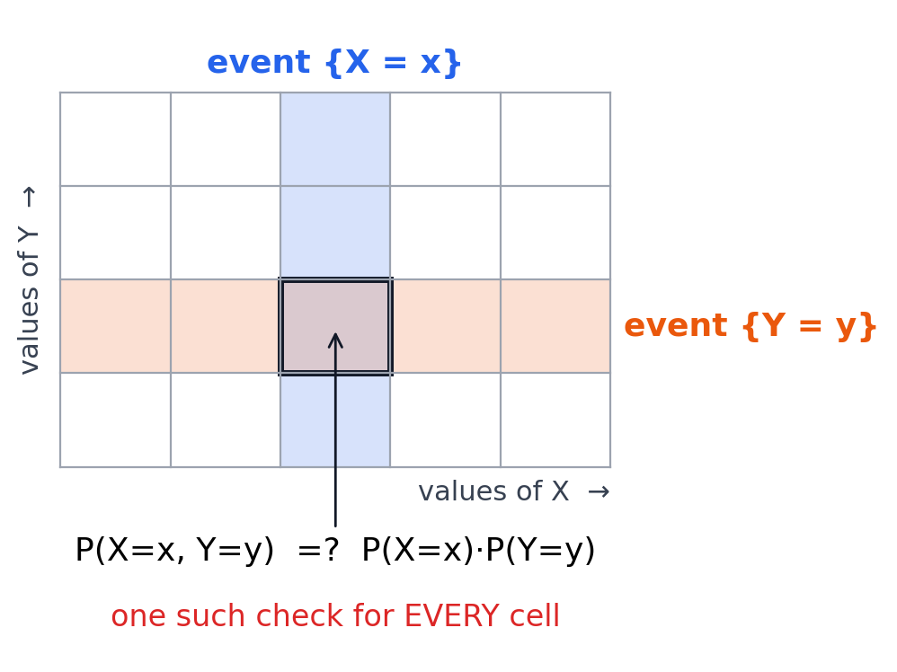
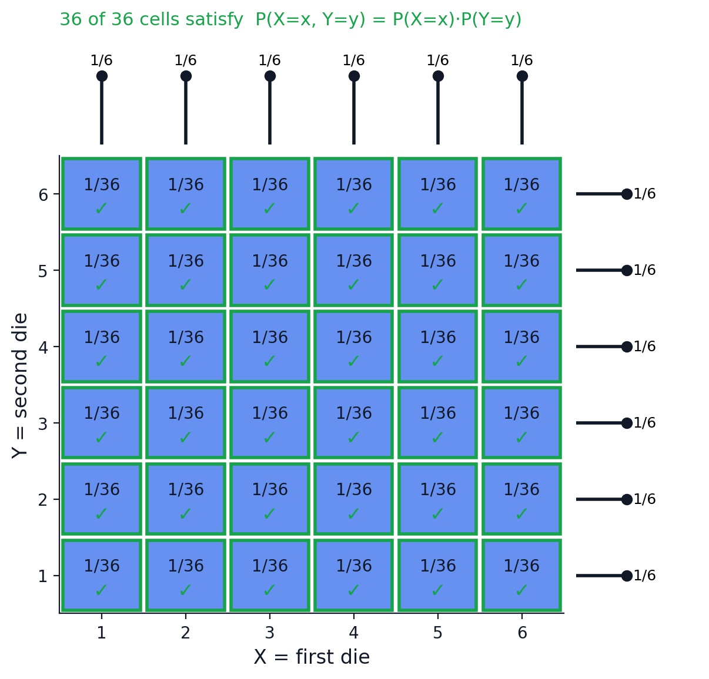
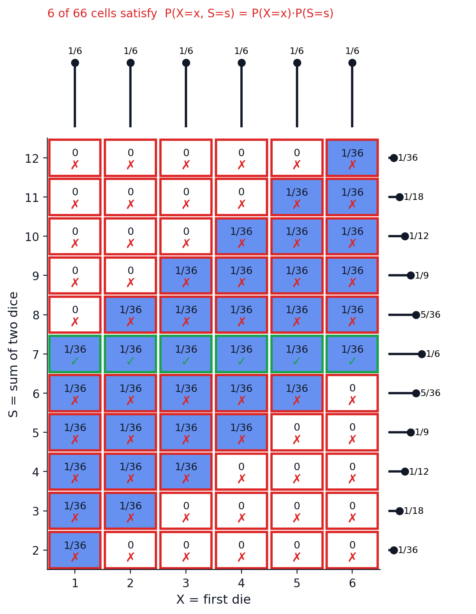

## Contents

- [Random Variables: Motivation & Definition](#rv-definition)
- [PMF, CDF, and Support](#pmf-cdf)
- [Named Distributions: Bernoulli, Binomial](#named-distributions)
- [The Hypergeometric Distribution](#hypergeometric)
- [Validating PMFs: Newton & Vandermonde](#valid-pmfs)
- [Functions of One Random Variable](#functions-one-rv)
- [Functions of Several Random Variables](#functions-several-rv)
- [Independence of Random Variables](#independence-rv)

---

## Motivation: Why Random Variables? {#rv-definition}

- So far, we've reasoned about **events**: subsets of the sample space $S$
- But often we don't care *which* outcome occurred — only some **number** attached to it

::: {.fragment}
**Example.** Toss a fair coin twice. We might ask:
:::

::: {.fragment}
- How many **Heads** came up?
- How many more **Heads** than **Tails**?
- How many **Tails** came up?
:::

::: {.fragment}
Each question turns an outcome $s \in S$ into a **number**. That's the idea we formalize today.
:::

## From Outcomes to Numbers {.smaller}

Press a button — watch each outcome get mapped to a number.

```{=html}
<div class="rvmap-wrap">
  <div class="rvmap-btnrow">
    <button class="rvmap-btn" data-fn="heads">X = Number of Heads</button>
    <button class="rvmap-btn" data-fn="tails">Y = Number of Tails</button>
    <button class="rvmap-btn" data-fn="diff">D = Heads &minus; Tails</button>
  </div>

  <svg class="rvmap-svg" viewBox="0 -20 900 400" xmlns="http://www.w3.org/2000/svg">
    <rect x="100" y="18" width="100" height="330" rx="10" fill="none" stroke="#334155" stroke-width="2"/>
    <text x="150" y="8" class="rvmap-headtext" text-anchor="middle">S</text>
    <text x="830" y="192" class="rvmap-headtext" text-anchor="start">&#8477;</text>

    <g id="rvmap-arrows"></g>
    <g id="rvmap-dots"></g>

    <g id="rvmap-pebbles">
      <circle cx="150" cy="60"  r="26" fill="#2563eb"/>
      <text x="150" y="66" text-anchor="middle" class="rvmap-pebbletext">HH</text>
      <circle cx="150" cy="140" r="26" fill="#16a34a"/>
      <text x="150" y="146" text-anchor="middle" class="rvmap-pebbletext">HT</text>
      <circle cx="150" cy="220" r="26" fill="#ea580c"/>
      <text x="150" y="226" text-anchor="middle" class="rvmap-pebbletext">TH</text>
      <circle cx="150" cy="300" r="26" fill="#dc2626"/>
      <text x="150" y="306" text-anchor="middle" class="rvmap-pebbletext">TT</text>
    </g>

    <line x1="540" y1="180" x2="820" y2="180" stroke="#334155" stroke-width="2"/>
    <g id="rvmap-ticks">
      <line x1="540" y1="174" x2="540" y2="186" stroke="#334155" stroke-width="2"/>
      <text x="540" y="204" text-anchor="middle" class="rvmap-ticktext">&minus;2</text>
      <line x1="610" y1="174" x2="610" y2="186" stroke="#334155" stroke-width="2"/>
      <text x="610" y="204" text-anchor="middle" class="rvmap-ticktext">&minus;1</text>
      <line x1="680" y1="174" x2="680" y2="186" stroke="#334155" stroke-width="2"/>
      <text x="680" y="204" text-anchor="middle" class="rvmap-ticktext">0</text>
      <line x1="750" y1="174" x2="750" y2="186" stroke="#334155" stroke-width="2"/>
      <text x="750" y="204" text-anchor="middle" class="rvmap-ticktext">1</text>
      <line x1="820" y1="174" x2="820" y2="186" stroke="#334155" stroke-width="2"/>
      <text x="820" y="204" text-anchor="middle" class="rvmap-ticktext">2</text>
    </g>
  </svg>

  <div class="rvmap-info" id="rvmap-info">Choose a random variable above.</div>
</div>

<style>
.rvmap-wrap { width: 100%; }
.rvmap-btnrow { display: flex; gap: 10px; justify-content: center; margin-bottom: 8px; }
.rvmap-btn {
  font-size: 0.85em; padding: 8px 14px; border-radius: 6px;
  border: 1px solid #cbd5e1; background: #f1f5f9; color: #1e293b;
  cursor: pointer; transition: background 0.15s, color 0.15s;
}
.rvmap-btn:hover { background: #e2e8f0; }
.rvmap-btn.active { background: #1e293b; color: #ffffff; border-color: #1e293b; }
.rvmap-svg { width: 100%; height: auto; max-height: 380px; display: block; margin: 0 auto; }
.rvmap-headtext { font-size: 20px; fill: #1e293b; font-weight: 600; }
.rvmap-pebbletext { font-size: 13px; fill: #ffffff; font-weight: 600; }
.rvmap-ticktext { font-size: 13px; fill: #334155; }
.rvmap-arrow { fill: none; stroke-width: 2.5; opacity: 0.9; }
.rvmap-dot { opacity: 0.95; }
.rvmap-info {
  text-align: center; margin-top: 10px; font-size: 0.85em;
  font-family: 'Courier New', monospace; color: #1e293b;
}
</style>

<script>
(function() {
  const rvmapOutcomes = [
    {id:'HH', y:60,  color:'#2563eb'},
    {id:'HT', y:140, color:'#16a34a'},
    {id:'TH', y:220, color:'#ea580c'},
    {id:'TT', y:300, color:'#dc2626'}
  ];

  const rvmapFuncs = {
    heads: {values:{HH:2, HT:1, TH:1, TT:0},  formula:'X(HH)=2,&nbsp; X(HT)=1,&nbsp; X(TH)=1,&nbsp; X(TT)=0'},
    tails: {values:{HH:0, HT:1, TH:1, TT:2},  formula:'Y(HH)=0,&nbsp; Y(HT)=1,&nbsp; Y(TH)=1,&nbsp; Y(TT)=2'},
    diff:  {values:{HH:2, HT:0, TH:0, TT:-2}, formula:'D(HH)=2,&nbsp; D(HT)=0,&nbsp; D(TH)=0,&nbsp; D(TT)=&minus;2'}
  };

  function rvmapXFor(v) { return 680 + v * 70; }

  const svgNS = 'http://www.w3.org/2000/svg';

  function rvmapDraw(key) {
    const arrowsG = document.getElementById('rvmap-arrows');
    const dotsG = document.getElementById('rvmap-dots');
    const info = document.getElementById('rvmap-info');
    if (!arrowsG || !dotsG || !info) return;

    arrowsG.innerHTML = '';
    dotsG.innerHTML = '';

    const f = rvmapFuncs[key];
    const counts = {};

    rvmapOutcomes.forEach(o => {
      const v = f.values[o.id];
      const tx = rvmapXFor(v);
      const idx = counts[v] || 0;
      counts[v] = idx + 1;
      const dotY = 180 - 20 - 18 * idx;

      const path = document.createElementNS(svgNS, 'path');
      const d = `M ${160} ${o.y} Q ${(160 + tx) / 2} ${o.y}, ${tx} ${180}`;
      path.setAttribute('d', d);
      path.setAttribute('class', 'rvmap-arrow');
      path.setAttribute('stroke', o.color);
      arrowsG.appendChild(path);

      const len = path.getTotalLength();
      path.style.strokeDasharray = len;
      path.style.strokeDashoffset = len;
      // force reflow then animate
      path.getBoundingClientRect();
      path.style.transition = 'stroke-dashoffset 0.6s ease';
      requestAnimationFrame(() => { path.style.strokeDashoffset = '0'; });

      const dot = document.createElementNS(svgNS, 'circle');
      dot.setAttribute('cx', tx);
      dot.setAttribute('cy', dotY);
      dot.setAttribute('r', 7);
      dot.setAttribute('fill', o.color);
      dot.setAttribute('class', 'rvmap-dot');
      dot.style.opacity = '0';
      dot.style.transition = 'opacity 0.4s ease 0.4s';
      dotsG.appendChild(dot);
      requestAnimationFrame(() => { dot.style.opacity = '0.95'; });
    });

    info.innerHTML = f.formula;
  }

  document.querySelectorAll('.rvmap-btn').forEach(btn => {
    btn.addEventListener('click', function() {
      document.querySelectorAll('.rvmap-btn').forEach(b => b.classList.remove('active'));
      btn.classList.add('active');
      rvmapDraw(btn.dataset.fn);
    });
  });
})();
</script>
```

## Definition: Random Variable

::: {.callout-note title="Definition"}
Given an experiment with sample space $S$, a **random variable** (r.v.) is a function

$$X : S \to \mathbb{R}$$

It assigns a real number $X(s)$ to every outcome $s \in S$.
:::

::: {.fragment}
For the two-coin example:
:::

::: {.fragment}
| $s$  | $X(s)$ (H) | $Y(s)$ (T) | $D(s)$ (H $-$ T) |
|:----:|:---------------:|:---------------:|:--------------------------:|
| $HH$ | 2 | 0 | 2 |
| $HT$ | 1 | 1 | 0 |
| $TH$ | 1 | 1 | 0 |
| $TT$ | 0 | 2 | $-2$ |
:::

::: {.fragment}
Same sample space, same outcomes — three different functions, three different r.v.'s.
:::

## Why "Random" *Variable*?

::: {.incremental}
- **Random**: before the experiment, we don't know which outcome $s$ will occur — so we don't know the value $X(s)$ either
- **Variable**: the value changes depending on which outcome occurs
- Once the experiment is run and $s\in S$ is realized, $X$ **crystallizes** into the number $X(s)$ — the mapping itself is not random, only the outcome fed into it is
- Convention: 
  - random variables are usually denoted by capital letters ($X, Y, D, \dots$)
  - a number that a variable might take is denoted by the corresponding lowercase letter ($x, y, d, \dots$)
:::

---

**Some more examples of random variables:**

::: {.incremental}
- Number of aces in a 5-card hand
- Sum of two dice rolls
- Number of Tails before the first Head, in a sequence of independent coin tosses
- Number of students attending a lecture
- Number of years a person will live
- Your income after graduating from NU
- Tomorrow's KZT/USD exchange rate
:::

::: {.fragment}
Some r.v.'s arise from simple experiments like throwing dice or taking cards, while others come from ambiguous and complex experiments which can be difficult to even describe. 
:::

## Simplifying the Picture

::: {.callout-important title="Key idea"}
Once $X$ is defined, we can often reason **directly about $X$** — its possible values and their probabilities — without relying on the structure of the probability space.
:::

::: {.fragment}
Questions like $P(X = 2)$ or "the average value of $X$" are questions about $X$ itself.
:::

::: {.fragment}
This is why random variables are useful: they let us **abstract away** from the sample space and work with numbers.
:::

## Distribution of a r.v. {.smaller #pmf-cdf}

- Recall that $X$ counts heads after two coin flips.
- Two natural questions: 
  - what are the possible values of $X$?
  - what is the **probability** of each value?

```{=html}
<div class="fragment" data-fragment-index="1">
<table style="width:100%; border-collapse:collapse; text-align:center; font-size:0.8em; margin-bottom: 10px;">
<thead>
<tr>
<th style="border:1px solid #333; padding:6px; text-align:center;"><em>x</em></th>
<th style="border:1px solid #333; padding:6px; text-align:center;"><em>P</em>(<em>X</em>&nbsp;=&nbsp;<em>x</em>)</th>
</tr>
</thead>
<tbody>
<tr>
<td style="border:1px solid #333; padding:6px; text-align:center;"><span class="fragment" data-fragment-index="2">0</span></td>
<td style="border:1px solid #333; padding:6px; text-align:center;"><span class="fragment" data-fragment-index="3">1/4</span></td>
</tr>
<tr>
<td style="border:1px solid #333; padding:6px; text-align:center;"><span class="fragment" data-fragment-index="2">1</span></td>
<td style="border:1px solid #333; padding:6px; text-align:center;"><span class="fragment" data-fragment-index="4">1/2</span></td>
</tr>
<tr>
<td style="border:1px solid #333; padding:6px; text-align:center;"><span class="fragment" data-fragment-index="2">2</span></td>
<td style="border:1px solid #333; padding:6px; text-align:center;"><span class="fragment" data-fragment-index="5">1/4</span></td>
</tr>
<tr>
<td style="border:1px solid #333; padding:6px; text-align:center;"><span class="fragment" data-fragment-index="2">any other <em>x</em></span></td>
<td style="border:1px solid #333; padding:6px; text-align:center;"><span class="fragment" data-fragment-index="6">0</span></td>
</tr>
</tbody>
</table>
</div>
```

::: {.fragment data-fragment-index="3"}
$P(X=0) = P(TT) = \dfrac{1}{4}$
:::

::: {.fragment data-fragment-index="4"}
$P(X=1) = P(HT) + P(TH) = \dfrac14 + \dfrac14 = \dfrac12$
:::

::: {.fragment data-fragment-index="5"}
$P(X=2) = P(HH) = \dfrac14$
:::

::: {.fragment data-fragment-index="6"}
$P(X = x) = 0$ for any $x \notin \{0,1,2\}$ — no outcome produces that value
:::

---

::: {.callout-note title="Definition: Support and PMF"}
The **support** of $X$ is the set of values $x$ with $P(X=x) > 0$. In example $\text{supp}(X) = \{0,1,2\}$.

The **probability mass function (PMF)** of $X$ is a function that gives the probability that a random variable equals to a specific value, denoted by$p_X(x) = P(X=x)$, defined for every $x \in \mathbb{R}$ (and equal to $0$ outside the support). 
:::

::: {.fragment}
- PMF is one way how we can discribe **the distribution** of a r.v. 
- It contains all the information about the probabilities of the values that the r.v. can take.
:::

---

**Empirical interpretation of PMF** 

As you repeat the experiment that generates the r.v. many times, and record the values it takes in a histogram, it will **approach** the PMF as the number of trials grows.

```{=html}
<div class="pmfchart-wrap">
  <div class="pmfchart-btnrow">
    <button class="pmfchart-btn" id="pmfchart-run1">Run 1 Trial</button>
    <button class="pmfchart-btn" id="pmfchart-run100">Run 100 Trials</button>
    <button class="pmfchart-btn pmfchart-reset" id="pmfchart-reset">Reset</button>
  </div>

  <svg class="pmfchart-svg" viewBox="0 0 900 400" xmlns="http://www.w3.org/2000/svg">
    <line x1="60" y1="340" x2="820" y2="340" stroke="#334155" stroke-width="2"/>
    <line x1="100" y1="360" x2="100" y2="20" stroke="#334155" stroke-width="2"/>

    <line x1="100" y1="206.7" x2="820" y2="206.7" stroke="#cbd5e1" stroke-width="1" stroke-dasharray="4,4"/>
    <line x1="100" y1="73.3" x2="820" y2="73.3" stroke="#cbd5e1" stroke-width="1" stroke-dasharray="4,4"/>
    <text x="88" y="211" text-anchor="end" class="pmfchart-ticktext">0.25</text>
    <text x="88" y="77" text-anchor="end" class="pmfchart-ticktext">0.5</text>

    <text x="250" y="360" text-anchor="middle" class="pmfchart-ticktext">0</text>
    <text x="450" y="360" text-anchor="middle" class="pmfchart-ticktext">1</text>
    <text x="650" y="360" text-anchor="middle" class="pmfchart-ticktext">2</text>

    <rect id="pmfchart-emp-0" class="pmfchart-empbar" x="205" y="340" width="90" height="0" fill="#2563eb" fill-opacity="0.55"/>
    <rect id="pmfchart-emp-1" class="pmfchart-empbar" x="405" y="340" width="90" height="0" fill="#2563eb" fill-opacity="0.55"/>
    <rect id="pmfchart-emp-2" class="pmfchart-empbar" x="605" y="340" width="90" height="0" fill="#2563eb" fill-opacity="0.55"/>

    <line x1="250" y1="340" x2="250" y2="206.7" stroke="#64748b" stroke-width="2.5"/>
    <line x1="450" y1="340" x2="450" y2="73.3"  stroke="#64748b" stroke-width="2.5"/>
    <line x1="650" y1="340" x2="650" y2="206.7" stroke="#64748b" stroke-width="2.5"/>
    <circle cx="250" cy="206.7" r="7" fill="#64748b"/>
    <circle cx="450" cy="73.3"  r="7" fill="#64748b"/>
    <circle cx="650" cy="206.7" r="7" fill="#64748b"/>
    <text x="250" y="192.7" text-anchor="middle" class="pmfchart-theorytext">1/4</text>
    <text x="450" y="59.3"  text-anchor="middle" class="pmfchart-theorytext">1/2</text>
    <text x="650" y="192.7" text-anchor="middle" class="pmfchart-theorytext">1/4</text>
  </svg>

  <div class="pmfchart-info" id="pmfchart-info">No trials yet — theoretical PMF shown as gray dots.</div>
</div>

<style>
.pmfchart-wrap { width: 100%; }
.pmfchart-btnrow { display: flex; gap: 10px; justify-content: center; margin-bottom: 8px; }
.pmfchart-btn {
  font-size: 0.85em; padding: 8px 14px; border-radius: 6px;
  border: 1px solid #cbd5e1; background: #f1f5f9; color: #1e293b;
  cursor: pointer; transition: background 0.15s, color 0.15s;
}
.pmfchart-btn:hover { background: #e2e8f0; }
.pmfchart-reset { background: #ffffff; border-color: #94a3b8; }
.pmfchart-svg { width: 100%; height: auto; max-height: 380px; display: block; margin: 0 auto; }
.pmfchart-ticktext { font-size: 13px; fill: #334155; }
.pmfchart-theorytext { font-size: 13px; fill: #64748b; }
.pmfchart-empbar { transition: height 0.3s ease, y 0.3s ease; }
.pmfchart-info {
  text-align: center; margin-top: 10px; font-size: 0.85em;
  font-family: 'Courier New', monospace; color: #1e293b;
}
</style>

<script>
(function() {
  const pmfBaselineY = 340;
  const pmfTopY = 20;
  const pmfMaxProb = 0.6;

  function pmfHeightForProb(p) {
    return (p / pmfMaxProb) * (pmfBaselineY - pmfTopY);
  }

  let pmfCounts = {0: 0, 1: 0, 2: 0};
  let pmfN = 0;

  function pmfSimulateOne() {
    const c1 = Math.random() < 0.5 ? 'H' : 'T';
    const c2 = Math.random() < 0.5 ? 'H' : 'T';
    const heads = (c1 === 'H' ? 1 : 0) + (c2 === 'H' ? 1 : 0);
    pmfCounts[heads] += 1;
    pmfN += 1;
  }

  function pmfRender() {
    [0, 1, 2].forEach(k => {
      const bar = document.getElementById('pmfchart-emp-' + k);
      if (!bar) return;
      const p = pmfN > 0 ? pmfCounts[k] / pmfN : 0;
      const h = pmfHeightForProb(p);
      const y = pmfBaselineY - h;
      bar.setAttribute('height', h);
      bar.setAttribute('y', y);
    });

    const info = document.getElementById('pmfchart-info');
    if (!info) return;
    if (pmfN === 0) {
      info.textContent = 'No trials yet — theoretical PMF shown as gray dots.';
    } else {
      const p0 = (pmfCounts[0] / pmfN).toFixed(2);
      const p1 = (pmfCounts[1] / pmfN).toFixed(2);
      const p2 = (pmfCounts[2] / pmfN).toFixed(2);
      info.textContent = `n = ${pmfN} trials  |  empirical: p(0)=${p0}, p(1)=${p1}, p(2)=${p2}`;
    }
  }

  function pmfReset() {
    pmfCounts = {0: 0, 1: 0, 2: 0};
    pmfN = 0;
    pmfRender();
  }

  const run1 = document.getElementById('pmfchart-run1');
  const run100 = document.getElementById('pmfchart-run100');
  const resetBtn = document.getElementById('pmfchart-reset');

  if (run1) run1.addEventListener('click', function() { pmfSimulateOne(); pmfRender(); });
  if (run100) run100.addEventListener('click', function() {
    for (let i = 0; i < 100; i++) pmfSimulateOne();
    pmfRender();
  });
  if (resetBtn) resetBtn.addEventListener('click', pmfReset);

  pmfRender();
})();
</script>
```

---

**PMFs of Y and D**

::: {.fragment}
**$Y$ = Number of Tails.** Since $Y = 2 - X$, $Y$ has the same distribution shape as $X$:

| $y$ | 0 | 1 | 2 | other |
|:---:|:---:|:---:|:---:|:---:|
| $P(Y=y)$ | $1/4$ | $1/2$ | $1/4$ | $0$ |

$P(Y=0)=P(HH)=\frac14$,  $P(Y=1)=P(HT)+P(TH)=\frac12$,  $P(Y=2)=P(TT)=\frac14$
:::

::: {.fragment}
**$D$ = Heads $-$ Tails.** Since $D = X - Y = 2X - 2$, its support shifts and stretches:

| $d$ | $-2$ | 0 | 2 | other |
|:---:|:---:|:---:|:---:|:---:|
| $P(D=d)$ | $1/4$ | $1/2$ | $1/4$ | $0$ |

$P(D=-2)=P(TT)=\frac14$,  $P(D=0)=P(HT)+P(TH)=\frac12$,  $P(D=2)=P(HH)=\frac14$
:::


---

::: {.callout-note title="Definition"}
The **cumulative distribution function (CDF)** of a random variable $X$ is the function

$$F_X(x) = P(X \le x), \qquad x \in \mathbb{R}$$
:::

::: {.fragment}
The CDF is an **alternative, fully equivalent** description of the distribution of $X$:

- Given the PMF, you can build $F_X$ by summing probabilities up to $x$
- Given $F_X$, you can recover the PMF from its jumps
:::

---

**Deriving the CDF of X**

::: {style="font-size:0.8em"}

Recall $\text{supp}(X) = \{0,1,2\}$ with $P(X=0)=\frac14$, $P(X=1)=\frac12$, $P(X=2)=\frac14$.

::: {.fragment}
$$F_X(x) = 0 \quad \text{for } x < 0$$
No value of $X$ is negative, so $P(X \le x) = 0$.
:::

::: {.fragment}
$$F_X(x) = P(X=0) = \frac14 \quad \text{for } 0 \le x < 1$$
:::

::: {.fragment}
$$F_X(x) = P(X=0)+P(X=1) = \frac14+\frac12 = \frac34 \quad \text{for } 1 \le x < 2$$
:::

::: {.fragment}
$$F_X(x) = P(X=0)+P(X=1)+P(X=2) = 1 \quad \text{for } x \ge 2$$
:::
:::

---

**Graph the CDF of X**

```{=html}
<svg class="cdfgraph-svg" viewBox="0 0 900 400" xmlns="http://www.w3.org/2000/svg" style="width:100%; height:auto; max-height:400px; display:block; margin:0 auto;">
  <line x1="60" y1="340" x2="820" y2="340" stroke="#334155" stroke-width="2"/>
  <line x1="275" y1="360" x2="275" y2="20" stroke="#334155" stroke-width="2"/>

  <line x1="275" y1="265" x2="800" y2="265" stroke="#cbd5e1" stroke-width="1" stroke-dasharray="4,4"/>
  <line x1="275" y1="190" x2="800" y2="190" stroke="#cbd5e1" stroke-width="1" stroke-dasharray="4,4"/>
  <line x1="275" y1="115" x2="800" y2="115" stroke="#cbd5e1" stroke-width="1" stroke-dasharray="4,4"/>
  <line x1="275" y1="40"  x2="800" y2="40"  stroke="#cbd5e1" stroke-width="1" stroke-dasharray="4,4"/>

  <text x="815" y="336" text-anchor="end" class="cdfgraph-axislabel">x</text>
  <text x="281" y="30" text-anchor="start" class="cdfgraph-axislabel">F(x)</text>

  <text x="263" y="269" text-anchor="end" class="cdfgraph-ticktext">1/4</text>
  <text x="263" y="194" text-anchor="end" class="cdfgraph-ticktext">1/2</text>
  <text x="263" y="119" text-anchor="end" class="cdfgraph-ticktext">3/4</text>
  <text x="263" y="44"  text-anchor="end" class="cdfgraph-ticktext">1</text>
  <text x="263" y="344" text-anchor="end" class="cdfgraph-ticktext">0</text>

  <text x="275" y="360" text-anchor="middle" class="cdfgraph-ticktext">0</text>
  <text x="450" y="360" text-anchor="middle" class="cdfgraph-ticktext">1</text>
  <text x="625" y="360" text-anchor="middle" class="cdfgraph-ticktext">2</text>

  <line x1="100" y1="340" x2="275" y2="340" stroke="#2563eb" stroke-width="3"/>
  <line x1="275" y1="265" x2="450" y2="265" stroke="#2563eb" stroke-width="3"/>
  <line x1="450" y1="115" x2="625" y2="115" stroke="#2563eb" stroke-width="3"/>
  <line x1="625" y1="40"  x2="800" y2="40"  stroke="#2563eb" stroke-width="3"/>

  <polygon points="100,340 112,335 112,345" fill="#2563eb"/>
  <polygon points="800,40 788,35 788,45" fill="#2563eb"/>

  <line x1="275" y1="340" x2="275" y2="265" stroke="#94a3b8" stroke-width="1.5" stroke-dasharray="4,3"/>
  <line x1="450" y1="265" x2="450" y2="115" stroke="#94a3b8" stroke-width="1.5" stroke-dasharray="4,3"/>
  <line x1="625" y1="115" x2="625" y2="40"  stroke="#94a3b8" stroke-width="1.5" stroke-dasharray="4,3"/>

  <circle cx="275" cy="340" r="6" fill="#ffffff" stroke="#2563eb" stroke-width="2.5"/>
  <circle cx="450" cy="265" r="6" fill="#ffffff" stroke="#2563eb" stroke-width="2.5"/>
  <circle cx="625" cy="115" r="6" fill="#ffffff" stroke="#2563eb" stroke-width="2.5"/>

  <circle cx="275" cy="265" r="6" fill="#2563eb"/>
  <circle cx="450" cy="115" r="6" fill="#2563eb"/>
  <circle cx="625" cy="40"  r="6" fill="#2563eb"/>
</svg>

<style>
.cdfgraph-ticktext { font-size: 13px; fill: #334155; }
.cdfgraph-axislabel { font-size: 15px; fill: #1e293b; font-weight: 600; }
</style>
```

::: {.fragment}
$F_X$ is a **step function**: flat between integers, with jumps at $x=0,1,2$ — the support of $X$.
:::

::: {.fragment}
Closed dot = value $F_X$ actually takes there (right-continuous); open dot = the limit approaching from the left.
:::

::: {.fragment}
The **size of each jump at $x$ is exactly $P(X=x)$** — the CDF encodes the PMF in its discontinuities.
:::

---

**Discrete versus Continuous Random Variables**

::: {.callout-note title="Definition: Discrete Random Variable"}
A random variable $X$ is **discrete** if there is a finite list $a_1,\dots,a_n$, or an infinite list $a_1,a_2,\dots$, of values such that

$$P(X \in \{a_1,a_2,\dots\}) = 1$$

That is, $X$ takes values only in some countable set — its **support**.
:::

::: {.fragment}
**Continuous random variables:** $X$ can take *any* value in an interval of $\mathbb{R}$ — e.g. a height, a duration. There are uncountably many possible values, and typically $P(X=x) = 0$ for every single point $x$.
:::

::: {.fragment}
::: {.callout-important title="Key contrast"}
A discrete r.v. only accumulates probability at countably many points, so its CDF $F_X$ is a **step function**: flat except at the points of the support, where it jumps. A continuous r.v.'s CDF has no jumps — it rises smoothly.
:::
:::

---

::: {.callout-note title="Properties of PMFs"}
Every PMF $p_X$ of a discrete random variable $X$ satisfies:

1. **Nonnegativity:** $p_X(x) \ge 0$ for all $x \in \mathbb{R}$
2. **Sums to one:** $\displaystyle\sum_{x} p_X(x) = 1$, summing over the support of $X$
:::

::: {.fragment}
These two properties **fully characterize** valid PMFs: any function $p(x)$ satisfying (1) and (2) on some countable set of values is the PMF of *some* discrete random variable — nothing else about the underlying experiment matters.
:::

---

**Example: Is This a Valid PMF?**

Let

$$p(x) = k^x, \qquad x = 1, 2, 3, \dots$$

for some constant $k$. Is there a value of $k$ that makes $p$ a valid PMF? If so, find it.

::: {.fragment}
**We need to check if the two properties hold.**
:::

---

**Example: Is This a Valid PMF?**

::: {style="font-size:0.7em"}

::: {.fragment}
**Nonnegativity** ($p(x) \ge 0$): requires $k \ge 0$, so that $k^x \ge 0$ for every integer $x \ge 1$.
:::

::: {.fragment}
**Sums to one:**
$$\sum_{x=1}^{\infty} k^x = 1$$
:::

::: {.fragment}
This is a **geometric series**, starting at $x=1$ — convergent only when $|k|<1$:

$$\sum_{x=1}^{\infty} k^x = \frac{k}{1-k}, \qquad |k| < 1$$
:::

::: {.fragment}
Setting this equal to $1$:

$$\frac{k}{1-k} = 1 \;\Longrightarrow\; k = 1-k \;\Longrightarrow\; k = \frac12$$
:::

::: {.fragment}
Check: $k=\tfrac12$ satisfies both $k \ge 0$ and $|k|<1$. So $p(x) = (1/2)^x$ for $x=1,2,3,\dots$ **is** a valid PMF.
:::
:::

## Named Distributions {#named-distributions}

- Some random variables are so common that they have their own names.
- We'll start with the **Bernoulli**, then the **Binomial**, and **Hypergeometric** distributions.

---

::: {.callout-note title="Definition"}
$X$ has the **Bernoulli distribution** with parameter $p$, written $$X \sim \text{Bern}(p),$$ if it takes only two values, $0$ and $1$, with probabilities

$$P(X=1) = p, \qquad P(X=0) = 1-p, \qquad 0 < p < 1$$
:::

```{=html}
<svg viewBox="0 0 500 260" xmlns="http://www.w3.org/2000/svg" style="width:100%; max-width:500px; height:auto; display:block; margin:0 auto;">
  <circle cx="250" cy="50" r="30" fill="#1e293b"/>
  <text x="250" y="57" text-anchor="middle" font-size="20" font-weight="600" fill="#ffffff">X</text>

  <line x1="232.7" y1="74.5" x2="154.2" y2="185.7" stroke="#334155" stroke-width="3"/>
  <polygon points="146.1,197.1 149.3,182.2 159.1,189.1" fill="#334155"/>

  <line x1="267.3" y1="74.5" x2="345.8" y2="185.7" stroke="#334155" stroke-width="3"/>
  <polygon points="353.9,197.1 340.9,189.1 350.7,182.2" fill="#334155"/>

  <text x="180.4" y="120.9" text-anchor="middle" font-size="19" font-weight="600" fill="#1e293b">1&minus;p</text>
  <text x="293.5" y="139.3" text-anchor="middle" font-size="19" font-weight="600" fill="#1e293b">p</text>

  <circle cx="130" cy="220" r="28" fill="#e2e8f0" stroke="#334155" stroke-width="2.5"/>
  <text x="130" y="227" text-anchor="middle" font-size="20" font-weight="600" fill="#1e293b">0</text>

  <circle cx="370" cy="220" r="28" fill="#dbeafe" stroke="#334155" stroke-width="2.5"/>
  <text x="370" y="227" text-anchor="middle" font-size="20" font-weight="600" fill="#1e293b">1</text>
</svg>
```

::: {.fragment}
$\text{Bern}(p)$ is not one distribution — it's a **family**, indexed by the parameter $p \in (0,1)$. Different $p$ gives a different distribution.
:::

---

- ***Bernoulli trials*** are experiments with exactly two outcomes — success and failure — with success probability $p$.
- Think of Bernoulli distribution as the one describing a single Bernoulli trial.

Examples of Bernoulli r.v.s:

::: {.incremental}
- A single coin toss where we let $X=1$ if Heads, $0$ if Tails: $\text{Bern}(1/2)$ for a fair coin
- A die roll where we let $X=1$ if a 6 comes up, $0$ otherwise: $\text{Bern}(1/6)$
- A student comes to class ($X=1$) or not ($X=0$): $X \sim \text{Bern}(p)$ where $p$ is the probability of attending
:::

---

**Binomial Distribution**

::: {.callout-note title="Definition"}
- Perform $n$ **independent** $\text{Bern}(p)$ trials.  
- Let $X$ be the **number of successes**. 
- Then $X$ has the **Binomial distribution** with parameters $n$ and $p$:

$$X \sim \text{Bin}(n,p)$$
:::

::: {.incremental}
- Again, a **family** of distributions — this time indexed by *two* parameters, $n$ (number of trials) and $p$ (success probability per trial).
- Notice that we defined the Binomial distribution in terms of a **story** about where $X$ comes from. This is often more useful than giving the PMF directly, because it allows you to recognize distributions in new problems without having to rederive the PMF from scratch.
:::

---

**Example:**
Toss a fair coin $n$ times. Let $X$ = number of Heads.

::: {.fragment}
Each toss is a $\text{Bern}(1/2)$ trial, and the tosses are independent — exactly the Binomial story. So

$$X \sim \text{Bin}(n, 1/2)$$
:::

::: {.fragment}
Note: our very first example — two coin tosses, $X$ = number of Heads — was $\text{Bin}(2, 1/2)$ all along.
:::

---

**PMF of the Binomial**

If $X \sim \text{Bin}(n,p)$, then what are its support and PMF?

:::{.incremental}
- Support is $\{0,1,\dots,n\}$ — you can have anywhere from $0$ to $n$ successes
- PMF is $$P(X=k) = \binom{n}{k} p^k (1-p)^{n-k}, \qquad k = 0,1,\dots,n$$
:::

::: {.fragment}
*Where does PMF come from? Let's derive it.*
:::

---

::: {style="font-size:0.7em"}
**Deriving Binomial PMF**
To derive PMF means to find $P(X=x)$ for all $x\in \mathbb{R}$. Lets do this in steps.

::: {.incremental}
- The support of $X$ is $\{0,1,\dots,n\}$, so we only need to find $P(X=k)$ for $k=0,1,\dots,n$.
- Lets try to find $P(X=0)$ first. This is the probability of getting exactly 0 successes in $n$ independent Bernoulli trials.
  - This can happen in only one way -- all trials must be failures. 
  - Probability of each individual trial being a failure is $1-p$, so by independence, the probability of all $n$ trials being failures is $(1-p)^n$. Hence, $P(X=0) = (1-p)^n$.
- Lets find $P(X=1)$ next. This is the probability of getting exactly 1 success in $n$ independent Bernoulli trials.
  - There are $n$ different ways this can happen -- the success can occur in any one of the $n$ trials, with all other trials being failures. 
  - Probability of each individual trial being a success is $p$, and probability of each individual trial being a failure is $1-p$. So by independence, the probability of any specific sequence with exactly 1 success and $n-1$ failures is $p(1-p)^{n-1}$. 
  - Since there are $n$ different sequences that give exactly 1 success, we have $P(X=1) = n p (1-p)^{n-1}$.
:::
:::

---

::: {style="font-size:0.7em"}
Now lets do it for general $k$.

:::{.incremental}
- Fix $k \in \{0,1,\dots,n\}$. The event $\{X = k\}$ is: *exactly $k$ of the $n$ trials are successes.*
- The probability of this event is the sum of the probabilities of all sequences of $n$ trials that have exactly $k$ successes.
- The probability of any specific sequence with exactly $k$ successes and $n-k$ failures is the product of the individual trial probabilities, by independence: $$p^k (1-p)^{n-k}.$$
- There exactly $\binom{n}{k}$ sequences of $n$ trials that have exactly $k$ successes (choose which $k$ of the $n$ trials are successes).
- Summing over all sequences with exactly $k$ successes, we have: $$P(X=k) = \binom{n}{k} p^k (1-p)^{n-k}.$$
:::
:::

## Two Ways to Define a Random Variable

::: {.fragment}
**By distribution:** give the PMF (or CDF) directly, as a formula.
:::

::: {.fragment}
**By story:** describe the generative process — e.g. "count successes in $n$ independent trials."
:::

::: {.fragment}
**Recongizing the distribution from the story** is a key skill here.
:::

--- 

**Some More Binomial Examples**

::: {style="font-size:0.7em"}
::: {.incremental}
- Roll 6 dice — number of times 6 appears: $\text{Bin}(6, 1/6)$
- A monkey randomly answers $n$ multiple-choice questions (4 options each) — number of correct answers: $\text{Bin}(n, 1/4)$
- Number of likes a post receives, if each of $n$ viewers independently likes it with probability $p$: $\text{Bin}(n,p)$
- Number of loans (out of $n$ issued) that get repaid, if each is repaid independently with probability $p$: $\text{Bin}(n,p)$
- An airline sells $n$ tickets for a flight; if each ticketed passenger independently shows up with probability $p$ — number of no-shows: $\text{Bin}(n, 1-p)$ (the basis for overbooking policy)
- A firm sends out $n$ job offers; if each candidate independently accepts with probability $p$ — number of acceptances: $\text{Bin}(n,p)$
:::

::: {.fragment}
The last few examples are simplifications — real likes/repayments/no-shows etc are rarely *exactly* independent and have identical probabilities — but Binomial is often a reasonable first model.
:::
:::

---

Unlike the PMF, there is **no simple closed-form formula** for the Binomial CDF.

::: {.fragment}
We're stuck with the sum itself:

$$F_X(x) = P(X \le x) = \sum_{k=0}^{\lfloor x \rfloor} \binom{n}{k} p^k (1-p)^{n-k}$$
:::

::: {.fragment}
In practice this is computed numerically (software, tables) rather than simplified algebraically.
:::

## Comparing Binomial PMFs {.smaller}

Toggle each distribution on to see how $n$ and $p$ shape the PMF.

```{=html}
<div class="binomcompare-wrap">
  <div class="binomcompare-btnrow">
    <button class="binomcompare-btn" id="binomcompare-btn-a" style="border-color:#2563eb;">Bin(10, 0.2)</button>
    <button class="binomcompare-btn" id="binomcompare-btn-b" style="border-color:#16a34a;">Bin(10, 0.5)</button>
    <button class="binomcompare-btn" id="binomcompare-btn-c" style="border-color:#ea580c;">Bin(20, 0.5)</button>
  </div>

  <svg class="binomcompare-svg" viewBox="0 0 900 400" xmlns="http://www.w3.org/2000/svg">
    <line x1="100" y1="360" x2="820" y2="360" stroke="#334155" stroke-width="2"/>
    <line x1="120" y1="380" x2="120" y2="20" stroke="#334155" stroke-width="2"/>

    <line x1="120" y1="260" x2="820" y2="260" stroke="#cbd5e1" stroke-width="1" stroke-dasharray="4,4"/>
    <line x1="120" y1="160" x2="820" y2="160" stroke="#cbd5e1" stroke-width="1" stroke-dasharray="4,4"/>
    <line x1="120" y1="60"  x2="820" y2="60"  stroke="#cbd5e1" stroke-width="1" stroke-dasharray="4,4"/>
    <text x="108" y="264" text-anchor="end" class="binomcompare-ticktext">0.1</text>
    <text x="108" y="164" text-anchor="end" class="binomcompare-ticktext">0.2</text>
    <text x="108" y="64"  text-anchor="end" class="binomcompare-ticktext">0.3</text>
    <text x="108" y="364" text-anchor="end" class="binomcompare-ticktext">0</text>

    <text x="120" y="380" text-anchor="middle" class="binomcompare-ticktext">0</text>
    <text x="188" y="380" text-anchor="middle" class="binomcompare-ticktext">2</text>
    <text x="256" y="380" text-anchor="middle" class="binomcompare-ticktext">4</text>
    <text x="324" y="380" text-anchor="middle" class="binomcompare-ticktext">6</text>
    <text x="392" y="380" text-anchor="middle" class="binomcompare-ticktext">8</text>
    <text x="460" y="380" text-anchor="middle" class="binomcompare-ticktext">10</text>
    <text x="528" y="380" text-anchor="middle" class="binomcompare-ticktext">12</text>
    <text x="596" y="380" text-anchor="middle" class="binomcompare-ticktext">14</text>
    <text x="664" y="380" text-anchor="middle" class="binomcompare-ticktext">16</text>
    <text x="732" y="380" text-anchor="middle" class="binomcompare-ticktext">18</text>
    <text x="800" y="380" text-anchor="middle" class="binomcompare-ticktext">20</text>
    <text x="815" y="356" text-anchor="end" class="binomcompare-axislabel">k</text>

    <g id="binomcompare-g-a" style="display:none"></g>
    <g id="binomcompare-g-b" style="display:none"></g>
    <g id="binomcompare-g-c" style="display:none"></g>
  </svg>

  <div class="binomcompare-info" id="binomcompare-info">Press a button to show that distribution's PMF.</div>
</div>

<style>
.binomcompare-wrap { width: 100%; }
.binomcompare-btnrow { display: flex; gap: 10px; justify-content: center; margin-bottom: 8px; }
.binomcompare-btn {
  font-size: 0.85em; padding: 8px 14px; border-radius: 6px;
  border: 2px solid #cbd5e1; background: #f8fafc; color: #1e293b;
  cursor: pointer; transition: background 0.15s, color 0.15s;
}
.binomcompare-btn.active { color: #ffffff; }
.binomcompare-svg { width: 100%; height: auto; max-height: 380px; display: block; margin: 0 auto; }
.binomcompare-ticktext { font-size: 12px; fill: #334155; }
.binomcompare-axislabel { font-size: 14px; fill: #1e293b; font-weight: 600; }
.binomcompare-info {
  text-align: center; margin-top: 10px; font-size: 0.85em;
  font-family: 'Courier New', monospace; color: #1e293b;
}
</style>

<script>
(function() {
  function comb(n, k) {
    if (k < 0 || k > n) return 0;
    k = Math.min(k, n - k);
    let result = 1;
    for (let i = 0; i < k; i++) result = result * (n - i) / (i + 1);
    return result;
  }
  function binomPmf(n, p, k) { return comb(n, k) * Math.pow(p, k) * Math.pow(1 - p, n - k); }

  const baselineY = 360, topY = 20, maxProb = 0.32;
  function xPix(k) { return 120 + 34 * k; }
  function yPix(p) { return baselineY - (p / maxProb) * (baselineY - topY); }

  const seriesList = [
    {key: 'a', n: 10, p: 0.2, color: '#2563eb', dx: -5, label: 'Bin(10, 0.2)'},
    {key: 'b', n: 10, p: 0.5, color: '#16a34a', dx: 0,  label: 'Bin(10, 0.5)'},
    {key: 'c', n: 20, p: 0.5, color: '#ea580c', dx: 5,  label: 'Bin(20, 0.5)'}
  ];

  const svgNS = 'http://www.w3.org/2000/svg';
  const active = {a: false, b: false, c: false};

  function populateGroup(s) {
    const g = document.getElementById('binomcompare-g-' + s.key);
    if (!g) return;
    for (let k = 0; k <= s.n; k++) {
      const p = binomPmf(s.n, s.p, k);
      const x = xPix(k) + s.dx;
      const yTop = yPix(p);

      const line = document.createElementNS(svgNS, 'line');
      line.setAttribute('x1', x); line.setAttribute('y1', baselineY);
      line.setAttribute('x2', x); line.setAttribute('y2', yTop);
      line.setAttribute('stroke', s.color);
      line.setAttribute('stroke-width', '2');
      g.appendChild(line);

      const dot = document.createElementNS(svgNS, 'circle');
      dot.setAttribute('cx', x); dot.setAttribute('cy', yTop);
      dot.setAttribute('r', '4.5'); dot.setAttribute('fill', s.color);
      g.appendChild(dot);
    }
  }

  function updateInfo() {
    const info = document.getElementById('binomcompare-info');
    if (!info) return;
    const shown = seriesList.filter(s => active[s.key]).map(s => s.label);
    info.textContent = shown.length === 0
      ? "Press a button to show that distribution's PMF."
      : 'Showing: ' + shown.join(', ');
  }

  seriesList.forEach(s => {
    populateGroup(s);
    const btn = document.getElementById('binomcompare-btn-' + s.key);
    if (!btn) return;
    btn.addEventListener('click', function() {
      active[s.key] = !active[s.key];
      const g = document.getElementById('binomcompare-g-' + s.key);
      if (g) g.style.display = active[s.key] ? 'block' : 'none';
      btn.classList.toggle('active', active[s.key]);
      btn.style.background = active[s.key] ? s.color : '#f8fafc';
      updateInfo();
    });
  });

  updateInfo();
})();
</script>
```

::: {.fragment}
Larger $n$ spreads the distribution out; $p$ shifts where its mass is centered. All three still sum to $1$.
:::

---

**Another Example**

- Deal a $4$-card hand from a standard $52$-card deck. Let $X$ = number of aces.
- This *looks* like counting successes in $4$ trials — is $X \sim \text{Bin}(4, 4/52)$?

::: {.fragment}
Each card drawn is "ace or not" — that part matches the Binomial story. What might break down?
:::

---

Binomial requires the trials to be **independent**, each with the *same* success probability $p$.

::: {.fragment}
Here, cards are dealt **without replacement**. After the first card, the deck has changed:

- If the first card was an ace: $3$ aces left in $51$ cards
- If not: $4$ aces left in $51$ cards
:::

::: {.fragment}
The probability of "ace" on draw 2 **depends on the outcome of draw 1** — the trials are not independent, and $p$ isn't fixed. The Binomial model doesn't apply.
:::

---

## The Hypergeometric Distribution {#hypergeometric}

::: {.callout-note title="Story Definition"}
An urn contains $w$ white (success) balls and $b$ black (failure) balls, $N = w+b$ total. Draw $n$ balls **without replacement**. Let $X$ = number of white balls drawn. Then

$$X \sim \text{HGeom}(w,b,n)$$
:::

::: {.fragment}
A family indexed by **three** parameters: $w$, $b$, and $n$.
:::

::: {.fragment}
Our aces problem: $w=4$ (aces), $b=48$ (other cards), $n=4$ (hand size) — $X \sim \text{HGeom}(4,48,4)$.
:::

---

**Simulating the Urn**

Draw 3 balls from an urn of 4 red (success) and 6 gray (failure) balls — without replacement.

```{=html}
<div class="urnwidget-wrap">
  <div class="urnwidget-btnrow">
    <button class="urnwidget-btn" id="urnwidget-draw">Draw 3 Balls</button>
    <button class="urnwidget-btn urnwidget-reset" id="urnwidget-reset">Reset</button>
  </div>

  <svg class="urnwidget-svg" viewBox="0 0 820 260" xmlns="http://www.w3.org/2000/svg">
    <text x="220" y="30" text-anchor="middle" class="urnwidget-label">Urn (4 red, 6 gray)</text>
    <rect x="40" y="45" width="360" height="175" rx="18" fill="#f8fafc" stroke="#334155" stroke-width="2"/>

    <g id="urnwidget-balls">
      <circle class="urnwidget-ball" id="urnwidget-ball-0" cx="100" cy="100" r="22" fill="#dc2626"/>
      <circle class="urnwidget-ball" id="urnwidget-ball-1" cx="160" cy="100" r="22" fill="#64748b"/>
      <circle class="urnwidget-ball" id="urnwidget-ball-2" cx="220" cy="100" r="22" fill="#dc2626"/>
      <circle class="urnwidget-ball" id="urnwidget-ball-3" cx="280" cy="100" r="22" fill="#64748b"/>
      <circle class="urnwidget-ball" id="urnwidget-ball-4" cx="340" cy="100" r="22" fill="#dc2626"/>
      <circle class="urnwidget-ball" id="urnwidget-ball-5" cx="100" cy="180" r="22" fill="#64748b"/>
      <circle class="urnwidget-ball" id="urnwidget-ball-6" cx="160" cy="180" r="22" fill="#dc2626"/>
      <circle class="urnwidget-ball" id="urnwidget-ball-7" cx="220" cy="180" r="22" fill="#64748b"/>
      <circle class="urnwidget-ball" id="urnwidget-ball-8" cx="280" cy="180" r="22" fill="#64748b"/>
      <circle class="urnwidget-ball" id="urnwidget-ball-9" cx="340" cy="180" r="22" fill="#64748b"/>
    </g>

    <text x="620" y="30" text-anchor="middle" class="urnwidget-label">Drawn (in order)</text>
    <circle cx="500" cy="140" r="22" fill="none" stroke="#94a3b8" stroke-width="2" stroke-dasharray="4,3"/>
    <circle cx="580" cy="140" r="22" fill="none" stroke="#94a3b8" stroke-width="2" stroke-dasharray="4,3"/>
    <circle cx="660" cy="140" r="22" fill="none" stroke="#94a3b8" stroke-width="2" stroke-dasharray="4,3"/>
    <circle id="urnwidget-slot-0" cx="500" cy="140" r="22" fill="none" opacity="0"/>
    <circle id="urnwidget-slot-1" cx="580" cy="140" r="22" fill="none" opacity="0"/>
    <circle id="urnwidget-slot-2" cx="660" cy="140" r="22" fill="none" opacity="0"/>
    <text x="500" y="180" text-anchor="middle" class="urnwidget-ticktext">1st</text>
    <text x="580" y="180" text-anchor="middle" class="urnwidget-ticktext">2nd</text>
    <text x="660" y="180" text-anchor="middle" class="urnwidget-ticktext">3rd</text>
  </svg>

  <div class="urnwidget-info" id="urnwidget-info">Click "Draw 3 Balls" to sample without replacement.</div>
</div>

<style>
.urnwidget-wrap { width: 100%; }
.urnwidget-btnrow { display: flex; gap: 10px; justify-content: center; margin-bottom: 8px; }
.urnwidget-btn {
  font-size: 0.85em; padding: 8px 14px; border-radius: 6px;
  border: 1px solid #cbd5e1; background: #f1f5f9; color: #1e293b;
  cursor: pointer; transition: background 0.15s, color 0.15s;
}
.urnwidget-btn:hover { background: #e2e8f0; }
.urnwidget-reset { background: #ffffff; border-color: #94a3b8; }
.urnwidget-svg { width: 100%; height: auto; max-height: 300px; display: block; margin: 0 auto; }
.urnwidget-label { font-size: 15px; fill: #1e293b; font-weight: 600; }
.urnwidget-ticktext { font-size: 12px; fill: #64748b; }
.urnwidget-ball { transition: opacity 0.3s ease; }
.urnwidget-info {
  text-align: center; margin-top: 10px; font-size: 0.85em;
  font-family: 'Courier New', monospace; color: #1e293b;
}
</style>

<script>
(function() {
  const urnColors = ['red','gray','red','gray','red','gray','red','gray','gray','gray'];
  const urnTotal = urnColors.length;
  const slotX = [500, 580, 660];
  const slotY = 140;

  let drawnMask = new Array(urnTotal).fill(false);
  let drawnSequence = [];
  let drawing = false;

  function colorHex(c) { return c === 'red' ? '#dc2626' : '#64748b'; }

  function shuffleIndices(arr) {
    const a = arr.slice();
    for (let i = a.length - 1; i > 0; i--) {
      const j = Math.floor(Math.random() * (i + 1));
      const tmp = a[i]; a[i] = a[j]; a[j] = tmp;
    }
    return a;
  }

  function updateInfo() {
    const info = document.getElementById('urnwidget-info');
    if (!info) return;
    if (drawnSequence.length === 0) {
      info.textContent = 'Click "Draw 3 Balls" to sample without replacement.';
    } else {
      const redCount = drawnSequence.filter(c => c === 'red').length;
      const grayCount = drawnSequence.length - redCount;
      info.textContent = `Drew ${redCount} red (success), ${grayCount} gray (failure) out of ${drawnSequence.length} draws.`;
    }
  }

  function runDraw() {
    if (drawing) return;
    drawing = true;
    const remainingIdx = [];
    for (let i = 0; i < urnTotal; i++) if (!drawnMask[i]) remainingIdx.push(i);
    const n = Math.min(3, remainingIdx.length);
    const order = shuffleIndices(remainingIdx).slice(0, n);

    order.forEach((idx, step) => {
      setTimeout(() => {
        drawnMask[idx] = true;
        drawnSequence.push(urnColors[idx]);

        const ball = document.getElementById('urnwidget-ball-' + idx);
        if (ball) ball.style.opacity = '0.12';

        const slot = document.getElementById('urnwidget-slot-' + step);
        if (slot) {
          slot.setAttribute('fill', colorHex(urnColors[idx]));
          slot.setAttribute('opacity', '1');
        }

        updateInfo();
        if (step === order.length - 1) drawing = false;
      }, step * 500);
    });
  }

  function resetUrn() {
    drawnMask = new Array(urnTotal).fill(false);
    drawnSequence = [];
    drawing = false;
    for (let i = 0; i < urnTotal; i++) {
      const ball = document.getElementById('urnwidget-ball-' + i);
      if (ball) ball.style.opacity = '1';
    }
    for (let s = 0; s < 3; s++) {
      const slot = document.getElementById('urnwidget-slot-' + s);
      if (slot) slot.setAttribute('opacity', '0');
    }
    updateInfo();
  }

  const drawBtn = document.getElementById('urnwidget-draw');
  const resetBtn = document.getElementById('urnwidget-reset');
  if (drawBtn) drawBtn.addEventListener('click', runDraw);
  if (resetBtn) resetBtn.addEventListener('click', resetUrn);
})();
</script>
```

---

::: {.callout-note title="Definition"}
If $X \sim \text{HGeom}(w,b,n)$, then

$$P(X=k) = \frac{\dbinom{w}{k}\dbinom{b}{n-k}}{\dbinom{w+b}{n}}$$

for integers $k$ with $0 \le k \le w$ and $0 \le n-k \le b$.
:::

::: {.fragment}
Numerator: choose $k$ white and $n-k$ black. Denominator: total ways to choose any $n$ from $N=w+b$.
:::

---

**Hypergeometric Examples**

::: {.fragment}
**Aces in a 4-card hand:** $w=4$ (aces), $b=48$, $n=4$.

$$P(X=2) = \frac{\binom{4}{2}\binom{48}{2}}{\binom{52}{4}} = \frac{6 \times 1128}{270725} = 0.025$$
:::

::: {.fragment}
**Quality control:** a batch of $20$ items has $3$ defective. Inspect $5$ at random without replacement — number of defectives found is $\text{HGeom}(3,17,5)$.
:::

::: {.fragment}
**Committee selection:** a class has $12$ economics majors and $8$ other majors. Pick a committee of $6$ students at random — number of economics majors on it is $\text{HGeom}(12,8,6)$.
:::

---

**Deriving the Hypergeometric PMF**

::: {style="font-size:0.8em"}
Urn: $w$ white, $b$ black, draw $n$ without replacement. Start with the simplest case.

::: {.incremental}
- $\{X=0\}$: **none** of the $n$ drawn balls are white — all $n$ are black.
  - Choose $0$ white (from $w$) and $n$ black (from $b$), out of all $\binom{w+b}{n}$ equally likely samples of size $n$:
  $$P(X=0) = \frac{\binom{w}{0}\binom{b}{n}}{\binom{w+b}{n}}$$
- $\{X=1\}$: **exactly one** white ball among the $n$ drawn.
  - Choose $1$ white (from $w$) and $n-1$ black (from $b$):
$$P(X=1) = \frac{\binom{w}{1}\binom{b}{n-1}}{\binom{w+b}{n}}$$
:::
:::

---

**Deriving the Hypergeometric PMF**

::: {style="font-size:0.8em"}
The pattern is now clear — for any valid $k$, choose $k$ white and $n-k$ black:

$$P(X=k) = \frac{\binom{w}{k}\binom{b}{n-k}}{\binom{w+b}{n}}$$


::: {.fragment}
Same reasoning as $k=0,1$ — just replace the fixed small number with the general $k$.
:::
:::

---

**Sampling: With or Without Replacement**

Same urn story (white/black balls, count successes), but:

- **With replacement** (each draw independent, same composition every time) $\to$ $\text{Bin}(n,p)$ with $p = w/(w+b)$
- **Without replacement** (composition changes after each draw) $\to$ $\text{HGeom}(w,b,n)$

::: {.fragment}
As $N=w+b$ grows large relative to $n$, removing a few balls barely changes the composition — $\text{HGeom}$ starts to look like $\text{Bin}$.
:::

---

## Comparing Hypergeometric PMFs {.smaller}

Same sample size $n = 5$, different urns. The dashed gray series is the Binomial with $p = w/(w+b)$ — sampling the *same* urn **with** replacement.

```{=html}
<div class="hgeomcompare-wrap">
  <div class="hgeomcompare-btnrow">
    <button class="hgeomcompare-btn" id="hgeomcompare-btn-a" style="border-color:#2563eb;">HGeom(10, 10, 5)</button>
    <button class="hgeomcompare-btn" id="hgeomcompare-btn-b" style="border-color:#ea580c;">HGeom(5, 15, 5)</button>
    <button class="hgeomcompare-btn" id="hgeomcompare-btn-c" style="border-color:#16a34a;">HGeom(50, 50, 5)</button>
    <button class="hgeomcompare-btn" id="hgeomcompare-btn-d" style="border-color:#64748b;">Bin(5, 0.5)</button>
  </div>

  <svg class="hgeomcompare-svg" viewBox="0 0 900 400" xmlns="http://www.w3.org/2000/svg">
    <line x1="100" y1="360" x2="820" y2="360" stroke="#334155" stroke-width="2"/>
    <line x1="120" y1="380" x2="120" y2="20" stroke="#334155" stroke-width="2"/>

    <line x1="120" y1="286.09" x2="820" y2="286.09" stroke="#cbd5e1" stroke-width="1" stroke-dasharray="4,4"/>
    <line x1="120" y1="212.17" x2="820" y2="212.17" stroke="#cbd5e1" stroke-width="1" stroke-dasharray="4,4"/>
    <line x1="120" y1="138.26" x2="820" y2="138.26" stroke="#cbd5e1" stroke-width="1" stroke-dasharray="4,4"/>
    <line x1="120" y1="64.35"  x2="820" y2="64.35"  stroke="#cbd5e1" stroke-width="1" stroke-dasharray="4,4"/>
    <text x="108" y="290" text-anchor="end" class="hgeomcompare-ticktext">0.1</text>
    <text x="108" y="216" text-anchor="end" class="hgeomcompare-ticktext">0.2</text>
    <text x="108" y="142" text-anchor="end" class="hgeomcompare-ticktext">0.3</text>
    <text x="108" y="68"  text-anchor="end" class="hgeomcompare-ticktext">0.4</text>
    <text x="108" y="364" text-anchor="end" class="hgeomcompare-ticktext">0</text>

    <text x="150" y="380" text-anchor="middle" class="hgeomcompare-ticktext">0</text>
    <text x="270" y="380" text-anchor="middle" class="hgeomcompare-ticktext">1</text>
    <text x="390" y="380" text-anchor="middle" class="hgeomcompare-ticktext">2</text>
    <text x="510" y="380" text-anchor="middle" class="hgeomcompare-ticktext">3</text>
    <text x="630" y="380" text-anchor="middle" class="hgeomcompare-ticktext">4</text>
    <text x="750" y="380" text-anchor="middle" class="hgeomcompare-ticktext">5</text>
    <text x="815" y="356" text-anchor="end" class="hgeomcompare-axislabel">k</text>

    <g id="hgeomcompare-g-a" style="display:none"></g>
    <g id="hgeomcompare-g-b" style="display:none"></g>
    <g id="hgeomcompare-g-c" style="display:none"></g>
    <g id="hgeomcompare-g-d" style="display:none"></g>
  </svg>

  <div class="hgeomcompare-info" id="hgeomcompare-info">Press a button to show that distribution's PMF.</div>
</div>

<style>
.hgeomcompare-wrap { width: 100%; }
.hgeomcompare-btnrow { display: flex; gap: 10px; justify-content: center; flex-wrap: wrap; margin-bottom: 8px; }
.hgeomcompare-btn {
  font-size: 0.85em; padding: 8px 14px; border-radius: 6px;
  border: 2px solid #cbd5e1; background: #f8fafc; color: #1e293b;
  cursor: pointer; transition: background 0.15s, color 0.15s;
}
.hgeomcompare-btn.active { color: #ffffff; }
.hgeomcompare-svg { width: 100%; height: auto; max-height: 380px; display: block; margin: 0 auto; }
.hgeomcompare-ticktext { font-size: 12px; fill: #334155; }
.hgeomcompare-axislabel { font-size: 14px; fill: #1e293b; font-weight: 600; }
.hgeomcompare-info {
  text-align: center; margin-top: 10px; font-size: 0.85em;
  font-family: 'Courier New', monospace; color: #1e293b;
}
</style>

<script>
(function() {
  function comb(n, k) {
    if (k < 0 || k > n) return 0;
    k = Math.min(k, n - k);
    let result = 1;
    for (let i = 0; i < k; i++) result = result * (n - i) / (i + 1);
    return result;
  }
  function hgeomPmf(w, b, n, k) { return comb(w, k) * comb(b, n - k) / comb(w + b, n); }
  function binomPmf(n, p, k) { return comb(n, k) * Math.pow(p, k) * Math.pow(1 - p, n - k); }

  const baselineY = 360, topY = 20, maxProb = 0.46;
  function xPix(k) { return 150 + 120 * k; }
  function yPix(p) { return baselineY - (p / maxProb) * (baselineY - topY); }

  const seriesList = [
    {key: 'a', kind: 'h', w: 10, b: 10, n: 5, color: '#2563eb', dx: -9, label: 'HGeom(10, 10, 5)'},
    {key: 'b', kind: 'h', w: 5,  b: 15, n: 5, color: '#ea580c', dx: -3, label: 'HGeom(5, 15, 5)'},
    {key: 'c', kind: 'h', w: 50, b: 50, n: 5, color: '#16a34a', dx: 3,  label: 'HGeom(50, 50, 5)'},
    {key: 'd', kind: 'b', n: 5, p: 0.5,       color: '#64748b', dx: 9,  label: 'Bin(5, 0.5)'}
  ];

  const svgNS = 'http://www.w3.org/2000/svg';
  const active = {a: false, b: false, c: false, d: false};

  function populateGroup(s) {
    const g = document.getElementById('hgeomcompare-g-' + s.key);
    if (!g) return;
    for (let k = 0; k <= s.n; k++) {
      const p = (s.kind === 'h') ? hgeomPmf(s.w, s.b, s.n, k) : binomPmf(s.n, s.p, k);
      const x = xPix(k) + s.dx;
      const yTop = yPix(p);

      const line = document.createElementNS(svgNS, 'line');
      line.setAttribute('x1', x); line.setAttribute('y1', baselineY);
      line.setAttribute('x2', x); line.setAttribute('y2', yTop);
      line.setAttribute('stroke', s.color);
      line.setAttribute('stroke-width', s.kind === 'b' ? '2' : '2.5');
      if (s.kind === 'b') line.setAttribute('stroke-dasharray', '4,3');
      g.appendChild(line);

      const dot = document.createElementNS(svgNS, 'circle');
      dot.setAttribute('cx', x); dot.setAttribute('cy', yTop);
      dot.setAttribute('r', '4.5'); dot.setAttribute('fill', s.color);
      g.appendChild(dot);
    }
  }

  function updateInfo() {
    const info = document.getElementById('hgeomcompare-info');
    if (!info) return;
    const shown = seriesList.filter(function(s) { return active[s.key]; })
                            .map(function(s) { return s.label; });
    info.textContent = shown.length === 0
      ? "Press a button to show that distribution's PMF."
      : 'Showing: ' + shown.join(', ');
  }

  seriesList.forEach(function(s) {
    populateGroup(s);
    const btn = document.getElementById('hgeomcompare-btn-' + s.key);
    if (!btn) return;
    btn.addEventListener('click', function() {
      active[s.key] = !active[s.key];
      const g = document.getElementById('hgeomcompare-g-' + s.key);
      if (g) g.style.display = active[s.key] ? 'block' : 'none';
      btn.classList.toggle('active', active[s.key]);
      btn.style.background = active[s.key] ? s.color : '#f8fafc';
      updateInfo();
    });
  });

  updateInfo();
})();
</script>
```

::: {.fragment}
$\text{HGeom}(10,10,5)$ is **symmetric** — half the urn is white, so $k$ and $5-k$ are equally likely.
:::

::: {.fragment}
Shrinking $w$ to $5$ out of $20$ shifts the mass left: the fraction of white balls, $w/(w+b)$, plays the role that $p$ plays for the Binomial.
:::

## Hypergeometric vs Binomial {.smaller}

Turn on $\text{HGeom}(10,10,5)$, $\text{HGeom}(50,50,5)$ and $\text{Bin}(5,0.5)$ together — all three have the same white fraction $1/2$.

::: {.fragment}
| $k$ | 0 | 1 | 2 | 3 | 4 | 5 |
|:---:|:---:|:---:|:---:|:---:|:---:|:---:|
| $\text{HGeom}(10,10,5)$ | $.016$ | $.135$ | $.348$ | $.348$ | $.135$ | $.016$ |
| $\text{HGeom}(50,50,5)$ | $.028$ | $.153$ | $.319$ | $.319$ | $.153$ | $.028$ |
| $\text{Bin}(5,0.5)$ | $.031$ | $.156$ | $.312$ | $.312$ | $.156$ | $.031$ |
:::

::: {.fragment}
The largest gap from the Binomial is $0.036$ when $N=20$, but only $0.006$ when $N=100$.
:::

::: {.fragment}
::: {.callout-important title="Why"}
Drawing $5$ balls from an urn of $100$ barely changes its composition, so the draws are *almost* independent with a fixed $p$. Drawing $5$ from an urn of $20$ removes a quarter of it — the dependence is visible.
:::
:::

::: {.fragment}
::: {.callout-warning title="Direction of the difference"}
Without replacement, the extremes are **less** likely: $P(X=0)$ drops from $.031$ to $.016$. Each white ball drawn makes the next one harder to get, which pulls samples toward the middle.
:::
:::

----

## Are These Really Valid PMFs? {#valid-pmfs}

::: {.fragment}
We've now written down three PMFs. For $\text{Bern}(p)$, checking $p_X(x)\ge0$ and $\sum p_X(x) = p + (1-p) = 1$ is immediate.
:::

::: {.fragment}
But $\text{Bin}(n,p)$ and $\text{HGeom}(w,b,n)$ are more complicated sums. Are we *sure* they sum to $1$?
:::

::: {.fragment}
Nonnegativity is clear for both (binomial coefficients and probabilities are $\ge 0$). The real question is the **sum-to-one** property — let's check it.
:::

---

**Binomial Sums to One: Newton's Binomial Theorem**

::: {.fragment}
Recall the **binomial theorem**: for any $a,b$ and integer $n\ge0$,

$$(a+b)^n = \sum_{k=0}^{n} \binom{n}{k} a^k b^{n-k}$$
:::

::: {.fragment}
Set $a=p$, $b=1-p$:

$$\sum_{k=0}^{n} \binom{n}{k} p^k (1-p)^{n-k} = (p + (1-p))^n = 1^n = 1$$
:::

::: {.fragment}
This is exactly $\sum_k P(X=k)$ for $X\sim\text{Bin}(n,p)$ — confirmed valid.
:::

---

**Hypergeometric Sums to One: Vandermonde's Identity**

::: {.callout-note title="Vandermonde's Identity"}
For nonnegative integers $m,l,r$,

$$\sum_{k=0}^{r} \binom{m}{k}\binom{l}{r-k} = \binom{m+l}{r}$$
:::

::: {.fragment}
Apply with $m=w$, $l=b$, $r=n$:

$$\sum_{k=0}^{n} \binom{w}{k}\binom{b}{n-k} = \binom{w+b}{n}$$
:::

::: {.fragment}
Divide both sides by $\binom{w+b}{n}$:

$$\sum_{k} P(X=k) = \sum_{k} \frac{\binom{w}{k}\binom{b}{n-k}}{\binom{w+b}{n}} = \frac{\binom{w+b}{n}}{\binom{w+b}{n}} = 1$$
:::

---

**Proving Vandermonde: A Story Proof**

::: {.fragment}
Consider a group of $m$ men and $l$ women. Count the number of ways to choose a committee of $r$ people — **two ways**.
:::

::: {.fragment}
**Directly:** choose any $r$ people from the $m+l$ total: $\binom{m+l}{r}$ ways.
:::

::: {.fragment}
**By splitting on $k$ = number of men on the committee:** for each $k=0,\dots,r$, choose $k$ men (from $m$) and $r-k$ women (from $l$): $\binom{m}{k}\binom{l}{r-k}$ ways. Summing over all $k$ counts every committee exactly once.
:::

::: {.fragment}
::: {.callout-important title="Same count, two expressions"}
$$\sum_{k=0}^{r} \binom{m}{k}\binom{l}{r-k} = \binom{m+l}{r}$$
:::
:::

## Functions of One Random Variable {#functions-one-rv}

::: {.fragment}
Often we are interested in quantaties that are functions of random variables.
:::

::: {.incremental}
- Let $X$ be the number of H after two coin tosses:
  - $2-X$ is the number of T
  - $|2-2X|$ is the absolute difference between H and T
:::

::: {.fragment}
::: {.callout-important title="Today's question"}
Each of these is a new random quantity built out of $X$. If we know the distribution of $X$, can we get the distribution of $g(X)$?
:::
:::


---

**Illustration of the two functions**


```{=html}
<div class="fmach-wrap">
  <div class="fmach-btnrow">
    <button class="fmach-btn" data-g="minus">g(x) = 2 &minus; x</button>
    <button class="fmach-btn" data-g="absd">g(x) = |2 &minus; 2x|</button>
  </div>

  <svg class="fmach-svg" viewBox="0 0 900 400" xmlns="http://www.w3.org/2000/svg">
    <rect x="45" y="55" width="130" height="300" rx="10" fill="none" stroke="#334155" stroke-width="2"/>
    <text x="110" y="42" text-anchor="middle" class="fmach-head">S</text>
    <text x="110" y="385" text-anchor="middle" class="fmach-tick">each outcome: 1/4</text>

    <g id="fmach-l1"></g>
    <g id="fmach-l2"></g>
    <g id="fmach-s"></g>

    <line x1="260" y1="150" x2="880" y2="150" stroke="#334155" stroke-width="2"/>
    <line x1="260" y1="318" x2="880" y2="318" stroke="#334155" stroke-width="2"/>
    <text x="880" y="136" text-anchor="end" class="fmach-axis">X</text>
    <text x="880" y="304" text-anchor="end" class="fmach-axis">g(X)</text>

    <g id="fmach-ticks"></g>
  </svg>

  <div class="fmach-info" id="fmach-info">P(X=0) = 1/4, P(X=1) = 1/2, P(X=2) = 1/4 &nbsp;&mdash;&nbsp; pick a function g to apply on top of X.</div>
</div>

<style>
.fmach-wrap { width: 100%; }
.fmach-btnrow { display: flex; gap: 10px; justify-content: center; margin-bottom: 8px; }
.fmach-btn {
  font-size: 0.85em; padding: 8px 14px; border-radius: 6px;
  border: 1px solid #cbd5e1; background: #f1f5f9; color: #1e293b;
  cursor: pointer; transition: background 0.15s, color 0.15s;
}
.fmach-btn:hover { background: #e2e8f0; }
.fmach-btn.active { background: #1e293b; color: #ffffff; border-color: #1e293b; }
.fmach-svg { width: 100%; height: auto; max-height: 400px; display: block; margin: 0 auto; }
.fmach-head { font-size: 20px; fill: #1e293b; font-weight: 600; }
.fmach-peb { font-size: 14px; fill: #ffffff; font-weight: 600; }
.fmach-tick { font-size: 13px; fill: #334155; }
.fmach-axis { font-size: 17px; fill: #1e293b; font-weight: 600; }
.fmach-arc { fill: none; stroke-width: 2.5; opacity: 0.9; }
.fmach-info { text-align: center; margin-top: 8px; font-size: 0.85em; font-family: 'Courier New', monospace; color: #1e293b; }
</style>

<script>
(function() {
  const NS = 'http://www.w3.org/2000/svg';
  const AX_X = 150, AX_G = 318;
  const peb = [
    {id:'HH', x:2, color:'#2563eb'},
    {id:'HT', x:1, color:'#16a34a'},
    {id:'TH', x:1, color:'#ea580c'},
    {id:'TT', x:0, color:'#dc2626'}
  ];
  peb.forEach(function(p, i) { p.y = 100 + 70 * i; });
  const gs = {
    minus: {f: function(x) { return 2 - x; },
            label: 'g(x) = 2 &minus; x',
            pmf: 'P(g=0) = 1/4, P(g=1) = 1/2, P(g=2) = 1/4',
            note: 'one-to-one: same probabilities, new labels'},
    absd:  {f: function(x) { return Math.abs(2 - 2 * x); },
            label: 'g(x) = |2 &minus; 2x|',
            pmf: 'P(g=0) = 1/2, P(g=2) = 1/2',
            note: 'HH and TT collapse onto 2: probabilities add'}
  };
  function px(v) { return 340 + v * 200; }
  function el(tag, attrs, parent) {
    const e = document.createElementNS(NS, tag);
    Object.keys(attrs).forEach(function(k) { e.setAttribute(k, attrs[k]); });
    if (parent) parent.appendChild(e);
    return e;
  }

  function build() {
    const S = document.getElementById('fmach-s');
    const T = document.getElementById('fmach-ticks');
    if (!S || !T) return;
    peb.forEach(function(p) {
      el('circle', {cx:110, cy:p.y, r:22, fill:p.color}, S);
      el('text', {x:110, y:p.y + 5, 'text-anchor':'middle', 'class':'fmach-peb'}, S).textContent = p.id;
    });
    [0, 1, 2].forEach(function(v) {
      el('line', {x1:px(v), y1:AX_X - 6, x2:px(v), y2:AX_X + 6, stroke:'#334155', 'stroke-width':2}, T);
      el('text', {x:px(v), y:AX_X + 24, 'text-anchor':'middle', 'class':'fmach-tick'}, T).textContent = v;
      el('line', {x1:px(v), y1:AX_G - 6, x2:px(v), y2:AX_G + 6, stroke:'#334155', 'stroke-width':2}, T);
      el('text', {x:px(v), y:AX_G - 14, 'text-anchor':'middle', 'class':'fmach-tick'}, T).textContent = v;
    });
  }

  function line1() {
    const g = document.getElementById('fmach-l1');
    if (!g) return;
    const counts = {};
    peb.forEach(function(p) {
      const idx = counts[p.x] || 0; counts[p.x] = idx + 1;
      const tx = px(p.x);
      el('path', {d:'M 132 ' + p.y + ' Q ' + ((132 + tx) / 2) + ' ' + p.y + ', ' + tx + ' ' + AX_X,
                  'class':'fmach-arc', stroke:p.color}, g);
      el('circle', {cx:tx, cy:AX_X - 14 - 16 * idx, r:6, fill:p.color}, g);
    });
  }

  function draw(key) {
    const g = document.getElementById('fmach-l2');
    const info = document.getElementById('fmach-info');
    if (!g || !info) return;
    g.innerHTML = '';
    const G = gs[key];
    const counts = {};
    peb.forEach(function(p) {
      const v = G.f(p.x);
      const idx = counts[v] || 0; counts[v] = idx + 1;
      const x0 = px(p.x), x1 = px(v);
      const path = el('path', {d:'M ' + x0 + ' ' + (AX_X + 8) + ' Q ' + ((x0 + x1) / 2) + ' 250, ' + x1 + ' ' + (AX_G - 8),
                               'class':'fmach-arc', stroke:p.color}, g);
      const len = path.getTotalLength();
      path.style.strokeDasharray = len;
      path.style.strokeDashoffset = len;
      path.getBoundingClientRect();
      path.style.transition = 'stroke-dashoffset 0.6s ease';
      requestAnimationFrame(function() { path.style.strokeDashoffset = '0'; });
      const c = el('circle', {cx:x1, cy:AX_G + 14 + 16 * idx, r:6, fill:p.color}, g);
      c.style.opacity = '0';
      c.style.transition = 'opacity 0.4s ease 0.45s';
      requestAnimationFrame(function() { c.style.opacity = '1'; });
    });
    info.innerHTML = G.label + ' &nbsp;&rarr;&nbsp; ' + G.pmf + '<br>' + G.note;
  }

  build();
  line1();
  document.querySelectorAll('.fmach-btn').forEach(function(b) {
    b.addEventListener('click', function() {
      document.querySelectorAll('.fmach-btn').forEach(function(o) { o.classList.remove('active'); });
      b.classList.add('active');
      draw(b.dataset.g);
    });
  });
})();
</script>
```

---

::: {.callout-note title="Definition"}
For an experiment with sample space $S$, an r.v. $X$, and a function $g : \mathbb{R} \to \mathbb{R}$, the random variable $g(X)$ is the function that maps

$$s \;\longmapsto\; g(X(s)) \qquad \text{for all } s \in S$$
:::


::: {.fragment}
::: {.callout-important title="Key point"}
$g(X)$ is a function from $S$ to $\mathbb{R}$ — so it is a random variable in its own right.
:::
:::


## Why is $g(X)$ Random?

::: {.incremental}
- The function $g$ is **not random**.
- What is random is the **input**: we don't know which $s$ will occur, so we don't know $X(s)$ which is the input into $g$.
- Once the experiment runs and $X$ **crystallizes** to a number, $g(X)$ crystallizes too.
:::

---

**One-to-One Transformations**

The function $g(x)=2-x$ maps each $x$ into a distinct $g(x)$, i.e. it is **one-to-one function**. 

::: {.callout-note title="Rule for one-to-one functions"}
If $g$ is **one-to-one** (distinct inputs give distinct outputs), then the support of $Y = g(X)$ is $\{g(x) : x \in \text{supp}(X)\}$ and

$$P\big(Y = g(x)\big) = P\big(g(X) = g(x)\big) = P(X = x)$$
:::

::: {.fragment}
::: {.columns}
::: {.column width="48%"}
| $x$ | $P(X = x)$ |
|:---:|:---:|
| $x=0$ | $1/4$ |
| $x=1$ | $1/2$ |
| $x=2$ | $1/4$ |
: PMF of $X$
:::
::: {.column width="48%"}
| $y$ | $P(Y = y)$ |
|:---:|:---:|
| $2$ | $1/4$ |
| $1$ | $1/2$ |
| $0$ | $1/4$ |
: PMF of $Y = g(X)$
:::
:::
:::

---

::: {.callout-caution title="Question 1"}
With $X \sim \text{Bin}(5,0.4)$ and $R = 300X + 100$:

Find pmf of $R$.
:::


## When $g$ is Not One-to-One

The function $g(x)=|2-2X|$ is not one-to-one -- both 0 and 2 are mapped into the same output 2. 

::: {.fragment}
So $P(g(X)=2)$ cannot be the probability of one $x$ — **two** values produce that output.
:::

::: {.fragment}
::: {.callout-important title="The fix"}
When several $x$'s map to the same $y$, the event $\{g(X) = y\}$ is the **union** of the corresponding disjoint events $\{X = x\}$. Add their probabilities.
:::
:::

::: {.fragment}
$$P(g(X)=2) = P(X=0)+P(X=2) = 1/2$$
:::

## Theorem: PMF of $g(X)$

::: {.callout-note title="Theorem"}
Let $X$ be a discrete r.v. and $g : \mathbb{R} \to \mathbb{R}$. The support of $g(X)$ is the set of all $y$ such that $g(x) = y$ for at least one $x$ in the support of $X$, and

$$P\big(g(X) = y\big) \;=\; \sum_{x \,:\, g(x) = y} P(X = x)$$
:::

::: {.fragment}
::: {.callout-warning title="Recipe"}
1. List the support of $X$ and its probabilities
2. Compute $g(x)$ for each $x$ in the support
3. **Group** the $x$'s that share the same value of $g(x)$
4. **Add** the probabilities inside each group
:::
:::

::: {.fragment}
One-to-one is just the special case where every group has size one.
:::

## Watch the PMF Transform {.smaller}

$X \sim \text{Bin}(4, 1/2)$ on top. Pick a transformation and watch where the probability mass goes.

```{=html}
<div class="pmftrans-wrap">
  <div class="pmftrans-btnrow">
    <button class="pmftrans-btn" data-g="id">Y = X</button>
    <button class="pmftrans-btn" data-g="sh">Y = X + 2</button>
    <button class="pmftrans-btn" data-g="db">Y = 2X</button>
    <button class="pmftrans-btn" data-g="abs">Y = |X &minus; 2|</button>
    <button class="pmftrans-btn" data-g="sq">Y = (X &minus; 2)&sup2;</button>
    <button class="pmftrans-btn" data-g="ind">Y = I(X &#8805; 3)</button>
  </div>

  <svg class="pmftrans-svg" viewBox="0 0 900 500" xmlns="http://www.w3.org/2000/svg">
    <text x="60" y="45" class="pmftrans-title">PMF of X</text>
    <line x1="70" y1="210" x2="870" y2="210" stroke="#334155" stroke-width="2"/>
    <line x1="70" y1="135" x2="870" y2="135" stroke="#e2e8f0" stroke-width="1" stroke-dasharray="4,4"/>
    <line x1="70" y1="60"  x2="870" y2="60"  stroke="#e2e8f0" stroke-width="1" stroke-dasharray="4,4"/>
    <g id="pmftrans-top"></g>

    <text x="60" y="285" class="pmftrans-title" id="pmftrans-lab">PMF of Y = g(X)</text>
    <line x1="70" y1="450" x2="870" y2="450" stroke="#334155" stroke-width="2"/>
    <line x1="70" y1="375" x2="870" y2="375" stroke="#e2e8f0" stroke-width="1" stroke-dasharray="4,4"/>
    <line x1="70" y1="300" x2="870" y2="300" stroke="#e2e8f0" stroke-width="1" stroke-dasharray="4,4"/>
    <g id="pmftrans-bot"></g>

    <g id="pmftrans-axis">
      <text x="110" y="232" text-anchor="middle" class="pmftrans-tick">0</text>
      <text x="198" y="232" text-anchor="middle" class="pmftrans-tick">1</text>
      <text x="286" y="232" text-anchor="middle" class="pmftrans-tick">2</text>
      <text x="374" y="232" text-anchor="middle" class="pmftrans-tick">3</text>
      <text x="462" y="232" text-anchor="middle" class="pmftrans-tick">4</text>
      <text x="550" y="232" text-anchor="middle" class="pmftrans-tick">5</text>
      <text x="638" y="232" text-anchor="middle" class="pmftrans-tick">6</text>
      <text x="726" y="232" text-anchor="middle" class="pmftrans-tick">7</text>
      <text x="814" y="232" text-anchor="middle" class="pmftrans-tick">8</text>

      <text x="110" y="472" text-anchor="middle" class="pmftrans-tick">0</text>
      <text x="198" y="472" text-anchor="middle" class="pmftrans-tick">1</text>
      <text x="286" y="472" text-anchor="middle" class="pmftrans-tick">2</text>
      <text x="374" y="472" text-anchor="middle" class="pmftrans-tick">3</text>
      <text x="462" y="472" text-anchor="middle" class="pmftrans-tick">4</text>
      <text x="550" y="472" text-anchor="middle" class="pmftrans-tick">5</text>
      <text x="638" y="472" text-anchor="middle" class="pmftrans-tick">6</text>
      <text x="726" y="472" text-anchor="middle" class="pmftrans-tick">7</text>
      <text x="814" y="472" text-anchor="middle" class="pmftrans-tick">8</text>
    </g>
  </svg>

  <div class="pmftrans-info" id="pmftrans-info">Colours track where each value of X ends up. Stacked colours = merged mass.</div>
</div>

<style>
.pmftrans-wrap { width: 100%; }
.pmftrans-btnrow { display: flex; gap: 8px; justify-content: center; flex-wrap: wrap; margin-bottom: 6px; }
.pmftrans-btn {
  font-size: 0.78em; padding: 6px 12px; border-radius: 6px;
  border: 1px solid #cbd5e1; background: #f1f5f9; color: #1e293b;
  cursor: pointer; transition: background 0.15s, color 0.15s;
}
.pmftrans-btn:hover { background: #e2e8f0; }
.pmftrans-btn.active { background: #1e293b; color: #ffffff; border-color: #1e293b; }
.pmftrans-svg { width: 100%; height: auto; max-height: 460px; display: block; margin: 0 auto; }
.pmftrans-tick { font-size: 14px; fill: #334155; }
.pmftrans-val { font-size: 12px; fill: #475569; }
.pmftrans-title { font-size: 16px; fill: #1e293b; font-weight: 600; }
.pmftrans-bar { transition: x 0.65s ease, y 0.65s ease, height 0.65s ease; }
.pmftrans-info { text-align: center; margin-top: 6px; font-size: 0.8em; font-family: 'Courier New', monospace; color: #1e293b; }
</style>

<script>
(function() {
  const NS = 'http://www.w3.org/2000/svg';
  const num = [1, 4, 6, 4, 1];
  const col = ['#2563eb', '#16a34a', '#ea580c', '#dc2626', '#7c3aed'];
  const MAXP = 0.75, BW = 26;
  const TOPBASE = 210, TOPTOP = 60, BOTBASE = 450, BOTTOP = 300;

  const gs = {
    id:  {f: function(x) { return x; },                 lab: 'PMF of Y = X'},
    sh:  {f: function(x) { return x + 2; },             lab: 'PMF of Y = X + 2'},
    db:  {f: function(x) { return 2 * x; },             lab: 'PMF of Y = 2X'},
    abs: {f: function(x) { return Math.abs(x - 2); },   lab: 'PMF of Y = |X - 2|'},
    sq:  {f: function(x) { return (x - 2) * (x - 2); }, lab: 'PMF of Y = (X - 2)\u00B2'},
    ind: {f: function(x) { return x >= 3 ? 1 : 0; },    lab: 'PMF of Y = I(X \u2265 3)'}
  };

  function px(v) { return 110 + v * 88; }
  function hgt(p, base, top) { return (p / MAXP) * (base - top); }

  function drawTop() {
    const g = document.getElementById('pmftrans-top');
    if (!g) return;
    for (let x = 0; x <= 4; x++) {
      const h = hgt(num[x] / 16, TOPBASE, TOPTOP);
      const r = document.createElementNS(NS, 'rect');
      r.setAttribute('x', px(x) - BW / 2);
      r.setAttribute('y', TOPBASE - h);
      r.setAttribute('width', BW);
      r.setAttribute('height', h);
      r.setAttribute('fill', col[x]);
      r.setAttribute('rx', 3);
      g.appendChild(r);
      const t = document.createElementNS(NS, 'text');
      t.setAttribute('x', px(x));
      t.setAttribute('y', TOPBASE - h - 8);
      t.setAttribute('text-anchor', 'middle');
      t.setAttribute('class', 'pmftrans-val');
      t.textContent = num[x] + '/16';
      g.appendChild(t);
    }
  }

  let bars = null;
  function buildBottom() {
    const g = document.getElementById('pmftrans-bot');
    if (!g) return;
    bars = [];
    for (let x = 0; x <= 4; x++) {
      const r = document.createElementNS(NS, 'rect');
      r.setAttribute('x', px(x) - BW / 2);
      r.setAttribute('y', BOTBASE);
      r.setAttribute('width', BW);
      r.setAttribute('height', 0);
      r.setAttribute('fill', col[x]);
      r.setAttribute('rx', 3);
      r.setAttribute('class', 'pmftrans-bar');
      g.appendChild(r);
      bars.push(r);
    }
  }

  function draw(key) {
    const f = gs[key].f;
    const info = document.getElementById('pmftrans-info');
    const lbl = document.getElementById('pmftrans-lab');
    if (!bars || !info || !lbl) return;

    const tot = {}, stack = {}, map = [], out = [];
    for (let x = 0; x <= 4; x++) {
      const y = f(x);
      tot[y] = (tot[y] || 0) + num[x];
    }
    for (let x = 0; x <= 4; x++) {
      const y = f(x);
      const below = stack[y] || 0;
      stack[y] = below + num[x];
      const h = hgt(num[x] / 16, BOTBASE, BOTTOP);
      const hb = hgt(below / 16, BOTBASE, BOTTOP);
      bars[x].setAttribute('x', px(y) - BW / 2);
      bars[x].setAttribute('y', BOTBASE - hb - h);
      bars[x].setAttribute('height', h);
      map.push(x + '\u21A6' + y);
    }
    Object.keys(tot).map(Number).sort(function(a, b) { return a - b; }).forEach(function(y) {
      out.push('P(Y=' + y + ')=' + tot[y] + '/16');
    });
    lbl.textContent = gs[key].lab;
    info.innerHTML = map.join(', ') + ' &nbsp;&nbsp;|&nbsp;&nbsp; ' + out.join(', ');
  }

  drawTop();
  buildBottom();
  document.querySelectorAll('.pmftrans-btn').forEach(function(b) {
    b.addEventListener('click', function() {
      document.querySelectorAll('.pmftrans-btn').forEach(function(o) { o.classList.remove('active'); });
      b.classList.add('active');
      draw(b.dataset.g);
    });
  });
})();
</script>
```


## What the Animation Shows

::: {.incremental}
- $Y = X+2$: the whole picture **slides right**. Nothing merges.
- $Y = 2X$: the picture **stretches horizontally**. The gaps are real — $2X$ can never be odd.
- $Y = |X-2|$: bars fold onto each other. $x=1$ and $x=3$ **merge**: $\tfrac{4}{16}+\tfrac{4}{16} = \tfrac{8}{16}$.
- $Y = I(X\ge 3)$: five bars collapse into two.
:::

::: {.fragment}
::: {.callout-important title="Big idea"}
A transformation moves probability mass **sideways** along the axis. Mass is never created or destroyed — it is only relocated, and sometimes piled up.
:::
:::

## Functions of Several Random Variables {#functions-several-rv}

Most interesting quantities depend on **more than one** random input.

::: {.incremental}
- Total revenue of two shops: $X + Y$
- The winner of a two-player game: $\max(X, Y)$
- The bottleneck in a two-stage process: $\min(X, Y)$
- The gap between two exam scores: $|X - Y|$
- A portfolio of two KASE stocks: $w_1 X + w_2 Y$
:::

::: {.fragment}
The logic is exactly the same as before — only now the machine takes **two** inputs.
:::

## Definition: Function of Two R.V.s

::: {.callout-note title="Definition"}
Given an experiment with sample space $S$, if $X$ and $Y$ are r.v.s that map $s \in S$ to $X(s)$ and $Y(s)$, then $g(X,Y)$ is the r.v. that maps

$$s \;\longmapsto\; g\big(X(s),\, Y(s)\big)$$
:::

::: {.fragment}
Interpretation is the same as always: **if we observe $X = x$ and $Y = y$, then $g(X,Y)$ crystallizes to $g(x,y)$.**
:::

::: {.fragment}
$X + Y$ feels obvious. $\max(X,Y)$ feels stranger — but it is no different: observe $X=3$, $Y=5$, and $\max(X,Y)$ crystallizes to $5$.
:::

## One Sample Space for Both {.smaller}

::: {.callout-warning title="Requirement"}
$X$ and $Y$ must be defined on the **same** sample space $S$. Otherwise $g(X(s), Y(s))$ is meaningless.
:::

::: {.fragment}
This is never a real restriction — we just build $S$ rich enough.
:::

::: {.fragment}
**Example.** $X$ comes from a coin flip, $Y$ from a die roll. Separately we had

$$S_1 = \{H, T\}, \qquad S_2 = \{1,2,3,4,5,6\}$$
:::

::: {.fragment}
Redefine both on the product space

$$S = S_1 \times S_2 = \{(s_1, s_2) : s_1 \in S_1,\, s_2 \in S_2\}$$

with $X(s_1,s_2)$ depending only on $s_1$ and $Y(s_1,s_2)$ only on $s_2$. Now $X + Y$, $XY$, $\max(X,Y)$ all make sense.
:::

## Example: The Dice Duel {.smaller}

At the NU board-game club, Aigerim and Nurlan each roll a fair die. Let $X$ be Aigerim's roll and $Y$ be Nurlan's roll.

::: {.fragment}
$S$ has $36$ equally likely outcomes $(x,y)$. Here are $7$ of them:

| $s$ | $X$ | $Y$ | $\max(X,Y)$ | $\|X-Y\|$ |
|:---:|:---:|:---:|:---:|:---:|
| $(1,2)$ | 1 | 2 | 2 | 1 |
| $(1,6)$ | 1 | 6 | 6 | 5 |
| $(2,5)$ | 2 | 5 | 5 | 3 |
| $(3,1)$ | 3 | 1 | 3 | 2 |
| $(4,3)$ | 4 | 3 | 4 | 1 |
| $(5,4)$ | 5 | 4 | 5 | 1 |
| $(6,6)$ | 6 | 6 | 6 | 0 |
:::

::: {.fragment}
Each column is a random variable: a number attached to every outcome.
:::

## The 36-Cell Grid {.smaller}

Every outcome is one cell. To get a PMF, **count the cells**.

```{=html}
<div class="dicegrid-wrap">
  <div class="dicegrid-btnrow">
    <button class="dicegrid-btn" data-g="sum">X + Y</button>
    <button class="dicegrid-btn" data-g="max">max(X, Y)</button>
    <button class="dicegrid-btn" data-g="min">min(X, Y)</button>
    <button class="dicegrid-btn" data-g="dif">|X &minus; Y|</button>
  </div>

  <svg class="dicegrid-svg" viewBox="0 0 920 420" xmlns="http://www.w3.org/2000/svg">
    <text x="212" y="40" text-anchor="middle" class="dicegrid-lab">Nurlan's roll (Y)</text>
    <text x="34" y="200" text-anchor="middle" class="dicegrid-lab" transform="rotate(-90 34 200)">Aigerim's roll (X)</text>

    <text x="102" y="78" text-anchor="middle" class="dicegrid-hdr">1</text>
    <text x="146" y="78" text-anchor="middle" class="dicegrid-hdr">2</text>
    <text x="190" y="78" text-anchor="middle" class="dicegrid-hdr">3</text>
    <text x="234" y="78" text-anchor="middle" class="dicegrid-hdr">4</text>
    <text x="278" y="78" text-anchor="middle" class="dicegrid-hdr">5</text>
    <text x="322" y="78" text-anchor="middle" class="dicegrid-hdr">6</text>

    <text x="68" y="115" text-anchor="middle" class="dicegrid-hdr">1</text>
    <text x="68" y="159" text-anchor="middle" class="dicegrid-hdr">2</text>
    <text x="68" y="203" text-anchor="middle" class="dicegrid-hdr">3</text>
    <text x="68" y="247" text-anchor="middle" class="dicegrid-hdr">4</text>
    <text x="68" y="291" text-anchor="middle" class="dicegrid-hdr">5</text>
    <text x="68" y="335" text-anchor="middle" class="dicegrid-hdr">6</text>

    <g id="dicegrid-cells"></g>

    <text x="655" y="60" text-anchor="middle" class="dicegrid-lab">Count out of 36</text>
    <line x1="420" y1="380" x2="900" y2="380" stroke="#334155" stroke-width="2"/>
    <g id="dicegrid-bars"></g>
  </svg>

  <div class="dicegrid-info" id="dicegrid-info">Choose a function of X and Y.</div>
</div>

<style>
.dicegrid-wrap { width: 100%; }
.dicegrid-btnrow { display: flex; gap: 10px; justify-content: center; margin-bottom: 6px; }
.dicegrid-btn {
  font-size: 0.82em; padding: 7px 14px; border-radius: 6px;
  border: 1px solid #cbd5e1; background: #f1f5f9; color: #1e293b;
  cursor: pointer; transition: background 0.15s, color 0.15s;
}
.dicegrid-btn:hover { background: #e2e8f0; }
.dicegrid-btn.active { background: #1e293b; color: #ffffff; border-color: #1e293b; }
.dicegrid-svg { width: 100%; height: auto; max-height: 420px; display: block; margin: 0 auto; }
.dicegrid-lab { font-size: 15px; fill: #1e293b; font-weight: 600; }
.dicegrid-hdr { font-size: 14px; fill: #475569; font-weight: 600; }
.dicegrid-cellnum { font-size: 14px; font-weight: 600; pointer-events: none; }
.dicegrid-cell, .dicegrid-bar { cursor: pointer; transition: opacity 0.25s ease; }
.dicegrid-cellnum { transition: opacity 0.25s ease; }
.dicegrid-small { font-size: 13px; fill: #334155; }
.dicegrid-info { text-align: center; margin-top: 6px; font-size: 0.82em; font-family: 'Courier New', monospace; color: #1e293b; }
</style>

<script>
(function() {
  const NS = 'http://www.w3.org/2000/svg';
  const PAL = ['#1e3a8a', '#1d4ed8', '#2563eb', '#3b82f6', '#60a5fa', '#93c5fd',
               '#fed7aa', '#fdba74', '#fb923c', '#f97316', '#ea580c'];
  const GX = 80, GY = 88, CS = 44;
  const BX0 = 430, BBASE = 380, BTOP = 90, MAXC = 12;

  const gs = {
    sum: {f: function(x, y) { return x + y; },           lab: 'X + Y'},
    max: {f: function(x, y) { return Math.max(x, y); },  lab: 'max(X, Y)'},
    min: {f: function(x, y) { return Math.min(x, y); },  lab: 'min(X, Y)'},
    dif: {f: function(x, y) { return Math.abs(x - y); }, lab: '|X - Y|'}
  };

  let cur = null, sel = null;

  function counts(f) {
    const c = {};
    for (let x = 1; x <= 6; x++) for (let y = 1; y <= 6; y++) {
      const v = f(x, y); c[v] = (c[v] || 0) + 1;
    }
    return c;
  }

  function setInfo(html) {
    const i = document.getElementById('dicegrid-info');
    if (i) i.innerHTML = html;
  }

  function pick(v) {
    if (!cur) return;
    sel = (sel === v) ? null : v;
    document.querySelectorAll('.dicegrid-cell, .dicegrid-cellnum, .dicegrid-bar').forEach(function(e) {
      const m = (sel === null) || (Number(e.getAttribute('data-v')) === sel);
      e.style.opacity = m ? '1' : '0.12';
    });
    if (sel === null) {
      setInfo('g(X, Y) = ' + gs[cur].lab + ' &nbsp;&mdash;&nbsp; click a cell or a bar to isolate one value');
    } else {
      const c = counts(gs[cur].f)[sel];
      setInfo('P( ' + gs[cur].lab + ' = ' + sel + ' ) = ' + c + '/36 = ' + (c / 36).toFixed(3));
    }
  }

  function render(key) {
    const f = gs[key].f;
    const cells = document.getElementById('dicegrid-cells');
    const barsG = document.getElementById('dicegrid-bars');
    if (!cells || !barsG) return;
    cells.innerHTML = '';
    barsG.innerHTML = '';

    const c = counts(f);
    const vals = Object.keys(c).map(Number).sort(function(a, b) { return a - b; });
    const idxOf = {};
    vals.forEach(function(v, i) { idxOf[v] = i; });

    for (let x = 1; x <= 6; x++) for (let y = 1; y <= 6; y++) {
      const v = f(x, y);
      const gx = GX + (y - 1) * CS, gy = GY + (x - 1) * CS;
      const r = document.createElementNS(NS, 'rect');
      r.setAttribute('x', gx); r.setAttribute('y', gy);
      r.setAttribute('width', CS - 2); r.setAttribute('height', CS - 2);
      r.setAttribute('fill', PAL[idxOf[v] % PAL.length]);
      r.setAttribute('rx', 2);
      r.setAttribute('class', 'dicegrid-cell');
      r.setAttribute('data-v', v);
      cells.appendChild(r);
      const t = document.createElementNS(NS, 'text');
      t.setAttribute('x', gx + (CS - 2) / 2); t.setAttribute('y', gy + 28);
      t.setAttribute('text-anchor', 'middle');
      t.setAttribute('class', 'dicegrid-cellnum');
      t.setAttribute('fill', idxOf[v] < 4 ? '#ffffff' : '#1e293b');
      t.setAttribute('data-v', v);
      t.textContent = v;
      cells.appendChild(t);
      r.addEventListener('click', function() { pick(v); });
    }

    const step = (880 - BX0) / vals.length;
    const bw = Math.min(34, step - 8);
    vals.forEach(function(v, i) {
      const cx = BX0 + step * (i + 0.5);
      const h = (c[v] / MAXC) * (BBASE - BTOP);
      const r = document.createElementNS(NS, 'rect');
      r.setAttribute('x', cx - bw / 2); r.setAttribute('y', BBASE - h);
      r.setAttribute('width', bw); r.setAttribute('height', h);
      r.setAttribute('fill', PAL[i % PAL.length]);
      r.setAttribute('rx', 3);
      r.setAttribute('class', 'dicegrid-bar');
      r.setAttribute('data-v', v);
      barsG.appendChild(r);
      const n = document.createElementNS(NS, 'text');
      n.setAttribute('x', cx); n.setAttribute('y', BBASE - h - 7);
      n.setAttribute('text-anchor', 'middle');
      n.setAttribute('class', 'dicegrid-small');
      n.textContent = c[v];
      barsG.appendChild(n);
      const lb = document.createElementNS(NS, 'text');
      lb.setAttribute('x', cx); lb.setAttribute('y', BBASE + 20);
      lb.setAttribute('text-anchor', 'middle');
      lb.setAttribute('class', 'dicegrid-small');
      lb.textContent = v;
      barsG.appendChild(lb);
      r.addEventListener('click', function() { pick(v); });
    });

    cur = key; sel = null;
    setInfo('g(X, Y) = ' + gs[key].lab + ' &nbsp;&mdash;&nbsp; click a cell or a bar to isolate one value');
  }

  document.querySelectorAll('.dicegrid-btn').forEach(function(b) {
    b.addEventListener('click', function() {
      document.querySelectorAll('.dicegrid-btn').forEach(function(o) { o.classList.remove('active'); });
      b.classList.add('active');
      render(b.dataset.g);
    });
  });
})();
</script>
```

## Reading the Grid: $\max(X,Y)$ {.smaller}

From counting cells:

$$P(\max = 1) = \tfrac{1}{36},\; P(\max = 2) = \tfrac{3}{36},\; \dots,\; P(\max = 6) = \tfrac{11}{36}$$

::: {.fragment}
The counts are $1, 3, 5, 7, 9, 11$ — each new value adds an **L-shaped** strip to the grid.
:::

::: {.fragment}
We can also compute directly, without the picture:

$$
\begin{aligned}
P(\max(X,Y) = 5) &= P(X{=}5, Y{\le}4) + P(X{\le}4, Y{=}5) + P(X{=}5,Y{=}5)\\
&= 2 \cdot \tfrac{4}{36} + \tfrac{1}{36} \;=\; \tfrac{9}{36}
\end{aligned}
$$
:::

::: {.fragment}
::: {.callout-warning title="Why three terms?"}
The two "one is 5, the other is smaller" cases are disjoint, but neither includes the corner cell $(5,5)$ — so it must be added separately. Splitting a max/min event into disjoint pieces is a standard trap.
:::
:::

## Your Turn {.smaller}

::: {.callout-caution title="Question 3"}
Still the dice duel, $X$ and $Y$ independent fair dice.

(a) Find $P(\min(X,Y) \ge 3)$ — try to *see* it in the grid before computing.

(b) Find $P(|X - Y| \le 1)$.

(c) Aigerim wins if $X > Y$. Find $P(\text{Aigerim wins})$ using symmetry, not counting.
:::

::: {.fragment}
(a) $\min \ge 3$ means **both** dice are $\ge 3$: a $4 \times 4$ block of cells, so $\tfrac{16}{36} = \tfrac49$.
:::

::: {.fragment}
(b) Counts: $|X-Y| = 0$ gives $6$ cells, $|X-Y|=1$ gives $10$. Total $\tfrac{16}{36} = \tfrac49$.
:::

::: {.fragment}
(c) $P(X>Y) = P(Y>X)$ by symmetry, and $P(X=Y) = \tfrac{6}{36}$. So
$$P(X>Y) = \tfrac12\left(1 - \tfrac16\right) = \tfrac{5}{12}$$
:::

## Independence of random variables {#independence-rv}

::: {.callout-note title="Definition"}
$X$ and $Y$ are **independent** if
$$P(X \le x,\ Y \le y) = P(X \le x)\,P(Y \le y) \quad \text{for all } x, y \in \mathbb{R}.$$
For **discrete** $X, Y$ this is equivalent to
$$P(X = x,\ Y = y) = P(X = x)\,P(Y = y) \quad \text{for all } x, y.$$
:::

- Intuition: learning about $X$ tells you **nothing** about $Y$
- $X_1,\dots,X_n$ independent: $P(X_1=x_1,\dots,X_n=x_n)=P(X_1=x_1)\cdots P(X_n=x_n)$ for **all** $x_1,\dots,x_n$
- **i.i.d.** = independent + identically distributed — e.g. the $n$ Bernoulli trials behind $\text{Bin}(n,p)$

## From events to random variables

:::: {.columns}
::: {.column width="55%"}
- Each value pair $(x,y)$ gives two events: $\{X=x\}$ and $\{Y=y\}$
- $X, Y$ independent $\iff$ $\{X=x\}$ and $\{Y=y\}$ are independent **for every** pair $(x,y)$
- Via conditioning: $P(Y=y \mid X=x) = P(Y=y)$ for all $y$, whenever $P(X=x)>0$

:::
::: {.column width="45%"}

:::
::::

::: {.callout-important}
Independence of two events: **one** equation. Independence of two r.v.s: **one equation per cell** of the table.
:::

--- 

**Checking independence = checking many conditions**

- $X$ takes $m$ values, $Y$ takes $n$ values $\Rightarrow$ $m \times n$ equations
- Two dice: $6\times 6 = 36$ equations; first die and sum: $6 \times 11 = 66$
- Some cells can satisfy the product rule even when $X, Y$ are **dependent** (Example 3)

---

::: {.callout-tip title="Example 1"}
Roll two fair dice. $X$ = first die, $Y$ = second die.
:::

:::: {.columns}
::: {.column width="45%"}
- $P(X=x)=P(Y=y)=\tfrac16$
- 36 equally likely outcomes
- $\tfrac1{36}=\tfrac16\cdot\tfrac16$ in **all 36** cells
- $\Rightarrow$ $X, Y$ **independent** (in fact i.i.d.)
:::
::: {.column width="55%"}

:::
::::

---

::: {.callout-tip title="Example 2"}
Roll **one** fair die. $X = 1$ if the roll is even, $Y = 1$ if the roll is $\le 2$ ($0$ otherwise).
:::

:::: {.columns}
::: {.column width="48%"}
- $P(X=1)=\tfrac12$, $P(Y=1)=\tfrac13$
- $P(X=1, Y=1)=P(\text{roll}=2)=\tfrac16=\tfrac12\cdot\tfrac13$
- All **4** cells pass $\Rightarrow$ **independent**

::: {.fragment}
- But if we change $Y=1$ to mean "roll $\le 3$" (otherwise): $P(X=1,Y=1)=\tfrac16 \ne \tfrac12\cdot\tfrac12$ $\Rightarrow$ **dependent**
:::
:::
::: {.column width="52%"}
{width="100%"}
:::
::::

---

::: {.callout-tip title="Example 3"}
Roll two fair dice. $X$ = first die, $S$ = sum of both dice.
:::

:::: {.columns}
::: {.column width="55%"}
- Zero cell: $P(X=1, S=12)=0$, but
  $P(X=1)\,P(S=12)=\tfrac16\cdot\tfrac1{36}=\tfrac1{216}$
- $\Rightarrow$ **dependent** — one failure is enough
- 30 of the 66 cells are zero cells

::: {.fragment}
- **Trap:** the whole row $S=7$ passes:
  $P(X=x, S=7)=\tfrac1{36}=\tfrac16\cdot\tfrac16$ for every $x$
- Checking only $S=7$ gives the **wrong** answer
:::
:::
::: {.column width="45%"}

:::
::::


## Independent or dependent?

::: {.callout-caution title="Practice"}
1. Last digit of your student ID and your ECON211 final score [— **independent**: nothing links them]{.fragment}
2. Your Quiz 1 score and your Quiz 2 score [— **dependent**: same student, same study habits]{.fragment}
3. Your die roll at one Nauryz fair booth and your friend's roll at the next booth [— **independent**: separate physical mechanisms]{.fragment}
4. Minutes late to a 9:00 class: you and your roommate [— **dependent**: same bus, same −30°C buran morning]{.fragment}
5. USD/KZT rate next month and the tenge price of a new iPhone [— **dependent**: imports are priced off the dollar]{.fragment}
:::

::: {.callout-important .fragment}
Most real-world dependence comes from a **shared cause** — weather, the economy, ability. Variables that are independent **given** the cause are dependent once the cause is unknown.
:::